# Sorbi — ekran envanteri
21 Eylül 2026 · 65 ekran tek tek · mobil 390×844, boş ve dolu hal · kaynak kodu, yüklenen modüller, veri dosyaları ve API uçları kontrol edildi

Her ekran için: ne işe yarıyor · ekranda ne var · kullanıcı ne yapıyor · teknik (motor, veri, hesap, ağırlık) · boş-dolu farkı · kusur · durum.
Ekran görüntüleri `ekranlar/` klasöründe, dosya adı sayfanınkiyle aynı.

---

## Kontrol edilmiş beş bulgu

Bunlar envanter sırasında kodda doğrulandı, tahmin değil:

1. **210.384 haritalık kütüphane hiçbir sayfaya bağlı değil.** `ozellik-veri.json` ve `sorbi-ozellik.js` dosyaları sitede duruyor ama hiçbir HTML onları yüklemiyor (0 sayfa). `/nadirlik` hâlâ 24.000 örneklemli `nadirlik-veri.json` ile çalışıyor.
2. **`/burc-uyumu` "sunucuya hiçbir veri gönderilmiyor" yazıyor ama gönderiyor.** `sorbi-uyum.js` her hesapta seçilen burç çiftini `/api/track` ucuna POST ediyor (`type:"uyum_hesaplandi"`). Gizlilik metniyle davranış çelişiyor — KVKK açısından düzeltilmesi gereken tek madde bu.
3. **`masa.html` (Astrolog Masası) sunucuya hiç gitmiyor.** `/api/panel/...` çağrıları sayfa içindeki bir fonksiyona düşüyor, veri `sorbiMasa_v1` anahtarıyla tarayıcıda duruyor. API dosyasında `panel` ucu yok. Kimlik doğrulama yok; sayfa herkese açık ama noindex ve hiçbir yerden bağlantısız.
4. **30 sayfada ölü çapa.** `/#dogum-haritasi` bağlantısı ana sayfada karşılığı olmayan bir id'ye gidiyor; ana CTA'ların çoğu bu.
5. **`/ogren` Ders 03 verisi motorla tutmuyor.** `ogren-veri.json` 06:00 için Aslan 10° diyor, sitenin kendi motoru aynı an için Balık 29° veriyor — yaklaşık 9 saat kayma.

---

## Tüm ekranlar — tek tablo

| # | ekran | grup | ağırlık | durum |
|---|---|---|---|---|
| 1 | `index.html` | Ana akış | 203 kel · 3.7 ekran (dolu 412 kel · 5.5 ekran) | canlı ve işini yapıyor |
| 2 | `bugun.html` | Ana akış | 170 kel · 2.5 ekran (dolu 175 kel · 2.6 ekran) | canlı ve işini yapıyor |
| 3 | `haritam.html` | Ana akış | 207 kel · 2.7 ekran (dolu 251 kel · 3.5 ekran) | canlı ama eksik |
| 4 | `seni-taniyorum.html` | Ana akış | 248 kel · 2.9 ekran (dolu 118 kel · 1.7 ekran) | canlı ve işini yapıyor |
| 5 | `araclar.html` | Ana akış | 386 kel · 5.1 ekran (dolu 393 kel · 5.2 ekran) | canlı ve işini yapıyor |
| 6 | `hakkinda.html` | Ana akış | 154 kel · 2.6 ekran | canlı ve işini yapıyor |
| 7 | `destek.html` | Ana akış | 416 kel · 4.5 ekran | canlı ve işini yapıyor |
| 8 | `gizlilik.html` | Ana akış | 601 kel · 6.2 ekran | canlı ve işini yapıyor |
| 9 | `masa.html` | Ana akış | 42 kel · 1 ekran | canlı ama eksik — sunucusuz danışan paneli olarak çalışıyor, ama bağlantısız, menüsüz ve mobilde ilk ekranı boş görünen gizli bir sayfa. Yarım bırakılmış değil; bilinçli olarak yerelleştirilmiş ama siteye bağlanmamış. |
| 10 | `404.html` | Ana akış | 151 kel · 2.5 ekran | canlı ve işini yapıyor |
| 11 | `dogum-haritasi-hesaplama.html` | Harita araçları | 151 kel · 2.5 ekran (dolu 751 kel · 5.4 ekran) | canlı ve işini yapıyor · **Çakışıyor:** detayli-dogum-haritasi.html (natal modu bunun üst kümesi: aynı girdi, aynı 10 gezegen, aynı Placidus/Whole Sign, daha fazla çıktı) ve rapor-araci.html (aynı gömülü motorun kopyası + aynı yorum taslak dizileri SUN_T/MOON_T/ASC_T). |
| 12 | `detayli-dogum-haritasi.html` | Harita araçları | 409 kel · 2.6 ekran (dolu 692 kel · 4.7 ekran) | canlı ve işini yapıyor · **Çakışıyor:** dogum-haritasi-hesaplama.html (natal modu onun tam üst kümesi), rapor-araci.html (PDF Rapor işlevi onun yaptığını daha eksiksiz yapıyor; yalnız serbest yorum kutusu yok), natal-harita.html (rehberin üst CTA'sı buraya `?m=natal` ile geliyor). |
| 13 | `natal-harita.html` | Harita araçları | 798 kel · 8.7 ekran | canlı ve işini yapıyor · **Çakışıyor:** hesap açısından çakışmıyor (rehber); "Doğum haritası nedir / saat neden önemli" açıklamaları yukselen-burc-hesaplama, ay-burcu-hesaplama ve detayli-dogum-haritasi'nin SEO bloklarındaki aynı konuyu tekrar ediyor. |
| 14 | `yukselen-burc-hesaplama.html` | Harita araçları | 256 kel · 3.1 ekran (dolu 282 kel · 3.3 ekran) | canlı ve işini yapıyor · **Çakışıyor:** dogum-haritasi-hesaplama.html (Yükselen orada Büyük Üçlü kartında aynı formülle çıkıyor; bu sayfa onun tek satırlık alt kümesi, aynı ASC_T tonunda metin) ve yukselen-tahmini.html (saat bilinmeyen durum orada). |
| 15 | `ay-burcu-hesaplama.html` | Harita araçları | 249 kel · 3 ekran (dolu 273 kel · 3.3 ekran) | canlı ama eksik (SEO metni yanlış) · **Çakışıyor:** yukselen-burc-hesaplama.html (aynı şablon, aynı JS iskeleti; tek satır fark: ascf yerine GeoMoon) ve dogum-haritasi-hesaplama.html (Ay orada Büyük Üçlü'de, MOON_T metinleriyle). |
| 16 | `yukselen-tahmini.html` | Harita araçları | 302 kel · 3.5 ekran | canlı ve işini yapıyor · **Çakışıyor:** çakışmıyor (tek başına iş yapıyor); yukselen-burc-hesaplama.html'nin "saati bilmiyorsan yaklaşık gir" cümlesi buraya link vermiyor; dogum-haritasi-hesaplama.html'nin "Doğum saatimi bilmiyorum" kutusu da bu sayfaya bağlanmıyor. |
| 17 | `rapor-araci.html` | Harita araçları | 209 kel · 4 ekran (dolu 223 kel · 4.1 ekran) | yarım (çalışıyor ama mobilde bozuk, başlıklar görünmez, kaydetmiyor) · **Çakışıyor:** detayli-dogum-haritasi.html (PDF Rapor) ve dogum-haritasi-hesaplama.html (aynı motor, aynı SUN_T/MOON_T/ASC_T taslak metinleri). |
| 18 | `burc-uyumu.html` | İlişki, soru ve kart | 1062 kel · 9.5 ekran | canlı ve işini yapıyor |
| 19 | `sinastri.html` | İlişki, soru ve kart | 805 kel · 8.7 ekran | canlı ve işini yapıyor |
| 20 | `horary.html` | İlişki, soru ve kart | 813 kel · 8.8 ekran | çakışıyor: soru-sor.html (ad ve rol örtüşmesi; içerik olarak canlı ve işini yapıyor) |
| 21 | `soru-sor.html` | İlişki, soru ve kart | 1182 kel · 10.6 ekran (dolu 1624 kel · 13 ekran) | canlı ve işini yapıyor (ad/rol düzeyinde horary.html ile çakışıyor) |
| 22 | `gunun-karti.html` | İlişki, soru ve kart | 262 kel · 3.4 ekran | canlı ve işini yapıyor |
| 23 | `tarot.html` | İlişki, soru ve kart | 521 kel · 6.8 ekran | canlı ve işini yapıyor |
| 24 | `retro-ay-takvimi.html` | Zaman, yer ve içerik | 686 kel · 6.6 ekran | canlı ve işini yapıyor |
| 25 | `uygun-gun-secimi.html` | Zaman, yer ve içerik | 372 kel · 3.6 ekran (dolu 390 kel · 3.7 ekran) | canlı ve işini yapıyor |
| 26 | `astrokartografi.html` | Zaman, yer ve içerik | 339 kel · 3.6 ekran (dolu 367 kel · 4 ekran) | canlı ama eksik |
| 27 | `yasam-donguleri.html` | Zaman, yer ve içerik | 891 kel · 9.9 ekran | canlı ama eksik |
| 28 | `gunluk-burc-yorumlari.html` | Zaman, yer ve içerik | 237 kel · 3.2 ekran | canlı ve işini yapıyor |
| 29 | `ates-burclari.html` | Zaman, yer ve içerik | 498 kel · 5 ekran | canlı ve işini yapıyor |
| 30 | `toprak-burclari.html` | Zaman, yer ve içerik | 476 kel · 4.9 ekran | canlı ve işini yapıyor |
| 31 | `hava-burclari.html` | Zaman, yer ve içerik | 448 kel · 4.7 ekran | canlı ve işini yapıyor |
| 32 | `su-burclari.html` | Zaman, yer ve içerik | 464 kel · 4.8 ekran | canlı ve işini yapıyor |
| 33 | `nadirlik.html` | Sayım, nadirlik, öğren | 431 kel · 3.7 ekran | canlı ve işini yapıyor |
| 34 | `sayim.html` | Sayım, nadirlik, öğren | 338 kel · 3.6 ekran | canlı ve işini yapıyor |
| 35 | `sayim-yildiz.html` | Sayım, nadirlik, öğren | 855 kel · 7.7 ekran | canlı ve işini yapıyor |
| 36 | `sayim-yukselen.html` | Sayım, nadirlik, öğren | 768 kel · 6.9 ekran | canlı ve işini yapıyor |
| 37 | `sayim-retro.html` | Sayım, nadirlik, öğren | 724 kel · 7 ekran | canlı ve işini yapıyor |
| 38 | `sayim-yigin.html` | Sayım, nadirlik, öğren | 722 kel · 6.7 ekran | canlı ve işini yapıyor |
| 39 | `sayim-anaretik.html` | Sayım, nadirlik, öğren | 603 kel · 6 ekran | canlı ve işini yapıyor |
| 40 | `ogren.html` | Sayım, nadirlik, öğren | 1287 kel · 13.5 ekran | canlı ve işini yapıyor |
| 41 | `burc-ozellikleri.html` | Burç özellikleri (hub + 12) | 1344 kel · 13.1 ekran | canlı ve işini yapıyor |
| 42 | `koc-burcu-ozellikleri.html` | Burç özellikleri (hub + 12) | 1410 kel · 10 ekran | canlı ve işini yapıyor |
| 43 | `boga-burcu-ozellikleri.html` | Burç özellikleri (hub + 12) | 1400 kel · 10 ekran | canlı · kalıptan üretilmiş |
| 44 | `ikizler-burcu-ozellikleri.html` | Burç özellikleri (hub + 12) | 1397 kel · 10 ekran | canlı · kalıptan üretilmiş |
| 45 | `yengec-burcu-ozellikleri.html` | Burç özellikleri (hub + 12) | 1557 kel · 10.1 ekran | canlı · kalıptan üretilmiş |
| 46 | `aslan-burcu-ozellikleri.html` | Burç özellikleri (hub + 12) | 1591 kel · 10.1 ekran | canlı · kalıptan üretilmiş |
| 47 | `basak-burcu-ozellikleri.html` | Burç özellikleri (hub + 12) | 1593 kel · 10 ekran | canlı · kalıptan üretilmiş |
| 48 | `terazi-burcu-ozellikleri.html` | Burç özellikleri (hub + 12) | 1409 kel · 10 ekran | canlı · kalıptan üretilmiş |
| 49 | `akrep-burcu-ozellikleri.html` | Burç özellikleri (hub + 12) | 1392 kel · 10.1 ekran | canlı · kalıptan üretilmiş |
| 50 | `yay-burcu-ozellikleri.html` | Burç özellikleri (hub + 12) | 1403 kel · 10.1 ekran | canlı · kalıptan üretilmiş |
| 51 | `oglak-burcu-ozellikleri.html` | Burç özellikleri (hub + 12) | 1349 kel · 10 ekran | canlı · kalıptan üretilmiş |
| 52 | `kova-burcu-ozellikleri.html` | Burç özellikleri (hub + 12) | 1347 kel · 10.1 ekran | canlı · kalıptan üretilmiş |
| 53 | `balik-burcu-ozellikleri.html` | Burç özellikleri (hub + 12) | 1348 kel · 10 ekran | canlı · kalıptan üretilmiş |
| 54 | `koc-burcu-gunluk-yorum.html` | Günlük burç yorumları (12) | 275 kel · 3.6 ekran | canlı ve işini yapıyor (yorum motoru çalışıyor, JS hatası yok) — ama CTA çapası bozuk. |
| 55 | `boga-burcu-gunluk-yorum.html` | Günlük burç yorumları (12) | 271 kel · 3.6 ekran | canlı · kalıptan üretilmiş (12 sayfa aynı) |
| 56 | `ikizler-burcu-gunluk-yorum.html` | Günlük burç yorumları (12) | 271 kel · 3.6 ekran | canlı · kalıptan üretilmiş (12 sayfa aynı) |
| 57 | `yengec-burcu-gunluk-yorum.html` | Günlük burç yorumları (12) | 270 kel · 3.6 ekran | canlı · kalıptan üretilmiş (12 sayfa aynı) |
| 58 | `aslan-burcu-gunluk-yorum.html` | Günlük burç yorumları (12) | 274 kel · 3.6 ekran | canlı · kalıptan üretilmiş (12 sayfa aynı) |
| 59 | `basak-burcu-gunluk-yorum.html` | Günlük burç yorumları (12) | 272 kel · 3.7 ekran | canlı · kalıptan üretilmiş (12 sayfa aynı) |
| 60 | `terazi-burcu-gunluk-yorum.html` | Günlük burç yorumları (12) | 274 kel · 3.7 ekran | canlı · kalıptan üretilmiş (12 sayfa aynı) |
| 61 | `akrep-burcu-gunluk-yorum.html` | Günlük burç yorumları (12) | 278 kel · 3.7 ekran | canlı · kalıptan üretilmiş (12 sayfa aynı) |
| 62 | `yay-burcu-gunluk-yorum.html` | Günlük burç yorumları (12) | 272 kel · 3.6 ekran | canlı · kalıptan üretilmiş (12 sayfa aynı) |
| 63 | `oglak-burcu-gunluk-yorum.html` | Günlük burç yorumları (12) | 275 kel · 3.7 ekran | canlı · kalıptan üretilmiş (12 sayfa aynı) |
| 64 | `kova-burcu-gunluk-yorum.html` | Günlük burç yorumları (12) | 274 kel · 3.6 ekran | canlı · kalıptan üretilmiş (12 sayfa aynı) |
| 65 | `balik-burcu-gunluk-yorum.html` | Günlük burç yorumları (12) | 272 kel · 3.6 ekran | canlı · kalıptan üretilmiş (12 sayfa aynı) |

---

# Ana akış

## index.html — Ana sayfa

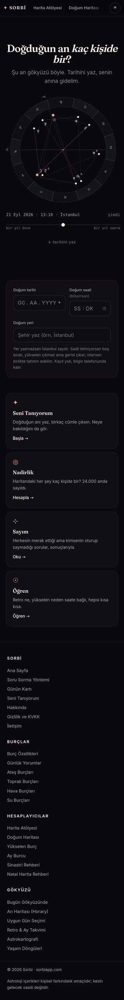

**Adres:** /  ·  **Başlık etiketi:** Sorbi — Gerçek efemerisle astroloji: harita, sayım, nadirlik  ·  **H1:** Doğduğun an kaç kişide bir?

**Ne işe yarıyor**
Sitenin giriş kapısı. Şu anın gökyüzünü hareketli bir çarkta gösterir, doğum tarihini yazınca aynı çarkı senin anına götürür ve Güneş–Ay–Yükselen'ini, bugünkü üç transitini ve doğum haritanı çıkarır. Buradan Harita Atölyesi'ne, Seni Tanıyorum'a, Nadirlik'e, Sayım'a ve Öğren'e dağıtır.

**Ekranda ne var**
- Üst menü — SORBİ logosu, 9 bağlantı (Harita Atölyesi, Doğum Haritası, Gökyüzü Hesaplayıcıları, Bugün, Burçlar, Nadirlik, Sayım, Öğren, ✦ Profilim), sağda tema düğmesi. Mobilde yatay kayar; ekran görüntüsünde sadece ilk iki bağlantı sığıyor.
- Profil çipi (yalnız dolu halde) — "✦ Deniz · 14.06.1994 09:35 · İstanbul — bilgilerin her araçta hazır · değiştir · çıkış".
- Hero — H1, alt cümle ("Şu an gökyüzü böyle. Tarihini yaz, senin anına gidelim."), canlı gökyüzü çarkı (sorbi-gokyuzu.js), altında tarih-saat-yer satırı ve "bir yıl önce / bir yıl sonra" kaydırma çizgisi, "↓ tarihini yaz" oku. Dolu halde ikinci bir "ŞİMDİ" çarkı ve "şimdiye dön" düğmesi eklenir, altına 3 cümlelik anlatım ("Güneş doğudan yükseliyordu…") ve "ne demek: yükselen / ay burcu / ev / açı / retro" terim düğmeleri gelir.
- Form kartı — Doğum tarihi (GG.AA.YYYY), Doğum saati (SS:DK, "biliyorsan"), Doğum yeri (şehir arama), ipucu metni ("Yer yazmazsan İstanbul sayılır… Kayıt yok, bilgin telefonunda kalır"). Gönder düğmesi yok; alan değişince hesaplar.
- Büyük üçlü (hesap sonrası) — Güneş / Ay / Yükselen üç kart.
- Transit listesi (hesap sonrası) — en fazla 3 yavaş gezegen transiti ("Şu an: transit Satürn · üçgen · natal Yükselen (1. ev) — 0.6° · ayrılıyor").
- İki düğme — "Harita Atölyesi'ne geç" (altın), "Aklındaki soruyu sor" (/soru-sor). Altında merak cümlesi ("✦ Haritanda 1 dikkat çekici ayrıntı yakaladım — Atölye'de gör →").
- Harita çarkı (hesap sonrası) — kâğıt temalı doğum haritası SVG'si, altında UTC / ev sistemi / MC / gündüz-gece rozetleri.
- Dört yol kartı — Seni Tanıyorum, Nadirlik, Sayım, Öğren.
- Alt bilgi — 4 sütun bağlantı, telif satırı ve sorumluluk notu.

**Kullanıcı ne yapıyor**
Doğum tarihi (zorunlu) → saat (isteğe bağlı) → yer (isteğe bağlı, open-meteo araması; boşsa İstanbul). Tarih ya da saat alanı değişince harita motoru tembel yüklenir, hero çarkı doğum anına döner, büyük üçlü + transitler + harita çarkı çizilir, doğum bilgisi `sorbi_birth` anahtarına yazılır. "Harita Atölyesi'ne geç" bağlantısı tarih/saat/koordinatı sorgu dizesiyle taşır. Kayıtlı bilgi varsa sayfa açılışta kendiliğinden hesaplar.

**Teknik**
- Motor/JS: sorbi-form.js (tarih/saat alanlarını segmentli girişe çevirir), sorbi-profil.js (profil çipi, nav rozeti, sorbi_birth↔sorbi_profile eşitleme), sorbi-yer.js (81 il yerel liste + open-meteo geocoding sarmalayıcısı), sorbi-olcum.js (anonim sayfa sayacı). Hesap anında tembel yüklenen: astronomy.browser.min.js, sorbi-chart.js (çark SVG), sorbi-astro.js (harita hesabı), sorbi-gokyuzu.js (canlı gökyüzü), sorbi-anlat.js (terim açıklamaları).
- Veri: localStorage `sorbi_birth`, `sorbi_profile`, `sorbi_tema`; dış istek geocoding-api.open-meteo.com; `/api/track` (sorbi-olcum.js üzerinden sayfa sayacı). Google AdSense betiği yüklü.
- Hesap: tarayıcıda.
- Ağırlık: 217 kelime · 3,7 ekran boyu mobilde (dolu halde 5,5) · 1 düğme (dolu halde 9) · 6 form alanı

**Boş / dolu hal**
Boş: tek çark (şimdi), boş form, dört yol kartı. Dolu: menü altında profil çipi; hero iki çarka bölünür ("DOĞDUĞUN AN" + "ŞİMDİ"), anlatım paragrafı ve terim düğmeleri açılır; form dolu gelir; büyük üçlü, 3 transit, iki düğme, merak cümlesi ve tam harita çarkı sayfa açılır açılmaz görünür. Toplam kelime 203'ten 412'ye çıkar.

**Kusur**
- Dolu halde sağa taşma belirgin (ölçüm: 33 taşan öğe). Büyük üçlü üçüncü kartı kesik ("12° Aslan 5"), transit satırlarının sağ ucu kesik ("ayrılıyo"), harita çarkı kutusu sağdan kırpılıyor (ekran görüntüsünde doğrulandı).
- Menü 9 bağlantı; 390 px'te sadece ikisi görünür, "Bugün", "Nadirlik", "Sayım" kaydırmadan bulunamaz.
- "✦ Profilim" nav bağlantısı profil yokken de görünür (kaynakta gizleyen kural yok; sadece profil varsa gösterme kodu var, gizleme yok).
- Formda gönder düğmesi yok; ilk kez gelen "tarihini yaz" okunu takip edip alanı değiştirmek zorunda.
- Hero'da "Şu an gökyüzü böyle" çarkı canlı animasyonla açılıyor; hafif-hareket tercihi dışında kapatma yolu yok.

**Durum:** canlı ve işini yapıyor

---

---

## bugun.html — Bugün

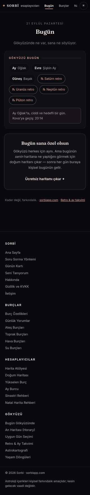

**Adres:** /bugun  ·  **Başlık etiketi:** Bugün — Kişisel Astroloji Günlüğün | Sorbi  ·  **H1:** Bugün

**Ne işe yarıyor**
Bugünkü gökyüzünün özeti: Ay hangi burçta, evresi ne, hangi gezegenler retroda, Ay boşlukta mı. Doğum bilgin kayıtlıysa altına bugünün senin haritana değen en güçlü transitini bir paragrafla yazar.

**Ekranda ne var**
- Üst menü — ortak menü, "Bugün" işaretli.
- Başlık bloğu — tarih ("21 EYLÜL PAZARTESİ"), H1, alt cümle ("Gökyüzünde ne var, sana ne söylüyor.").
- "Gökyüzü Bugün" kartı — rozetler: Ay Oğlak, Evre Şişkin Ay, Güneş Başak, ℞ Satürn / Uranüs / Neptün / Plüton retro; altında Ay boşlukta kutusu ("Ay Oğlak'ta, ciddi ve hedefli bir gün. Kova'ya geçiş: 20:14").
- Boş halde: "Bugün sana özel olsun" kartı — açıklama ve "Ücretsiz haritamı çıkar ✦" bağlantısı (/dogum-haritasi-hesaplama).
- Dolu halde: "Sana Bugün" kartı — başlık ("Akış günü."), tek paragraf yorum, "Ayrıca:" ikinci transit, "Bugün bir şey mi var? Sorunu sor ✦" düğmesi (/soru-sor).
- Alt satır — "Kader değil, farkındalık. · sorbiapp.com · Retro & ay takvimi".
- Alt bilgi — ortak footer.

**Kullanıcı ne yapıyor**
Girdi yok, okunur sayfa. Doğum bilgisi `sorbi_profile` içinden okunur; yoksa harita çıkarmaya yönlendirir.

**Teknik**
- Motor/JS: astronomy.browser.min.js (gezegen boylamları, Ay evresi; sayfa kendi ecl/asc hesabını inline yapıyor, sorbi-astro.js kullanmıyor), sorbi-profil.js, sorbi-olcum.js.
- Veri: localStorage `sorbi_profile` (sorbi_birth'i profil.js eşitler), `sorbi_tema`; `/api/track`. AdSense betiği yüklü.
- Hesap: tarayıcıda (Ay boşlukta hesabı için 2,6 günlük ileri tarama ve 3 günlük geri tarama, açılışta).
- Ağırlık: 158 kelime · 2,5 ekran boyu mobilde · 1 düğme · 0 form alanı

**Boş / dolu hal**
Boş: yalnız gökyüzü kartı + "Bugün sana özel olsun" çağrısı. Dolu: H1 "Bugün, " olur, "Sana Bugün" kartı gelir; toplam 170→175 kelime.

**Kusur**
- Dolu halde H1 "Bugün," diye virgülle bitiyor, isim boş. Sayfa ismi `sorbi_profile.name`'den okuyor; isim `sorbi_birth.name` içinde olduğunda ve profilde olmadığında boş kalıyor (ekran görüntüsünde doğrulandı).
- Ay boşlukta kutusundaki saat sabit Europe/Istanbul'a göre; profil dilimi kullanılmıyor.
- Transit hesabı sitenin ortak motorunu (sorbi-astro.js) değil sayfaya gömülü ayrı bir hesabı kullanıyor; orblar (Ay 6°, Güneş 4°…) diğer sayfalarla aynı olmayabilir — emin değilim.
- Ölçüm: 3 sağa taşan öğe (menü kaynaklı olması muhtemel).

**Durum:** canlı ve işini yapıyor

---

---

## haritam.html — Profilim

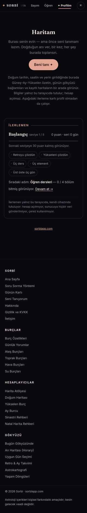

**Adres:** /haritam  ·  **Başlık etiketi:** Haritam — Sorbi  ·  **H1:** Haritam (boş) / Merhaba ✦ (dolu)

**Ne işe yarıyor**
Kayıtlı doğum bilgisinin "evi": adın, mührün (Ay sıfatı + Güneş ismi), büyük üçlün ve araç kısayolların bir arada. Profil olmadan da Öğren derslerindeki ilerleme kartı görünür.

**Ekranda ne var**
- Üst menü — "✦ Profilim" işaretli.
- Boş halde: H1 "Haritam", "Burası senin evin — ama önce seni tanımam lazım…" metni, "Beni tanı ✦" düğmesi (/seni-taniyorum), açıklama paragrafı.
- Dolu halde: "Merhaba Deniz ✦", "SENİN MÜHRÜN — Gururlu Rüzgâr", doğum satırı "1994-06-14 · 09:35 · İstanbul".
- Üç kısayol (dolu) — Bugün, Tam Haritam (/dogum-haritasi-hesaplama), Soruna Bak (#ask).
- "Büyük Üçlü" kartı (dolu) — Güneş İkizler / Ay Aslan / Yükselen Aslan; altında bağlantı satırı (Tüm araçlar, Uygun gün, Astrokartografi, İlişki uyumu).
- "Haritanı kendin oku" kartı (dolu) — "Sorbi kişiye özel okuma yapmaz…" metni ve "Bir soru haritada nasıl okunur →" düğmesi.
- Takvim kutusu (dolu, JS ile eklenir) — "Önümüzdeki 13 ayın gökyüzü… Atölye'deki Takvim sekmesinde. Aç →".
- "Kayıtlı Haritalarım" (yalnız `sorbi_charts` doluysa) — isim · tarih rozetleri ve "＋ yeni harita".
- "Okumalarım" kartı (yalnız `sorbi_profile.readings` doluysa) — soru ve durum ("Cevap hazırlanıyor / Cevaplandı / Ödeme bekliyor / İptal").
- "İlerlemen" kartı (her iki halde) — seviye adı "Başlangıç, seviye 1/5", "0 puan · seri 0 gün", ilerleme çubuğu, 5 nişan (Retroyu çözdün, Yükseleni çözdün, Üç ders, Üç element, Üst üste üç gün), "Sıradaki adım: Öğren dersleri — 0/4", gizlilik notu.
- Alt satır — "profilden çık · sorbiapp.com" (dolu) / "sorbiapp.com" (boş).
- Alt bilgi — ortak footer.

**Kullanıcı ne yapıyor**
Girdi yok, okunur sayfa. Tek eylem "profilden çık" (onay sorar, `sorbi_profile`'ı siler, ana sayfaya atar). Doğum bilgisini değiştirme yolu bu sayfada yok.

**Teknik**
- Motor/JS: astronomy.browser.min.js (büyük üçlü için inline hesap), sorbi-oyun.js (seviye/nişan/seri, `sorbi_oyun_*` anahtarları), sorbi-profil.js, sorbi-olcum.js.
- Veri: localStorage `sorbi_profile`, `sorbi_birth`, `sorbi_charts`, `sorbi_oyun_v1`, `sorbi_tema`; `/api/track`.
- Hesap: tarayıcıda.
- Ağırlık: 230 kelime · 2,7 ekran boyu mobilde (dolu 3,5) · 1 düğme (dolu 2) · 0 form alanı

**Boş / dolu hal**
Boş: karşılama + "Beni tanı" + ilerleme kartı. Dolu: isim, mühür, kısayollar, büyük üçlü, "kendin oku" kartı, takvim kutusu, ilerleme kartı, "profilden çık". Kelime 207→251.

**Kusur**
- "Okumalarım" listesi ve durum metinleri ("Ödeme bekliyor", "Cevap hazırlanıyor") sökülen ücretli okuma hizmetinin kalıntısı; `refreshStatuses` artık hiçbir uca gitmiyor, sadece yerel listeyi yeniden çiziyor. Yeni kullanıcıda hiç görünmez.
- "profilden çık" yalnız `sorbi_profile`'ı siliyor, `sorbi_birth` kalıyor; sonraki sayfa yüklemede profil.js `mend()` ile profili geri kuruyor — çıkış kalıcı olmayabilir (kaynaktan çıkarım; canlıda denenmedi, emin değilim).
- Destek sayfası "Profilim sayfasından doğum bilgilerinizi güncelleyebilir veya kaldırabilirsiniz" diyor; bu sayfada güncelleme yok.
- Menüde "✦ Profilim" profil yokken de görünür.
- Yükselen "Aslan" büyük üçlüde sadece burç adıyla, derece yok; index'te derece var. Tutarsızlık, hata değil.

**Durum:** canlı ama eksik

---

---

## seni-taniyorum.html — Seni Tanıyorum

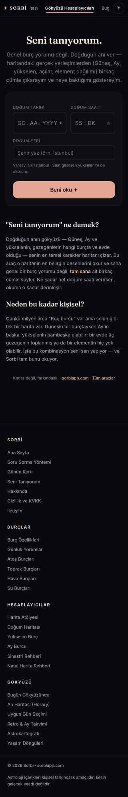

**Adres:** /seni-taniyorum  ·  **Başlık etiketi:** Seni Tanıyorum — Doğum Haritandan Kişisel Okuma | Sorbi  ·  **H1:** Seni tanıyorum.

**Ne işe yarıyor**
Doğum anını girince sinematik bir "okuma" animasyonuyla mührünü (ör. "Gururlu Rüzgâr"), Güneş–Ay–Yükselen üçlünün 100.000 kişide kaç kez oluştuğunu, 4-5 kişisel cümleyi ve haritandaki nadir yerleşimleri gösterir. Sonra tek soruluk kural tabanlı sohbet, paylaşım kartları ve uygulama duyuru listesi gelir.

**Ekranda ne var**
- Üst menü — "Gökyüzü Hesaplayıcıları" işaretli (bu sayfa araclar'a eşlenmiş).
- Başlık bloğu — H1, alt paragraf ("Genel burç yorumu değil…").
- Form kartı — Doğum tarihi, Doğum saati, Doğum yeri (arama listesi), not ("Varsayılan: İstanbul · Saat girersen yükselenini de okurum."), "Beni oku ✦" düğmesi.
- Sonuç bölümü (form gizlenir, H1 ve alt paragraf da gizlenir): okuma satırı ("✦ Doğduğun anın gökyüzünü kuruyorum…" döngüsü) → mühür başlığı ("Sorbi · Senin anın", isim, alt cümle) → küçük çark SVG → büyük üçlü → nadirlik kutusu ("Bu üçlü, 100.000 kişiden yalnızca N kişide oluşuyor", çubuk, "Bu sayı nereden geliyor?" açılır kutusu) → paylaşım (Story'de paylaş, Bağlantıyı kopyala) → "sorbiapp.com/seni-taniyorum · Sen kaçta birsin?" → nadir yerleşimler (sorbi-yildiz.js) → "Tam haritayı aç →" → "Haritanın söyledikleri" cümleleri → tepki ("Yararlı oldu / Kısmen / Yeterince açık değil") → "Haritana bir soru sor" sohbet kutusu (konu çipleri, metin alanı, "Sor") + cevap sonrası reklam yuvası → "Bu okuma haritanın yüzeyi" satış kartı ("Haritanın tamamını aç →") → "Sorbi telefonuna geliyor" e-posta listesi (adres, KVKK onay kutusu, "Beni listeye yaz ✦").
- Paylaşım kartı kaydırıcısı (kpTrack) — 1080×1920 PNG kartlar (sorbi-kart.js), telefonda paylaşım sayfasına gider.
- SEO bloğu — "Seni tanıyorum ne demek?", "Neden bu kadar kişisel?" (sonuçta gizlenir).
- Alt satır ve ortak footer (sonuçta footer gizlenir).

**Kullanıcı ne yapıyor**
Tarih (zorunlu) → saat → yer → "Beni oku ✦". Sayfa `sorbi_birth` ve `sorbi_profile`'a yazar, `/api/track`'e burç çifti gönderir, 4-5 saniyelik animasyonla sonucu açar. Sonra: tepki düğmesi (`/api/track`), sohbete 140 karakterlik soru (tarayıcıda kural tabanlı cevap, LLM yok), paylaş (navigator.share / pano), e-posta listesi (`/api/liste`). Kayıtlı bilgi varsa profil.js düğmeye kendisi basar; sayfa açılır açılmaz okuma başlar.

**Teknik**
- Motor/JS: astronomy.browser.min.js, sorbi-astro.js (harita), sorbi-chart.js (çark), sorbi-dignite.js (yönetici gezegenin dignitesi), sorbi-nadir.js (üçlü sıklığı, 1.367.496 gök anı), sorbi-yildiz.js + sorbi-yildiz-say.js (nadir yerleşimler), sorbi-sohbet.js (kural tabanlı soru-cevap), sorbi-karsilastir.js (paylaşım bağlantısından gelen üçlüyle karşılaştırma), sorbi-kart.js (PNG kart üretimi), sorbi-liste.js (e-posta listesi bloğu), sorbi-yer.js, sorbi-form.js, sorbi-profil.js, sorbi-olcum.js. Sayfa 96 KB, 15 betik.
- Veri: localStorage `sorbi_birth`, `sorbi_profile`, `sorbi.tuttu` (nadir yerleşim tepkisi), `sorbi_tema`; `/api/track` (seni_taniyorum, react, sohbet_soru, reklam_yuvasi, an_paylasildi, karsilastirma), `/api/liste`; open-meteo geocoding. AdSense betiği ve sohbet altında reklam yuvası.
- Hesap: tarayıcıda.
- Ağırlık: 364 kelime · 2,9 ekran boyu mobilde · 2 düğme · 6 form alanı

**Boş / dolu hal**
Boş: form + SEO metni + footer. Dolu: profil çipi görünür, form otomatik gönderilir, sayfa doğrudan sonuç akışına girer; H1, SEO ve footer gizlenir. Dolu ekran görüntüsü animasyonun ortasında alınmış görünüyor (okuma ve çark alanı boş, yalnız paylaşım düğmeleri ve e-posta kutusu var; 118 kelime, 1,7 ekran) — sonuçların tamamının çıkıp çıkmadığını bu görüntüden söyleyemiyorum, emin değilim.

**Kusur**
- Kayıtlı profille sayfa kullanıcıya sormadan kendiliğinden "Beni oku"ya basıyor ve 4-5 saniye animasyon oynatıyor; form hiç görünmüyor, farklı bir kişi için girmek istiyorsan önce profil çipinden "değiştir"e basman gerekiyor.
- Sonuçta footer ve H1 gizleniyor; sayfa alt bilgisi olmayan bir "uygulama ekranı"na dönüyor.
- Dolu ekranda 5 sağa taşan öğe ölçüldü; boş ekranda 5.
- İki ayrı nadirlik kaynağı aynı sayfada anlatılıyor (1.367.496 gök anı vs Nadirlik sayfasının 24.000 haritası); metin bunu açıklıyor ama okuyucu için iki sayı çelişebilir.
- Reklam yuvası sohbet cevabından sonra açılıyor; AdSense yüklenmezse boş "Reklam" etiketi kalır mı, emin değilim.

**Durum:** canlı ve işini yapıyor

---

---

## araclar.html — Gökyüzü Hesaplayıcıları

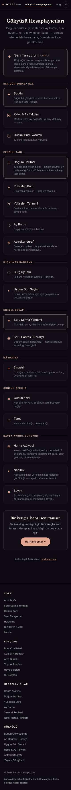

**Adres:** /araclar  ·  **Başlık etiketi:** Ücretsiz Astroloji Araçları — Harita, Yükselen | Sorbi  ·  **H1:** Gökyüzü Hesaplayıcıları

**Ne işe yarıyor**
Sitedeki tüm araçların gruplanmış dizini. 19 kart, her biri başka bir sayfaya götürür.

**Ekranda ne var**
- Üst menü — "Gökyüzü Hesaplayıcıları" işaretli.
- Başlık bloğu — H1, alt paragraf; dolu halde karşılama satırı ("Merhaba ✦ Bugünün → · ✦ Profilim").
- Öne çıkan kart — Seni Tanıyorum (YENİ rozeti).
- "Her gün buraya bak" — Bugün, Retro & Ay Takvimi, Günlük Burç Yorumu.
- "Kendini tanı" — Doğum Haritası, Yükselen Burç, Yükselen Tahmini, Ay Burcu, Astrokartografi.
- "İlişki & zamanlama" — Burç Uyumu, Uygun Gün Seçimi.
- "Kişisel cevap" — Soru Sorma Yöntemi, Soru Haritası (Horary).
- "İki harita" — Sinastri.
- "Günlük çekiliş" — Günün Kartı, Tarot.
- "Navda ayrıca duruyor" — Harita Atölyesi, Nadirlik, Sayım.
- Çağrı kartı — "Bir kez gir, hepsi seni tanısın", "Haritamı çıkar ✦" (/dogum-haritasi-hesaplama).
- Alt satır ve ortak footer.

**Kullanıcı ne yapıyor**
Girdi yok, okunur sayfa (bağlantı dizini). Tüm hedef sayfalar site klasöründe mevcut (tarot, yukselen-tahmini, soru-sor dahil).

**Teknik**
- Motor/JS: sorbi-profil.js, sorbi-olcum.js; sayfada 3 satırlık inline karşılama kodu.
- Veri: localStorage `sorbi_profile`, `sorbi_birth`, `sorbi_tema`; `/api/track`. AdSense betiği yüklü.
- Hesap: statik metin.
- Ağırlık: 395 kelime · 5,2 ekran boyu mobilde (dolu ölçümünden; boş ölçüm dosyasında bu sayfa yok) · 1 düğme · 0 form alanı

**Boş / dolu hal**
Dolu halde başlık altına "Merhaba ✦ Bugünün → · ✦ Profilim" satırı eklenir; başka fark yok.

**Kusur**
- Dolu halde "Merhaba ✦" — isim boş. `sorbi_profile.name` okunuyor, `sorbi_birth.name` okunmuyor (bugun.html ile aynı kusur; ekran görüntüsünde doğrulandı).
- Karşılama satırı `id="sorbiNavHaritam"` ile ikinci bir eleman üretiyor; menüdeki bağlantıyla aynı id sayfada iki kez var.
- "Navda ayrıca duruyor" başlığı iç terminoloji; ziyaretçi için anlamsız.
- Öne çıkan "Seni Tanıyorum" kartı ile "Kendini tanı" grubu aynı işi yapan iki farklı girişi (Seni Tanıyorum / Doğum Haritası) rekabet ettiriyor; hangisinin ana giriş olduğu sayfadan okunmuyor.
- Ölçüm: 5 sağa taşan öğe.

**Durum:** canlı ve işini yapıyor

---

---

## hakkinda.html — Hakkında

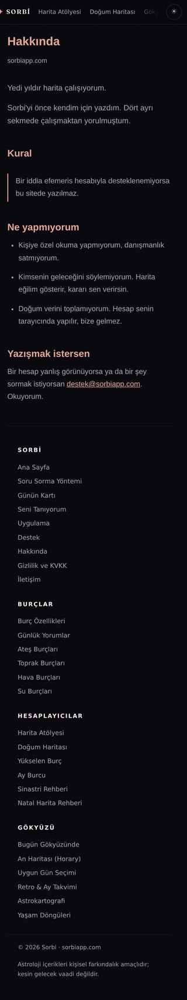

**Adres:** /hakkinda  ·  **Başlık etiketi:** Hakkında — Sorbi  ·  **H1:** Hakkında

**Ne işe yarıyor**
Sitenin neden var olduğunu, tek kuralını ve neyi yapmadığını birinci tekil şahısla anlatan kısa metin. E-posta adresi verir.

**Ekranda ne var**
- Üst menü — ortak menü (bu sayfada "✦ Profilim" profil yokken gizli).
- H1, "sorbiapp.com" tarih satırı.
- Giriş — "Yedi yıldır harita çalışıyorum." / "Sorbi'yi önce kendim için yazdım…"
- "Kural" — tek cümle, sol çizgili kutu: "Bir iddia efemeris hesabıyla desteklenemiyorsa bu sitede yazılmaz."
- "Ne yapmıyorum" — 3 madde (kişiye özel okuma yok, gelecek söylenmez, doğum verisi toplanmaz).
- "Yazışmak istersen" — destek@sorbiapp.com.
- Alt bilgi — ortak footer'ın farklı bir sürümü: "Uygulama" ve "Destek" bağlantıları var, diğer sayfalarda yok.

**Kullanıcı ne yapıyor**
Girdi yok, okunur sayfa.

**Teknik**
- Motor/JS: sorbi-profil.js, sorbi-olcum.js.
- Veri: localStorage `sorbi_tema` (`sorbi_birth`/`sorbi_profile` yalnız profil.js üzerinden); `/api/track`. AdSense betiği yüklü.
- Hesap: statik metin.
- Ağırlık: 158 kelime · 2,6 ekran boyu mobilde · 1 düğme · 0 form alanı

**Boş / dolu hal**
Fark yok (menüde "✦ Profilim" görünür olur).

**Kusur**
- Gövde yazı tipi sistem fontu (-apple-system/Segoe), başlıklar Fraunces değil; index/bugun/haritam'ın Inter + Fraunces diline uymuyor (ekran görüntüsünde belirgin: Arial benzeri başlıklar).
- Ekran görüntüsü 812 px genişliğinde alınmış (diğerleri 780); sayfa mobilde yatay taşıyor. Ölçüm: 7 sağa taşan öğe.
- Footer'daki "Uygulama" bağlantısı `/#uygulama`'ya gidiyor; index.html'de `id="uygulama"` yok.
- Footer sürümü sitenin geri kalanından farklı (gizlilik.html ile aynı, destek.html ile farklı).

**Durum:** canlı ve işini yapıyor

---

---

## destek.html — Destek

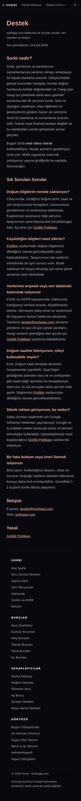

**Adres:** /destek  ·  **Başlık etiketi:** Sorbi Destek — SSS, Veri ve İletişim  ·  **H1:** Destek

**Ne işe yarıyor**
Sık sorulan sorular, verinin nerede saklandığı, KVKK/GDPR talebi ve iletişim. App Store destek adresi olarak da kullanılıyor (`/support` buraya 301 yönlendiriliyor).

**Ekranda ne var**
- Üst menü.
- H1, alt cümle, "Son güncelleme: 19 Eylül 2026".
- "Sorbi nedir?" — 2 paragraf ("kişisel planlama aracı", "Mobil uygulama üzerinde çalışıyoruz").
- "Sık Sorulan Sorular" — 6 soru: bilgiler nerede saklanıyor, nasıl silerim, veri talebi, doğum saatimi bilmiyorum, reklam neden, hata/öneri.
- "İletişim" — e-posta ve web.
- "Yasal" — Gizlilik Politikası bağlantısı.
- Ortak footer.

**Kullanıcı ne yapıyor**
Girdi yok, okunur sayfa.

**Teknik**
- Motor/JS: sorbi-profil.js, sorbi-olcum.js.
- Veri: localStorage `sorbi_tema`; `/api/track`. AdSense betiği yüklü.
- Hesap: statik metin.
- Ağırlık: 422 kelime · 4,5 ekran boyu mobilde · 1 düğme · 0 form alanı

**Boş / dolu hal**
Fark yok.

**Kusur**
- "Kaydettiğim bilgileri nasıl silerim?" cevabı Profilim sayfasında "güncelleyebilir veya kaldırabilirsiniz" diyor; haritam.html'de güncelleme yok, yalnız "profilden çık" var.
- "Mobil uygulama üzerinde çalışıyoruz; yayına girdiğinde duyuracağız" — gizlilik.html ise "iOS uygulaması ... ayrı bir politikaya tabidir" diye canlı bir uygulamaya bağlantı veriyor. İki sayfa çelişiyor.
- "Sorbi nedir?" tanımı ("kişisel planlama aracı", "hangi gün hangi işe yönelmek") sitenin geri kalanının diline (harita, nadirlik, sayım) uymuyor; App Store metninden gelmiş gibi duruyor — emin değilim.
- Yazı tipi hakkinda ile aynı sistem fontu. Ölçüm: 7 sağa taşan öğe.
- "1-2 iş günü içinde dönüş" ve "en geç 30 gün" vaatleri metinde; bunların tutulup tutulmadığı bilinmiyor.

**Durum:** canlı ve işini yapıyor

---

---

## gizlilik.html — Gizlilik Politikası

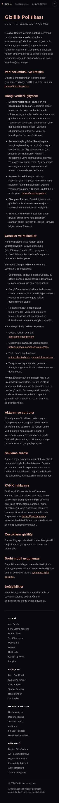

**Adres:** /gizlilik  ·  **Başlık etiketi:** Gizlilik Politikası — Sorbi  ·  **H1:** Gizlilik Politikası

**Ne işe yarıyor**
KVKK metni: doğum verisinin tarayıcıda kaldığını, anonim sayfa sayacını, e-posta listesini, AdSense çerezlerini ve kapatma yollarını anlatır.

**Ekranda ne var**
- Üst menü ("✦ Profilim" profil yokken gizli).
- H1, "sorbiapp.com · Yürürlük tarihi: 17 Eylül 2026".
- "Kısaca:" özet paragrafı.
- 9 başlık: Veri sorumlusu ve iletişim · Hangi verileri işliyoruz (5 madde: doğum verisi, anonim sayaç, e-posta listesi, yazışmalar, sunucu günlükleri) · Çerezler ve reklamlar (AdSense, kapatma bağlantıları, AEA rıza mesajı) · Aktarım ve yurt dışı (Cloudflare, Google) · Saklama süresi · KVKK haklarınız · Çocukların gizliliği · Sorbi mobil uygulaması (dış bağlantı: defnedev.github.io/sorbi-legal/privacy/) · Değişiklikler.
- Footer — hakkinda ile aynı farklı sürüm ("Uygulama", "Destek" bağlantılı).

**Kullanıcı ne yapıyor**
Girdi yok, okunur sayfa.

**Teknik**
- Motor/JS: sorbi-profil.js, sorbi-olcum.js.
- Veri: localStorage `sorbi_tema`; `/api/track`. AdSense betiği yüklü.
- Hesap: statik metin.
- Ağırlık: 606 kelime · 6,2 ekran boyu mobilde · 1 düğme · 0 form alanı

**Boş / dolu hal**
Fark yok.

**Kusur**
- Metin API dosyasıyla uyumlu: API'de yalnız `/api/track` ve `/api/liste` var, `/api/profile` kaldırılmış; politika "doğum verisi sunucuya gönderilmez" diyor ve kod bunu doğruluyor. Ancak e-posta listesinde IP özeti (HMAC) tutuluyor; politika e-posta listesi maddesinde bunu yazmıyor, sadece "sunucu günlükleri" genel maddesi var.
- "AEA/BK/İsviçre ziyaretçilerine ilk ziyarette rıza mesajı gösterilir" — sitede bir rıza bandı kodu bulamadım; AdSense'in kendi mesajı kastediliyor olabilir, emin değilim.
- Yürürlük tarihi 17 Eylül, destek "son güncelleme" 19 Eylül; API sökümü 19 Eylül'de yapılmış. Tarih tutarlı mı, emin değilim.
- Yazı tipi sistem fontu; footer sürümü farklı; "Uygulama" bağlantısı kırık çapa. Ölçüm: 6 sağa taşan öğe.

**Durum:** canlı ve işini yapıyor

---

---

## masa.html — Astrolog Masası

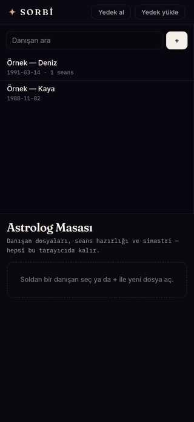

**Adres:** /masa  ·  **Başlık etiketi:** Astrolog Masası — Sorbi  ·  **H1:** Astrolog Masası

**Ne işe yarıyor**
Astrologlar için danışan dosyası ve seans hazırlığı ekranı: danışan ekle, haritasını çıkar, bugünün transitlerini ve ilerletimini gör, iki danışanı sinastride karşılaştır, seans notu tut, danışana yazdırılabilir çıktı ver. Tamamı tarayıcıda çalışır; menüden ulaşılmaz, yalnız adresi bilen açar.

**Ekranda ne var**
- Kendi üst şeridi (ortak menü yok) — "✦ SORBİ" logosu, "Astrolog Masası" etiketi (mobilde gizli), "Veriler bu tarayıcıda kalır" notu, "Yedek al" ve "Yedek yükle" düğmeleri.
- Sol panel (mobilde üstte) — "Danışan ara" arama kutusu, "+" yeni danışan düğmesi, danışan listesi. İlk açılışta iki örnek dosya tohumlanır: "Örnek — Deniz 1991-03-14 · 1 seans", "Örnek — Kaya 1988-11-02".
- İçerik alanı — H1 "Astrolog Masası", "Danışan dosyaları, seans hazırlığı ve sinastri — hepsi bu tarayıcıda kalır.", kesik çizgili kutu "Soldan bir danışan seç ya da + ile yeni dosya aç."
- Danışan seçilince (ekran görüntüsünde yok, kaynaktan): dosya başlığı (ad, doğum satırı, etiketler, "Dosyayı düzenle"), 4 sekme:
  - Seans hazırlığı — özet şeridi (Sect, En dar transit, İlerlemiş Ay, En zayıf gezegen), gece temalı çark, "Bugünün transitleri" (orb ≤ 2,5°), "Sekonder ilerletim" (≤ 1,5°), "Esansiyel dignite" tablosu (−9…+9), "Natal açılar" (en dar 24).
  - Sinastri — ikinci dosya seçici, çift çark, Toplam/Sert/Yumuşak/Kavuşum sayıları, "Kişisel gezegenler arası", "Tüm karşılıklı açılar".
  - Seanslar — "Seans ekle" formu (tarih, tür, tek cümle özet, not, Kaydet) ve "Geçmiş" listesi (sil düğmeli).
  - Danışana çıktı — "Yazdır / PDF", "Haritayı SVG indir", kâğıt temalı çark, üç temel yerleşim tablosu, en dar 8 açı, son seans özeti, imza notu.
- Danışan formu — İsim/rumuz, doğum tarihi, saati, yeri (open-meteo arama), etiketler, "saat bilinmiyor" kutusu, dosya notu, Kaydet / Vazgeç / Arşivle.
- Footer yok.

**Kullanıcı ne yapıyor**
"+" → form → Kaydet → dosya listeye girer → dosyaya tıkla → sekmeler. Her kayıt `sorbiMasa_v1` localStorage anahtarına yazılır. "Yedek al" JSON indirir, "Yedek yükle" JSON'u okuyup mevcut veriyi değiştirir (onay sorar). "Arşivle" dosyayı listeden gizler, silmez.

**Teknik**
- Motor/JS: sorbi-yer.js (baştan), sorbi-olcum.js; ilk hesapta tembel yüklenen astronomy.browser.min.js, sorbi-chart.js, sorbi-astro.js, sorbi-dignite.js.
- Veri: localStorage `sorbiMasa_v1` (danışanlar, seanslar, sıra sayacı), `sorbi_tema`, `sorbi_birth` (yalnız tema için konum); sessionStorage `masa_acilis`. Sunucuya giden tek şey `/api/track` olay adları: masa_acildi, masa_dosya, masa_seans, masa_cikti (danışan verisi gitmez). open-meteo geocoding.
- `/api/panel/danisanlar`, `/api/panel/danisan`, `/api/panel/seans` uçları hakkında: bunlar ağa çıkmıyor. Sayfanın içinde `api()` adlı bir işlev var; yol adına bakıp localStorage'ı okuyor/yazıyor ve Promise döndürüyor — eski sunucu uçlarının yerine geçen yerel bir taklit. `site/functions/api/[[route]].js` dosyasında `/api/panel/*` diye bir uç yok; biri bu adrese gerçekten istek atsa 404 "Not found" alır. Dosya başındaki not 19 Eylül 2026'da yönetici paneli, randevu, ödeme ve `/api/profile`'ın söküldüğünü yazıyor; masa.html o sökümün ardından yerelleştirilmiş sürüm. envanter-ham.json'daki "api" listesi bu yüzden yanıltıcı: dizgeler kaynakta geçiyor ama istek yok.
- Kimlik doğrulama: yok. Sayfa herkese açık; parola, jeton, giriş ekranı yok. Kaynakta `TOK=null` değişkeni ve `.giris` CSS kuralları (giriş kutusu stili) duruyor ama giriş HTML'i yok — eski girişli sürümün kalıntısı. `<meta name="robots" content="noindex">`, sitemap.xml'de yok, hiçbir sayfadan bağlantı yok; yalnız adresi bilen açar. Herkese açık olması bir sızıntı değil: veri ziyaretçinin kendi tarayıcısında, başka birinin dosyasını görme imkânı yok.
- Hesap: tarayıcıda.
- Ağırlık: 43 kelime · 1 ekran boyu mobilde · 5 düğme · 1 form alanı (danışan seçilmeden)

**Boş / dolu hal**
Fark yok (`sorbi_birth` yalnız tema için okunuyor; danışan listesi ayrı anahtardan geliyor).

**Kusur**
- Mobilde sol panel `max-height: calc(100vh − 180px)` ile tam ekran boyu kaplıyor; iki danışanın altında büyük boşluk, "Astrolog Masası" başlığı ve yönerge ancak kaydırınca görünüyor (ekran görüntüsünde doğrulandı).
- "Soldan bir danışan seç" yönergesi mobilde yanlış; liste solda değil üstte.
- Tema düğmesi `.sbnav` arıyor; bu sayfada ortak menü olmadığı için tema düğmesi hiç eklenmiyor. Sayfa hep gece temasında.
- Ortak menü ve footer yok; siteye geri dönüş yalnız logo.
- Kaynak kalıntıları: `TOK`, `.giris` stilleri, `cevap()` sarmalayıcısı, `/api/panel/...` yol adları — çalışan koda zarar vermiyor ama sayfanın ne olduğunu okuyanı yanıltıyor.
- Yedek yükleme JSON'u doğrulamıyor (yalnız `danisanlar` dizisi var mı bakıyor); bozuk yedek sessizce boş dosya listesi bırakabilir — emin değilim, denenmedi.
- Sayfa açıklaması "kayıt gerekmez" diyor, doğru; ama danışan kişisel verisi tarayıcıda şifresiz JSON olarak duruyor, ortak bilgisayarda kalır. Uyarı yalnız "Veriler bu tarayıcıda kalır" satırı.
- Örnek iki dosya kullanıcı silmeden listede kalır; arşivleyince de `arsiv:1` ile depoda durur.

**Durum:** canlı ama eksik — sunucusuz danışan paneli olarak çalışıyor, ama bağlantısız, menüsüz ve mobilde ilk ekranı boş görünen gizli bir sayfa. Yarım bırakılmış değil; bilinçli olarak yerelleştirilmiş ama siteye bağlanmamış.

---

---

## 404.html — Sayfa bulunamadı

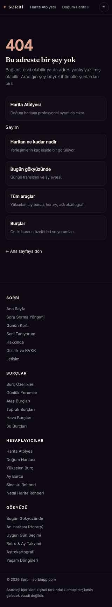

**Adres:** (bulunamayan her adres)  ·  **Başlık etiketi:** Sayfa bulunamadı — Sorbi  ·  **H1:** Bu adreste bir şey yok

**Ne işe yarıyor**
Kırık bağlantıya gelen ziyaretçiye beş ana sayfayı kart olarak sunar ve ana sayfaya dönüş verir.

**Ekranda ne var**
- Üst menü — ortak menü.
- "404" büyük sayı, H1, açıklama cümlesi.
- Yol kartları — Harita Atölyesi, "Sayım" (düz bağlantı, kart değil), Haritan ne kadar nadir, Bugün gökyüzünde, Tüm araçlar, Burçlar.
- "← Ana sayfaya dön".
- Ortak footer.

**Kullanıcı ne yapıyor**
Girdi yok, okunur sayfa.

**Teknik**
- Motor/JS: sorbi-olcum.js (bu sayfada profil.js yok).
- Veri: localStorage `sorbi_tema`, `sorbi_birth` (yalnız tema betiği konum için okuyor); `/api/track` (404 adresi `meta` olarak gider, 120 karaktere kesilir). AdSense yok.
- Hesap: statik metin.
- Ağırlık: 156 kelime · yaklaşık 2,5 ekran boyu mobilde (ölçüm dosyasında yok; tam ekran görüntüsü 4208 px / 1688 px'ten hesaplandı) · 1 düğme · 0 form alanı

**Boş / dolu hal**
Fark yok.

**Kusur**
- "Sayım" bağlantısı diğer beş kartın arasında kartsız, açıklamasız düz metin olarak duruyor; `class="yol"` ve açıklama unutulmuş (ekran görüntüsünde belirgin).
- `description` meta etiketi boş.
- Menüde "✦ Profilim" profil yokken de görünür; profil.js yüklenmediği için rozet mantığı da çalışmaz.
- `/api/track`'e gönderilen `meta` alanı bulunamayan adresin kendisi; kullanıcı adrese kişisel bir şey yazmışsa (ör. sorgu dizesi) o da sayaca gider — gizlilik metni "gönderilen tek bilgi sayfa yolu" diyor, sorgu dizesi `location.pathname` dışında olduğu için gitmez; yol içindeki kişisel dizgeler giderdi. Küçük risk, emin değilim.

**Durum:** canlı ve işini yapıyor

---

---

# Harita araçları

## dogum-haritasi-hesaplama.html — Doğum Haritan (ücretsiz natal harita)

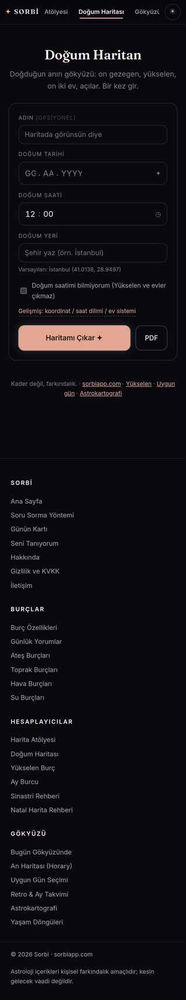

**Adres:** /dogum-haritasi-hesaplama  ·  **Başlık etiketi:** Ücretsiz Doğum Haritası Hesaplama — Sorbi Astroloji  ·  **H1:** Doğum Haritan

**Ne işe yarıyor**
Tarih, saat ve şehir girince çark çizip Güneş–Ay–Yükselen'i ve gezegen tablosunu veriyor; altında kısa bir Türkçe okuma var. Sitenin "herkes için" natal harita ekranı; daha ayrıntılı çalışma Atölye'de.

**Ekranda ne var**
- Üst nav + tema düğmesi — ortak parça
- Başlık + alt cümle — "Doğduğun anın gökyüzü: on gezegen, yükselen, on iki ev, açılar. Bir kez gir."
- Form kartı — Ad (opsiyonel), Doğum tarihi (GG.AA.YYYY segmentli), Doğum saati (12:00 ön dolu), Doğum yeri (şehir arama, "Varsayılan: İstanbul"), "Doğum saatimi bilmiyorum" kutusu, "Gelişmiş" açılır alanı (enlem, boylam, saat dilimi, ev sistemi Placidus/Whole Sign), düğmeler "Haritamı Çıkar ✦" ve "PDF"
- Sonuç (hesaptan sonra) — "ARŞİV NO. GG·AA·YY — ŞEHİR · PLACIDUS" başlık satırı; kağıt renkli SVG çark; Büyük Üçlü kartları (Güneş, Ay, Yükselen derece ile); "Ne anlama geliyor" başlıklı tek cümlelik lead + üç cümlelik özet; "Gezegen Konumları" katlanır tablo; "Haritanı Kaydet" katlanır kart (ad + e-posta)
- "Haritan burada bitmiyor." kilit kartı — "Raporun tamamını aç ✦" düğmesi; altında bulanık gösterilen 6 katlanır bölüm: Haritanın Üç Cümlesi, Baskın İmzalar, Denge (element·nitelik), Açı Defteri, Tek Gezegen Analizi, Teknik Ek (sabit yıldızlar)
- "Arkadaşına gönder" paylaş düğmesi
- Alt satır linkleri (Yükselen, Uygun gün, Astrokartografi) + ortak footer

**Kullanıcı ne yapıyor**
Tarih/saat/yer girer → "Haritamı Çıkar" → tarayıcıda hesap, çark ve bölümler dolar, sayfa sonuca kayar. Saat bilinmiyor kutusu işaretliyse saat 12:00 alınır, ev sistemi Whole Sign'a zorlanır, Yükselen/ev sütunları gizlenir. "Raporun tamamını aç" ödeme ya da giriş istemiyor: yalnızca bulanıklığı kaldırıyor (unlock() stil sıfırlıyor). "PDF" düğmesi window.print(). "Haritanı Kaydet" ad+e-posta alıp sorbi_profile'a yazıyor; sunucuya gitmiyor.

**Teknik**
- Motor/JS: astronomy.browser.min.js (gezegen boylamları); sorbi-chart.js (çark çizimi, `SorbiChart.adapt`+`draw`, tema 'paper'); sorbi-yer.js (şehir aramasını yakalar, 81 il yerel); sorbi-form.js (tarih/saat segmentli giriş); sorbi-profil.js (profil çipi + kayıtlı bilgiyle otomatik çalıştırma); sorbi-olcum.js. Hesap motoru **sayfanın içinde gömülü** (compute(), plac(), ascendant(), computeFixedStars()); sorbi-astro.js YÜKLENMİYOR. Çark için sorbi-chart gelmezse sayfanın kendi SVG çizimi devreye giriyor (yedek kod duruyor).
- Veri: localStorage `sorbi_birth` (yazar+okur), `sorbi_profile` (yazar+okur); `POST /api/track` {type:'chart_calculated'}; geocoding-api.open-meteo.com (sorbi-yer araya girer). AdSense etiketi var.
- Hesap: tarayıcıda. 10 gezegen, Yükselen, MC; ev: Placidus ya da Whole Sign; 5 majör açı (orb 8/8/7/7/5); 8 sabit yıldız (Algol, Aldebaran, Regulus, Spica, Antares, Sirius, Vega, Fomalhaut; presesyonsuz sabit RA/Dec, astronomy DefineStar ile); retro: +1 saat farkıyla işaret. Chiron, düğüm, Lilith yok.
- Ağırlık: 151 kelime (boş) / 751 (dolu) · 2.5 ekran boyu mobilde (dolu 5.4) · 3 düğme (dolu 15) · 8 form alanı

**Boş / dolu hal**
Boş: yalnız form. Dolu: form kayıtlı bilgiyle önden dolar, sorbi-profil.js "Haritamı Çıkar"a kendisi basar, sayfa açılışta çarkla gelir; üstte profil çipi VE ayrıca "Tekrar hoş geldin, ✦ haritan hazır." karşılama çubuğu görünür; "Haritanı Kaydet" bölümü "profilin hazır" olur.

**Kusur**
- Dolu halde iki ayrı kimlik şeridi üst üste (sorbi-profil çipi + sayfanın kendi welcomeBar'ı); karşılama çubuğunda ad boş kalıyor ("Tekrar hoş geldin, ✦ haritan hazır.").
- Sayfa sonundaki "kayıtlı bilgi varsa formu gizle, çip göster" bloğu `gen.closest('.form-card')` arıyor, form kartının sınıfı `.card` → blok hiç çalışmıyor (ölü kod); otomatik çalıştırmayı fiilen sorbi-profil.js yapıyor.
- "Raporun tamamını aç ✦" premium gibi sunuluyor ama tek tıkla bedava açılıyor; kilit görsel bir taklit.
- Kilitli alan bulanık gösterilirken ekranda 3 bulanık "üç cümle" satırı okunmaz halde duruyor (dolu ekran görüntüsü).
- "PDF" düğmesi PDF üretmiyor, tarayıcı yazdırma diyaloğu açıyor; kilitli bölümler yazdırmada da açılıyor (beforeprint tüm details'i açıyor) — kilit yazdırınca da anlamsızlaşıyor.
- Hesap motoru sayfaya gömülü kopya; aynı formüller sorbi-astro.js ve detayli-dogum-haritasi.html içinde de var (üç kopya).
- Varsayılan İstanbul koordinatı 41.0138/28.9497; yükselen ve ay sayfalarında 41.0082/28.9784 — aynı şehir, iki farklı nokta.
- `DETAY_URL='/'` tanımlı, kullanılmıyor.
- Sayfa `sorbi_birth`'e name/house/noTime yazıyor; yükselen ve ay sayfaları aynı anahtarı bu alanlar olmadan ezip yazıyor (bkz. o ekranlar).
- Ekran görüntüsünde nav yatay kayıyor ("Atölyesi" kesik) — ortak nav sorunu.

**Durum:** canlı ve işini yapıyor · **Çakışıyor:** detayli-dogum-haritasi.html (natal modu bunun üst kümesi: aynı girdi, aynı 10 gezegen, aynı Placidus/Whole Sign, daha fazla çıktı) ve rapor-araci.html (aynı gömülü motorun kopyası + aynı yorum taslak dizileri SUN_T/MOON_T/ASC_T).

---

---

## detayli-dogum-haritasi.html — Harita Atölyesi

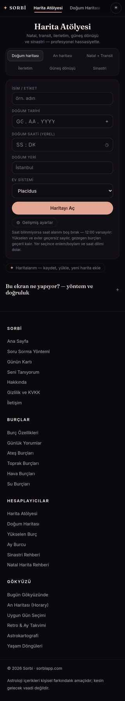

**Adres:** /detayli-dogum-haritasi  ·  **Başlık etiketi:** Detaylı Doğum Haritası — Profesyonel Harita Atölyesi | Sorbi  ·  **H1:** Harita Atölyesi

**Ne işe yarıyor**
Doğum bilgisini girip altı modda (natal, an haritası, transit, ilerletim, güneş dönüşü, sinastri) çift çark ve tam tablolar alıyorsun; 7 ev sistemi, dignite, sect, sabit yıldız, deklinasyon, 13 aylık transit takvimi. Sitenin "profesyonel" harita ekranı; yorum metni yok, veri var.

**Ekranda ne var**
- Üst nav + tema düğmesi — ortak
- Başlık "Harita Atölyesi" + alt cümle
- Mod sekmeleri (6 düğme) — Doğum haritası / An haritası / Natal + Transit / İlerletim / Güneş dönüşü / Sinastri
- Giriş kartı — İsim/etiket, Doğum tarihi, Doğum saati (yerel), Doğum yeri (arama), Ev sistemi (7 seçenek: Placidus, Whole Sign, Koch, Eşit, Porphyry, Regiomontanus, Campanus), "Haritayı Aç"; "Gelişmiş ayarlar" (enlem, boylam, saat dilimi, Ay düğümü gerçek/ortalama, açı orbu dar/standart/geniş, küçük açılar, kalıp noktaları klasik/genişletilmiş); moda göre ek satır (transit tarih-saat-dilim + "Şu an"; ilerletim hedef tarihi; dönüş yılı); saat yoksa uyarı notu
- İkinci kişi kartı (yalnız sinastri) — kayıtlı kişiden seç (kendi kayıtların + 12 ünlü), ya da ad/tarih/saat/yer/enlem/boylam/dilim
- "Haritalarım — kaydet, yükle, yeni harita ekle" katlanır kitaplık (sorbi_charts, dışa/içe aktar, sıfırla, ünlü kitaplığı)
- Sonuç (hesaptan sonra) — çark kutusu (SVG, kağıt/gece), açı çizgisi lejandı; düğme çubuğu: "✦ PDF Rapor", "Haritayı kaydet ✦", "Gece görünümü", "Dışa aktar · paylaş" (Kare PNG, Story 9:16, JSON, CSV, Bağlantıyı paylaş, Yazdır); meta satırı (mod, kişi, tarih, yer, ev sistemi, gündüz/gece, UTC, ARMC, ε)
- Sekmeler — Özet / Gezegenler·Evler / Açılar / Analiz / Uzman / Takvim. Özet: Büyük Üçlü kartları, etiketler (sekt ışığı, baskın element, baskın nitelik, ev sistemi), "Dikkat çekenler" kutusu (retro sayısı, kalıp) + "Yöntemi gör ✦" (→ /soru-sor), "En sıkı 5 açı", "Açı kalıpları" çipleri. Diğer sekmelerde: gezegen tablosu (°′″, hız, R), ev tablosu, açı listesi, açı ızgarası, dağılım, açı kalıpları, esansiyel dignite tablosu, sabit yıldızlar, sect/hayz tablosu, 13 aylık transit takvimi (Mars seçeneği), deklinasyon & antisya
- CTA kartı "Haritanda takıldığın bir yer mi var?" → /soru-sor
- Katlanır SEO metni "Bu ekran ne yapıyor? — yöntem ve doğruluk" (4 başlık)
- Ortak footer

**Kullanıcı ne yapıyor**
Mod seçer → bilgileri girer → "Haritayı Aç" → tarayıcıda hesap, çark ve altı sekme dolar. Ev sistemi/düğüm/orb/küçük açı/kalıp seçenekleri değişince harita anında yeniden hesaplanır. "PDF Rapor" gizli #rpt alanına 5 sayfalık rapor HTML'i (kapak+çark+büyük üçlü, gezegen+ev tabloları, açılar, sect, transit takvimi) basıp body'ye `rptmode` sınıfı ekleyip window.print() çağırır; afterprint'te geri alır. "Haritayı kaydet" sorbi_charts'a ekler. PNG/JSON/CSV tarayıcıda üretilip indirilir. "Bağlantıyı paylaş" URL parametreli link (?d=&t=&lat=&lon=&tz=&n=&p=&hs=&m=) verir; sayfa bu parametrelerle açılınca kendiliğinden hesaplar.

**Teknik**
- Motor/JS: astronomy.browser.min.js; sorbi-eph.js (Chiron, Lilith, ortalama düğüm, 82 sabit yıldız — `SORBI_EPH`, `SORBI_STARS`); sorbi-chart.js (çark, THEMES); sorbi-yer.js; sorbi-form.js; sorbi-profil.js; sorbi-olcum.js. Hesap motoru **sayfada gömülü** ve sorbi-astro.js ile satır satır aynı (buildHouses 7 sistem, trueNode, testAspect, vertexOf…); sorbi-astro.js ve sorbi-dignite.js YÜKLENMİYOR, dignite/sect fonksiyonları da gömülü (dignity(), sectReport()).
- Veri: localStorage `sorbi_birth` (yalnız okur), `sorbi_profile` (okur), `sorbi_charts` (yazar+okur), `sorbi_wheel_theme`; geocoding-api.open-meteo.com; URL parametreleri. API ucu yok. AdSense etiketi var.
- Hesap: tarayıcıda. 10 gezegen + Chiron + K/G düğüm + Lilith + Şans Noktası + Vertex; 7 ev sistemi; 10 açı türü (5 majör + 5 minör, ışık/yavaş orb katsayıları, yaklaşan/ayrılan); açı kalıpları (T-kare, Büyük Üçgen, Yod, stellium…); Ptolemaik dignite; sect/halb/hayz; 82 sabit yıldız (öz hareket + presesyon, orb 1°/40′); deklinasyon paralel/antisya; sekonder ilerletim; güneş dönüşü; 13 ay transit takvimi. Aralık 1850–2069; |enlem|≥66'da Placidus/Koch engelli.
- Ağırlık: 409 kelime (boş) / 692 (dolu) · 2.6 ekran boyu mobilde (dolu 4.7) · 10 düğme (dolu 26) · 15 form alanı

**Boş / dolu hal**
Boş: form + katlanır kitaplık, sonuç yok. Dolu: sorbi_birth ile form önden dolar, sorbi-profil.js "Haritayı Aç"a basar; sayfa açılışta çark + Özet sekmesiyle gelir; üstte profil çipi. Sinastri modunda "kayıtlı kişiden seç" listesi sorbi_charts'a bağlı, profil bilgisi oraya otomatik girmiyor.

**Kusur**
- Sekme şeridi mobilde taşıyor: altıncı sekme "Uz…" kesik, "Takvim" görünmüyor (dolu ekran görüntüsü).
- Özet'te "Dikkat çekenler: T-Kare kalıbı — 3 nokta" derken hemen altındaki "Açı kalıpları" çipleri "T-Kare, T-Kare, Yod, Yod" — aynı kalıp iki kez sayılıyor.
- Motor + dignite + sect kodu sayfaya gömülü; aynı kod sorbi-astro.js / sorbi-dignite.js olarak modül halinde de var ama bu sayfa onları çağırmıyor (iki kaynak, iki bakım noktası).
- "PDF Rapor" bir PDF dosyası üretmiyor; yazdırma diyaloğu. Rapora yorum metni girmiyor, yalnız tablolar.
- "Haritalarım" içinde 12 ünlü haritası (Amy Winehouse, Frida Kahlo, Einstein…) sabit veri olarak gömülü; sinastri ikinci kişi listesinde "Ünlüler" grubu olarak çıkıyor — ekranda adı geçmeyen bir işlev.
- Sayfa sorbi_birth'e yazmıyor: burada ilk kez hesap yapan biri diğer araçlarda "kayıtlı" olmuyor; kayıt yalnız sorbi_charts'a.
- JSON dışa aktarımı `sorbi:'detayli-dogum-haritasi'` etiketiyle tam ham veriyi veriyor; sayfada bunun ne için olduğu söylenmiyor.

**Durum:** canlı ve işini yapıyor · **Çakışıyor:** dogum-haritasi-hesaplama.html (natal modu onun tam üst kümesi), rapor-araci.html (PDF Rapor işlevi onun yaptığını daha eksiksiz yapıyor; yalnız serbest yorum kutusu yok), natal-harita.html (rehberin üst CTA'sı buraya `?m=natal` ile geliyor).

---

---

## natal-harita.html — Haritayı Okuma Rehberi

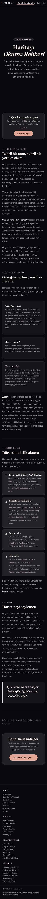

**Adres:** /natal-harita  ·  **Başlık etiketi:** Doğum Haritası Nasıl Okunur? Harita Okuma Rehberi — Sorbi  ·  **H1:** Haritayı Okuma Rehberi

**Ne işe yarıyor**
Doğum haritası nedir, saat neden önemli, gezegen–burç–ev nasıl okunur, açı ne demek, harita neyi söylemez — okunur bir rehber. Hesap yapmıyor; iki yerden hesaplayıcıya gönderiyor.

**Ekranda ne var**
- Üst nav + tema — ortak
- Hero — "✦ Doğum Haritası" rozeti, büyük başlık "Haritayı / Okuma Rehberi", alt paragraf; mobilde ilk ekranın tamamı bu
- CTA kartı "Doğum haritanı şimdi çıkar" — "Atölye'de aç ✦" → /detayli-dogum-haritasi?m=natal
- Bölüm "Doğum haritası nedir?" — Belirli bir anın, belirli bir yerden çizimi (4 paragraf; saat ve yer neden önemli)
- Bölüm "Üç katman ve açılar" — 3 kart: Gezegen — ne? / Burç — nasıl? / Ev — nerede?; Açılar paragrafı (orb)
- Bölüm "Nereden başlanır?" — Dört adımda ilk okuma (1 Büyük üçlü, 2 Yükselenin hükümdarı, 3 Yoğun evler, 4 Sıkı açılar) + Öğren linki
- Bölüm "Sınırlar" — Harita neyi söylemez (3 paragraf + alıntı kutusu)
- "Diğer rehberler" satırı — Sinastri, Soru haritası, Yaşam döngüleri
- Kapanış kartı "Kendi haritanda gör" → /dogum-haritasi-hesaplama
- Ortak footer

**Kullanıcı ne yapıyor**
girdi yok, okunur sayfa. İki CTA var: üstteki Atölye'ye, alttaki ücretsiz doğum haritasına.

**Teknik**
- Motor/JS: sorbi-profil.js (yalnız nav rozeti; form yok, çip basmaz); sorbi-olcum.js. Astronomi motoru yüklenmiyor.
- Veri: localStorage `sorbi_birth` (yalnız profil rozeti için okur). API yok. AdSense etiketi var. JSON-LD WebPage + BreadcrumbList.
- Hesap: statik metin.
- Ağırlık: 798 kelime · 8.7 ekran boyu mobilde · 1 düğme · 0 form alanı

**Boş / dolu hal**
fark yok (yalnız nav'daki "✦ Profilim" rozeti).

**Kusur**
- İki CTA iki farklı araca gidiyor: üst kart Atölye (detayli), alt kart ücretsiz harita (dogum-haritasi-hesaplama); rehber hangisinin "kendi haritan" olduğunu söylemiyor.
- Mobilde ilk ekran yalnız hero: 42 kelime, boşluk fazla; içerik ikinci ekrandan başlıyor.
- H1 ` ` ile kırıldığı için ham envanterde "HaritayıOkuma Rehberi" olarak okunuyor (metadata düzeyinde).
- Üst CTA kartı inline stilde "Fraunces" fontunu çağırıyor, sayfa o fontu yüklemiyor (Space Grotesk/Inter yüklü) — düşüş fontla görünüyor.
- Nav eşlemesi bu sayfayı "Gökyüzü Hesaplayıcıları"na bağlıyor; sayfa hesaplayıcı değil, rehber. Footer'da ise "Natal Harita Rehberi" adıyla "Hesaplayıcılar" sütununda.
- Adı "natal-harita" olan sayfa harita hesaplamıyor; adres, gruptaki hesaplayıcılarla aynı sözcüğü taşıyor.

**Durum:** canlı ve işini yapıyor · **Çakışıyor:** hesap açısından çakışmıyor (rehber); "Doğum haritası nedir / saat neden önemli" açıklamaları yukselen-burc-hesaplama, ay-burcu-hesaplama ve detayli-dogum-haritasi'nin SEO bloklarındaki aynı konuyu tekrar ediyor.

---

---

## yukselen-burc-hesaplama.html — Yükselen Burç Hesaplama

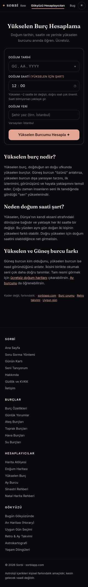

**Adres:** /yukselen-burc-hesaplama  ·  **Başlık etiketi:** Yükselen Burç Hesaplama — Ücretsiz ve Anında | Sorbi  ·  **H1:** Yükselen Burç Hesaplama

**Ne işe yarıyor**
Tarih, saat, şehir girince yalnız yükselen burcunu ve ona ait kısa bir metni gösteriyor. Tek çıktılı, hızlı bir SEO giriş sayfası; tam harita için ücretsiz doğum haritasına yönlendiriyor.

**Ekranda ne var**
- Üst nav + tema — ortak
- Başlık + alt cümle
- Form kartı — Doğum tarihi, Doğum saati "(yükselen için şart)" (12:00 ön dolu), not "Yükselen ~2 saatte bir değişir…", Doğum yeri (arama), "Varsayılan: İstanbul", "Yükselen Burcumu Hesapla ✦"
- Sonuç kartı (hesaptan sonra) — "YÜKSELEN BURCUN", burç glifi, "<Burç> Yükselen", 3 cümlelik metin, "Tüm haritanı çıkar (Güneş, Ay, evler) →" → /dogum-haritasi-hesaplama, "Sorunu sor ✦" → /soru-sor
- SEO metni — Yükselen burç nedir? / Neden doğum saati şart? / Yükselen ve Güneş burcu farkı
- Alt satır linkleri + ortak footer

**Kullanıcı ne yapıyor**
Tarih/saat/yer → "Yükselen Burcumu Hesapla" → tarayıcıda ARMC + yükselen formülü → burç adı + sabit metin. Girilen bilgi sorbi_birth'e yazılır (ve sorbi_profile.birth'e). /api/track'e {type:'yukselen_hesaplandi', meta:burç} gider.

**Teknik**
- Motor/JS: astronomy.browser.min.js (SiderealTime); sorbi-yer.js; sorbi-form.js; sorbi-profil.js; sorbi-olcum.js. Hesap sayfada gömülü 4 fonksiyon (tzOff, toUTC, obliq, ascf); sorbi-astro.js ve sorbi-chart.js yok.
- Veri: localStorage `sorbi_birth` (yazar+okur), `sorbi_profile` (okur, birth'i günceller); `POST /api/track`; open-meteo geocoding. AdSense. JSON-LD WebApplication + FAQPage (2 soru).
- Hesap: tarayıcıda; yalnız Yükselen derecesi → burç indeksi; ev sistemi yok, gezegen yok; 12 sabit metin (RTEXT).
- Ağırlık: 256 kelime (boş) / 282 (dolu) · 3.1 ekran boyu mobilde · 2 düğme (dolu 1) · 6 form alanı (dolu 0)

**Boş / dolu hal**
Boş: form. Dolu: form gizlenir, yerine "✦ Şehir · YYYY-AA-GG · SS:DK  değiştir" çipi gelir ve hesap kendiliğinden çalışır; sonuç kartı açılışta görünür. Üstte ayrıca sorbi-profil çipi.

**Kusur**
- Dolu halde iki çip alt alta: sorbi-profil çipi (GG.AA.YYYY) + sayfanın kendi çipi (YYYY-AA-GG) — aynı bilgi iki biçimde.
- sorbi_birth'i {date,time,place,lat,lon,tz} olarak ezip yazıyor; doğum haritası sayfasının yazdığı name/house/noTime alanları siliniyor.
- Varsayılan İstanbul 41.0082/28.9784 (doğum haritası sayfası 41.0138/28.9497).
- FAQ JSON-LD'de boş `"acceptedText":""` alanı (şemada yok).
- Yükselen için saat şart deniyor ama saat boşsa 12:00 ile hesaplıyor, uyarı vermiyor.
- Sonuç kartı alt CTA'sı iki satıra kırılıyor ("→" tek başına alt satırda) — dolu ekran görüntüsü.

**Durum:** canlı ve işini yapıyor · **Çakışıyor:** dogum-haritasi-hesaplama.html (Yükselen orada Büyük Üçlü kartında aynı formülle çıkıyor; bu sayfa onun tek satırlık alt kümesi, aynı ASC_T tonunda metin) ve yukselen-tahmini.html (saat bilinmeyen durum orada).

---

---

## ay-burcu-hesaplama.html — Ay Burcu Hesaplama

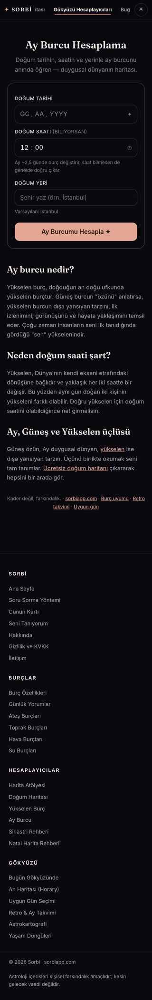

**Adres:** /ay-burcu-hesaplama  ·  **Başlık etiketi:** Ay Burcu Hesaplama — Ücretsiz & Anında | Sorbi  ·  **H1:** Ay Burcu Hesaplama

**Ne işe yarıyor**
Tarih (isteğe bağlı saat ve şehir) girince yalnız Ay burcunu ve kısa bir duygu metni gösteriyor. Yükselen sayfasının Ay için kopyası.

**Ekranda ne var**
- Üst nav + tema — ortak
- Başlık + alt cümle "…duygusal dünyanın haritası."
- Form kartı — Doğum tarihi, Doğum saati "(biliyorsan)", not "Ay ~2,5 günde burç değiştirir…", Doğum yeri, "Varsayılan: İstanbul", "Ay Burcumu Hesapla ✦"
- Sonuç kartı — "AY BURCUN", glif, "<Burç> Ay Burcu", 3 cümle, "Tüm haritanı çıkar…" ve "Sorunu sor ✦"
- SEO metni — "Ay burcu nedir?" / "Neden doğum saati şart?" / "Ay, Güneş ve Yükselen üçlüsü"
- Alt linkler + ortak footer

**Kullanıcı ne yapıyor**
Tarih (+saat, yer) → "Ay Burcumu Hesapla" → tarayıcıda GeoMoon boylamı → burç + metin; sorbi_birth yazılır; /api/track {type:'ay_burcu_hesaplandi'}.

**Teknik**
- Motor/JS: astronomy.browser.min.js (GeoMoon); sorbi-yer.js; sorbi-form.js; sorbi-profil.js; sorbi-olcum.js. Gömülü hesap; sorbi-astro.js yok.
- Veri: localStorage `sorbi_birth` (yazar+okur), `sorbi_profile`; `POST /api/track`; open-meteo. AdSense. JSON-LD WebApplication + FAQPage.
- Hesap: tarayıcıda; yalnız Ay boylamı → burç; 12 sabit metin.
- Ağırlık: 249 kelime (boş) / 273 (dolu) · 3 ekran boyu mobilde · 2 düğme (dolu 1) · 6 form alanı (dolu 0)

**Boş / dolu hal**
Yükselen sayfasıyla aynı: dolu halde form gizlenir, sayfa çipi + sorbi-profil çipi, otomatik hesap.

**Kusur**
- SEO bloğu yanlış sayfadan kopyalanmış: "Ay burcu nedir?" başlığının altında yükselen burcun tanımı yazıyor ("Yükselen burç, doğduğun an doğu ufkunda yükselen burçtur…"); "Neden doğum saati şart?" bölümü de yükseleni anlatıyor. Sayfanın kendi form notu ("saat bilmesen de genelde doğru çıkar") ile bu başlık birbirini yalanlıyor.
- Kullanılmayan `ascf` (yükselen) fonksiyonu kodda duruyor — kopya izi.
- Dolu halde iki çip (aynı yukselen sayfası).
- sorbi_birth'i dar biçimde ezip yazıyor (name/house/noTime kaybolur).
- Varsayılan koordinat 41.0082/28.9784 (doğum haritasıyla farklı).
- FAQ JSON-LD'de boş `acceptedText`.

**Durum:** canlı ama eksik (SEO metni yanlış) · **Çakışıyor:** yukselen-burc-hesaplama.html (aynı şablon, aynı JS iskeleti; tek satır fark: ascf yerine GeoMoon) ve dogum-haritasi-hesaplama.html (Ay orada Büyük Üçlü'de, MOON_T metinleriyle).

---

---

## yukselen-tahmini.html — Saatini bilmiyorsan (yükselen tahmini)

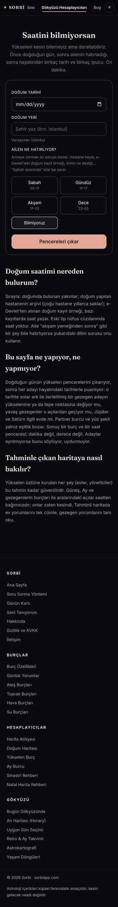

**Adres:** /yukselen-tahmini  ·  **Başlık etiketi:** Doğum Saatimi Bilmiyorum, Yükselenim Ne? Yükselen Tahmini | Sorbi  ·  **H1:** Saatini bilmiyorsan

**Ne işe yarıyor**
Doğum saatini bilmeyen için üç adımlı bir daraltma: o günün yükselen pencereleri, ailenin hatırladığı dilim, hayattan tarihli olaylar ve fiziksel ipuçları ile adayları puanlayıp bir burç + saat penceresi tahmini veriyor. Gruptaki tek "başka iş yapan" ekran: harita çizmiyor, saat tahmin ediyor.

**Ekranda ne var**
- Üst nav + tema — ortak
- Başlık + alt cümle ("On dakika.")
- Adım 1 kartı — Doğum tarihi (native tarih alanı), Doğum yeri (arama), "Ailen ne hatırlıyor?" 5 dilim düğmesi (Sabah 05–11, Gündüz 11–17, Akşam 17–23, Gece 23–05, Bilmiyoruz), "Pencereleri çıkar"
- Adım 2 kartı (gizli) — "O gün yükselen" özet cümlesi, pencere listesi (saat aralıkları, burç adı saklı), 7 olay sorusu (ay/yıl alanı + "olmadı/hatırlamıyorum" kutusu; 28 yaş altına gösterilmez), ipuçları: partner Güneş burcu (en çok 3), yüz şekli (4), yapı (4), boy (3), "Tahmin et", "Adaylar puanlanıyor…" bekleme yazısı
- Adım 3 kartı (gizli) — etiket (Tek pencere / Ayırt edilemedi / Tahmin · güven orta|zayıf), burç, saat bandı + pencere, açıklama, "Bu pencereyi ne işaret etti" gerekçeleri, ikinci aday, "Bu saatle devam et", "Baştan"
- SEO metni — Doğum saatimi nereden bulurum? / Bu sayfa ne yapıyor, ne yapmıyor? / Tahminle çıkan haritaya nasıl bakılır?
- Ortak footer

**Kullanıcı ne yapıyor**
Tarih + yer + dilim → "Pencereleri çıkar": gün 4 dakikada bir taranır (360 harita), yükselenin değiştiği anlar pencere olur, dilime düşenler aday. Tek aday varsa doğrudan sonuç. Aksi halde olay tarihleri + ipuçları → "Tahmin et": her 4 dakikalık aday için solar ark (ilerletilmiş Güneş arkı) ile olay anında gezegen–açısal nokta teması (0.75° orb), olay anındaki Satürn/Uranüs/Neptün/Plüton'un ASC/MC/DSC/IC'ye teması (1°), Satürn/Jüpiter'in ilgili evde olması, partner burcu (yükselen ya da karşıtı), fizyonomi puanları toplanır; pencereler en yüksek puanla sıralanır. Fark <1.2 ya da puan <2 ise "Ayırt edilemedi". "Bu saatle devam et" bandın ortasını saat olarak sorbi_birth'e yazar (tahmin:true, pencere:[..]) ve **ana sayfaya** yönlendirir.

**Teknik**
- Motor/JS: astronomy.browser.min.js; **sorbi-astro.js** (gruptaki tek sayfa ortak motoru gerçekten kullanıyor: `SorbiAstro.chart`, house:'W'); sorbi-yer.js; sorbi-profil.js; sorbi-olcum.js. sorbi-form.js YOK.
- Veri: localStorage `sorbi_birth` (okur: tarih/yer ön dolum; yazar: kabulde); open-meteo. API yok. AdSense. JSON-LD FAQPage (3) + WebApplication.
- Hesap: tarayıcıda; 360 Whole Sign harita + olay başına 2 harita; olay transit haritaları sabit 41°/29° İstanbul koordinatıyla (gezegen boylamları yer bağımsız olduğu için sonuç değişmez).
- Ağırlık: 302 kelime · 3.5 ekran boyu mobilde · 7 düğme · 2 form alanı

**Boş / dolu hal**
Dolu ölçümü yok (envdolu'da bu sayfa çekilmemiş). Koddan: sorbi_birth varsa tarih ve yer önden dolar, otomatik çalışma yok (sorbi-profil autorun #go/#goBtn/#gen arıyor, burada #go1). Kayıtlı bilgi saatli olsa bile sayfa "saatini bilmiyorsan" akışını aynen sunar.

**Kusur**
- Tarih alanı native `mm/dd/yyyy` olarak görünüyor (ekran görüntüsü): sorbi-form.js yüklenmediğinden gruptaki tek segmentsiz, İngilizce biçimli tarih girişi.
- "Bu saatle devam et" haritaya değil ana sayfaya ("/") gidiyor; tahmin sonucu görülen ekranla harita ekranı arasındaki bağ kopuk.
- sorbi_birth'e `tahmin:true` ve `pencere` yazılıyor; grubun diğer sayfaları bu bayrağı okumuyor — tahmini saat başka araçlarda kesin saat gibi kullanılıyor.
- Dolu profil için ekran görüntüsü/ölçüm yok.
- Yaş <28 ise olay soruları hiç çıkmıyor; yalnız ipuçlarıyla puanlama kalıyor, bu da çoğu zaman "Ayırt edilemedi" demek — sayfa bunu açıklıyor ama sonuç ekranından önce değil.

**Durum:** canlı ve işini yapıyor · **Çakışıyor:** çakışmıyor (tek başına iş yapıyor); yukselen-burc-hesaplama.html'nin "saati bilmiyorsan yaklaşık gir" cümlesi buraya link vermiyor; dogum-haritasi-hesaplama.html'nin "Doğum saatimi bilmiyorum" kutusu da bu sayfaya bağlanmıyor.

---

---

## rapor-araci.html — Rapor Atölyesi

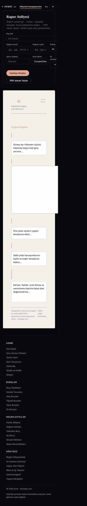

**Adres:** /rapor-araci (noindex, nofollow; canonical yok)  ·  **Başlık etiketi:** Sorbi · Rapor Atölyesi  ·  **H1:** yok (H2: Rapor Atölyesi)

**Ne işe yarıyor**
Bir kişinin doğum bilgisini girip çark + tablo + otomatik yorum taslağı olan bir "rapor sayfası" üretiyor; yorum kutuları elle düzenlenebiliyor ve tarayıcıdan yazdırılıyor. Ziyaretçi için değil, rapor hazırlayan kişi için bir iç araç; nav'a bağlı değil, aramaya kapalı.

**Ekranda ne var**
- Üst nav + tema — ortak (nav eşlemesi bu sayfayı "Gökyüzü Hesaplayıcıları" olarak işaretliyor)
- Kontrol kartı — "Rapor Atölyesi" (H2), açıklama "Doğum verisini gir → harita + aspektler otomatik. Yorum bölümlerini doldur → 'PDF olarak Yazdır'. Veriler hiçbir yere gönderilmez."; 4 sütunlu ızgara: Kişi Adı, Doğum tarihi, Doğum saati, Enlem (41.0082), Boylam (28.9784), Şehir (etiket), Saat dilimi (Europe/Istanbul), Ev sistemi (Placidus/Whole Sign), Rapor türü (Mini Natal Rapor / Detaylı Natal + Sinastri / Detaylı Okuma / Derin Okuma Özeti); "Haritayı Oluştur", "PDF olarak Yazdır"
- Rapor sayfası (kağıt renkli kutu, her zaman görünür) — üst: marka "Sorbi / Profesyonel Astroloji" + etiket "Natal Rapor" + rapor tarihi; kişi adı; doğum bilgisi satırı; bölüm "Temel Kimlik" (Güneş/Ay/Yükselen 3 kart + düzenlenebilir yorum kutusu); "Doğum Haritası" (320px SVG çark + gezegen/konum/ev tablosu); "Başlıca Açılar" (tablo + yorum kutusu); "Sabit Yıldızlar" (tablo + yorum kutusu); "Öne Çıkan Temalar & Öneriler" (yorum kutusu); dipnot "Hesaplama: astronomy-engine · ev matematiği Swiss Ephemeris'e karşı doğrulandı · Kader değil, farkındalık."
- Ortak footer

**Kullanıcı ne yapıyor**
Bilgi girer (şehir arama YOK; enlem/boylam elle) → "Haritayı Oluştur" → tarayıcıda hesap; ad, etiket, tarih, üçlü kartlar, tablo, çark, açılar, sabit yıldızlar dolar; dört yorum kutusuna otomatik taslak metin yazılır (draftIdentity: "Güneş X — …, Ay Y — …, Yükselen Z — …"; draftAspects: ilk 4 açı "akış ve doğal yetenek / gerilim ve gelişim alanı"; draftStars; draftThemes: 10 gezegen için "<gezegen> <burç> — <tema> <sıfat>."). Kutular `contenteditable`, elle düzenlenir. "PDF olarak Yazdır" = window.print(); @media print kontrol kartını gizler, kağıt kutusunu tam sayfa yapar. **PDF dosyası üretilmiyor**; tarayıcının "PDF olarak kaydet"ine bağlı. Kaydetme, paylaşma, sunucu yok.

**Teknik**
- Motor/JS: astronomy.browser.min.js; sorbi-chart.js (çark: `SC.adapt(ch,{house:'P'})` + `SC.draw(..., theme:'paper', title:'Sorbi')`); sorbi-form.js; sorbi-profil.js; sorbi-olcum.js. sorbi-yer.js YOK (şehir arama yok). Hesap motoru gömülü ve dogum-haritasi-hesaplama.html'deki compute/plac/ascendant/computeFixedStars'ın birebir kopyası; yorum dizileri SUN_T/MOON_T/ASC_T de aynı sayfadan kopya. Kendi 19 yıldızlık STARS listesi (doğum haritası sayfasında 8, Atölye'de 82).
- Veri: localStorage `sorbi_birth`/`sorbi_tema` yalnız tema ve profil çipi tarafından okunuyor; sayfanın kendi kodu localStorage'a dokunmuyor. API yok. AdSense yok. Google Fonts'tan Space Grotesk/Inter çağrılıyor ama CSS "Playfair Display" istiyor (yüklenmiyor).
- Hesap: tarayıcıda; 10 gezegen, ASC, MC; Placidus/Whole Sign; 5 majör açı; 19 sabit yıldız (orb 2°/1.5°); retro +1 saat farkıyla.
- Ağırlık: 209 kelime · 4 ekran boyu mobilde · 3 düğme · 12 form alanı · sayfa mobilde 1170px'e taşıyor (23 taşma; gruptaki en yüksek)

**Boş / dolu hal**
Dolu: yalnız üstte sorbi-profil çipi eklenir. Form ön dolmaz (sayfada ön dolum kodu yok), otomatik çalışma olmaz (sorbi-profil autorun #cDate boş olduğu için durur). Ölçümde 209→223 kelime farkı sadece çipten.

**Kusur**
- Mobilde okunmaz durumda (ekran görüntüsü): form ızgarası sabit 4 sütun, mobil kırılma noktası yok → "Enlem" kesik, "Boylam" ve "Rapor türü" ekran dışında, "Ev sistemi" seçimi boş kutu; rapor kutusunda 320px çark sütunu beyaz boş dikdörtgen olarak taşıyor; sayfa genişliği 1170px (viewport 390).
- Rapor kutusunda başlıklar görünmüyor: sayfa `:root` içinde `--ink:var(--bg)` diyor, ardından gelen ortak SORBI-TEMA bloğu `--ink`'i açık renge geri alıyor; `.rp-brand`, `.rp-title`, `.rp-sec h3` rengi krem-üstüne-krem oluyor. Ekranda marka "Sorbi" yerine yalnız "bi" (italik, terracotta olan kısım) görünüyor; "Temel Kimlik", "Doğum Haritası", "Başlıca Açılar" başlıkları ve kişi adı görünmez.
- Hesap öncesi rapor kutusu boş iskeletle her zaman ekranda; "Kişi Adı" ve "Doğum bilgileri" yer tutucuları da görünmez.
- Whole Sign seçilse bile çark `SC.adapt(ch,{house:'P'})` ile çiziliyor; tablo Whole Sign, çark Placidus etiketi.
- "Rapor türü" seçimi (4 tür) yalnız kapaktaki etiketi değiştiriyor; içerik dört türde de aynı. "Detaylı Natal + Sinastri" türünde sinastri yok.
- Yorum kutuları düzenlenebilir ama hiçbir yere kaydedilmiyor; sayfa yenilenince gidiyor.
- "PDF olarak Yazdır" adı PDF vaat ediyor, yazdırma diyaloğu açıyor.
- Şehir arama yok; enlem/boylam elle giriliyor (gruptaki tek sayfa).
- Playfair Display fontu CSS'te var, yüklenmiyor.
- Canonical yok, H1 yok, noindex — ama nav'da "Gökyüzü Hesaplayıcıları" altında işaretleniyor ve /araclar'a eşleniyor.
- Motor + yorum dizileri dogum-haritasi-hesaplama.html'den kopya; Atölye'nin "PDF Rapor" düğmesi bu sayfanın yaptığını daha eksiksiz (5 sayfa, 7 ev sistemi) yapıyor.

**Durum:** yarım (çalışıyor ama mobilde bozuk, başlıklar görünmez, kaydetmiyor) · **Çakışıyor:** detayli-dogum-haritasi.html (PDF Rapor) ve dogum-haritasi-hesaplama.html (aynı motor, aynı SUN_T/MOON_T/ASC_T taslak metinleri).

---

---

## Grup içi çakışma haritası
| Ekran | Motor | Ev sistemi | Noktalar | Çıktı | Kimin alt kümesi |
|---|---|---|---|---|---|
| dogum-haritasi-hesaplama | gömülü kopya | P / W | 10 gezegen + ASC/MC, 8 yıldız | çark + üçlü + okuma metni + kilitli bölümler | detayli natal modunun alt kümesi (yorum metni hariç) |
| detayli-dogum-haritasi | gömülü kopya (= sorbi-astro.js) | P/W/K/E/O/R/C | 10 + Chiron/düğüm/Lilith/PoF/Vertex, 82 yıldız | çift çark, 6 mod, tablolar, PDF-yazdır, PNG/JSON/CSV | üst küme |
| natal-harita | yok | — | — | rehber metni | hesap yok |
| yukselen-burc-hesaplama | gömülü (4 fonksiyon) | — | yalnız ASC | burç + metin | dogum-haritasi Büyük Üçlü'nün 1/3'ü |
| ay-burcu-hesaplama | gömülü (GeoMoon) | — | yalnız Ay | burç + metin | dogum-haritasi Büyük Üçlü'nün 1/3'ü; yukselen sayfasının kopyası |
| yukselen-tahmini | **sorbi-astro.js** | W | ASC/MC + 10 gezegen (360 harita) | saat penceresi tahmini | ayrı iş |
| rapor-araci | gömülü kopya (= dogum-haritasi) | P / W (çark hep P) | 10 + ASC/MC, 19 yıldız | yazdırılabilir rapor iskeleti + düzenlenebilir taslak | detayli "PDF Rapor"un kırık, iç kullanımlık öncülü |

- Aynı hesap kodu dört yerde: sorbi-astro.js (modül), detayli (gömülü aynısı), dogum-haritasi (eski kısa sürüm), rapor-araci (dogum-haritasi'nin kopyası). Ortak modülü yalnız yukselen-tahmini çağırıyor.
- sorbi_birth'i üç sayfa yazıyor (dogum-haritasi tam alanlarla; yukselen ve ay dar alanlarla, üstüne yazarak; yukselen-tahmini `tahmin:true` ile). detayli ve rapor-araci yazmıyor.
- SEO açıklama blokları: "yükselen nedir / saat neden şart" metni yukselen sayfasında, ay sayfasında (yanlış yerde) ve natal-harita'da tekrar.

---

# İlişki, soru ve kart

## burc-uyumu.html — Burç uyumu taraması

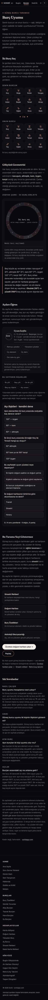

**Adres:** /burc-uyumu  ·  **Başlık etiketi:** Burç Uyumu Hesaplama — İki Burcun Aşk & İlişki Uyumu | Sorbi  ·  **H1:** Burç Uyumu

**Ne işe yarıyor**
İki Güneş burcu seçersin, sayfa aşk / iletişim / uzun vade için üç yüzde ve genel bir yüzde verir. Yüzdenin hangi sayıdan geldiğini satır satır gösterir, iki burcu zodyak çarkında birlikte çizer ve dört soruluk küçük bir sınavla açı kavramlarını öğretir. Doğum saati, tarih ya da ad istemez.

**Ekranda ne var**
- Üst blok — kicker "Güneş burcu taraması", H1, iki cümlelik tanıtım, hesabın açık aritmetikle gösterileceği notu.
- İki Burç Seç — "Senin burcun" ve "Onun burcu" başlıklı iki adet 12'lik burç ızgarası (glif + ad), arada "✦ ile ✦" ayracı, altında "İki burç seçildiğinde sonuç açılır." durum satırı ve JavaScript'siz alternatif olarak Burç Özellikleri bağlantısı.
- Tarama Sonucu — seçim yapılana kadar gizli (`.res{display:none}`). Açılınca büyük yüzde, etiket (İkiz Ruhlar, Doğal Akış, Tatlı Uyum, Zıt Çekim, Tutkulu Gerilim, Emek İster, Ayar Gerektiren), üç alt ölçü (Aşk & çekim, İletişim, Uzun vade), kısa okuma paragrafı.
- Hesap dökümü (`#uyNeden`) — seçimden sonra dolan, taban puan + element düzeltmesi + açı düzeltmesi satırları.
- Gökyüzü Geometrisi — açıklama paragrafı; "Zodyak çarkı · iki burç birlikte" canvas'ı (seçim yokken ortasında "İki burç seç / Henüz burç seçilmedi" yazıyor); gizli "Açı laboratuvarı" (iki kaydırıcılı açı gösterimi, seçimden sonra açılıyor); beş büyük açı ve orb listesi (kavuşum 0°/8°, altmışlık 60°/5°, kare 90°/7°, üçgen 120°/7°, karşıt 180°/8°).
- Ölçülmüş veri şeridi (`#uyVeri`, gizli) — nadirlik-veri.json'dan iki burcun gökyüzündeki payı; çift oranı iki paydan türetiliyor ve türetildiği söyleniyor.
- Açıları Öğren — "Uyum keşfin" ilerleme kartı (0/12 çift denendi, seviye, puan, seri, ortak site nişanları), "Bu sayfanın nişanları" (İlk çift, Beş çift, On iki çift, Beş açı ilişkisi, Açı sınavı), dört soruluk "Açı ilişkileri · kendini dene" sınavı (12 seçenek düğmesi), "0 / 4 soru yanıtlandı" sayacı.
- Bu Tarama Neyi Göstermez — sınır paragrafları; dört yol kartı (Sinastri Rehberi, Doğum Haritası, Burç Özellikleri, Astroloji Okuryazarlığı); "Ücretsiz doğum haritanı çıkar →" düğmesi ve "Paylaş" düğmesi; altında üç bağlantılı kapanış cümlesi.
- Sık Sorulanlar — dört soru (nasıl çalışır, sınırı, aynı burç, açılar); FAQPage JSON-LD ile aynı içerik.
- Dip not — çarkın efemeris kullanmadığı, 24.000 gök anından örneklenen veri dosyası, sınav/nişan kaydının yalnızca tarayıcıda tutulduğu.
- Ortak alt bilgi (footer).

**Kullanıcı ne yapıyor**
Girdi: iki burç ızgarasından birer seçim (dokunma, fare ya da klavye: ok tuşları, Enter/boşluk). Ayrı bir "hesapla" düğmesi yok; ikinci seçimle sonuç anında açılır. İşlem: `sorbi-uyum.js` içindeki `meta()`/`hesapla()` — burçlar arası uzaklık taban puanı (aynı burç 82, iki ara 86, üç ara 62, dört ara 92, beş ara 52, karşıt 78, yan yana 55), element uyumu ±, açı türü ±; sonuç 144 kombinasyonda yedi farklı değere düşüyor. Çıktı: genel yüzde, üç alt yüzde, etiket, okuma paragrafı, döküm satırları, çarkta iki burç vurgusu, açı laboratuvarında kaydırıcıların burç ortasına kurulması; 700 ms sonra oyun sayacı artıyor. "Paylaş": `navigator.share`, yoksa panoya "X ve Y için burç uyumu taraması %N çıktı. Sen de dene: https://sorbiapp.com/burc-uyumu" kopyalanıyor. Sınav düğmeleri doğru/yanlışı ve gerekçeyi (`data-neden`) anında gösteriyor.

**Teknik**
- Motor/JS: sorbi-astro.js (ortak açı tablosu), sorbi-gosteri.js (canvas çark ve açı gösterimi bileşenleri), sorbi-oyun.js (ilerleme/nişan/sınav kaydı), sorbi-uyum.js (puanlama, seçici, döküm, paylaş, çark tipi), sorbi-profil.js (nav rozeti), sorbi-olcum.js (sayfa görüntüleme sayacı).
- Veri: /nadirlik-veri.json (fetch ile, burç payları); localStorage `sorbi_oyun_v1` (ilerleme), `sorbi_tema`; `sorbi_birth` yalnız tema betiği tarafından okunuyor. API: `/api/track` — sorbi-olcum.js sayfa görüntülemesini (`type:'sayfa'`) ve sorbi-uyum.js her hesapta seçilen çifti (`type:'uyum_hesaplandi', meta:'Koç-Boğa'`) POST ediyor.
- Hesap: tamamen tarayıcıda; efemeris yok, saf burç geometrisi.
- Ağırlık: 961 kelime · 9,5 ekran boyu mobilde · 39 düğme · 0 form alanı

**Boş / dolu hal**
Fark yok. Kayıtlı doğum bilgisi "Senin burcun" seçimini ön-doldurmuyor; profil çipi de basılmıyor (sayfada tarih alanı ve `#go` düğmesi olmadığı için sorbi-profil.js sessiz kalıyor, yalnızca nav'a "✦ Profilim" rozeti ekliyor). Ölçümler iki halde birebir aynı.

**Kusur**
- Sayfa iki yerde "sunucuya hiçbir veri gönderilmiyor, çerez kullanılmıyor" diyor; oysa `sorbi-uyum.js` her hesapta seçilen burç çiftini `/api/track`'e gönderiyor (uyum_hesaplandi). Metin ile kod çelişiyor.
- "Paylaş" bağlantısı seçilen çifti taşımıyor (URL parametresi yok); bağlantıyı açan kişi boş sayfayı görüyor, paylaşımdaki yüzdeyi göremiyor.
- Tarama Sonucu, hesap dökümü, açı laboratuvarı ve veri şeridi seçim yapılana kadar tamamen gizli; ilk yüklemede sayfanın yarısı "boş vaat" olarak görünüyor (çarkın ortasında "Henüz burç seçilmedi").
- Mobilde nav aktif sekmeye ortalanınca soldaki "Doğum Haritası" bağlantısı "…arı" olarak kesik görünüyor (ortak nav davranışı, ekran görüntüsünde).
- Okuma paragrafları (READS) her çift için yalnızca uzaklık tipine bağlı; "Koç–Aslan" ile "Boğa–Başak" aynı metni farklı adlarla alıyor. Sayfa bunu "sayı geometriye aittir" diyerek kabul ediyor, gizlemiyor.

**Durum:** canlı ve işini yapıyor

---

---

## sinastri.html — Sinastri rehberi

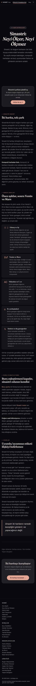

**Adres:** /sinastri  ·  **Başlık etiketi:** Sinastri Neyi Ölçer, Neyi Ölçmez? — Sorbi  ·  **H1:** Sinastri: Neyi Ölçer, Neyi Ölçmez

**Ne işe yarıyor**
Sinastrinin (iki doğum haritasını üst üste koyma) ne olduğunu, nereye bakıldığını, burç uyumundan ve kompozit haritadan farkını ve sınırlarını anlatan okunur rehber. Hesap yapmaz; hesabı Harita Atölyesi'nin sinastri kipine yönlendirir.

**Ekranda ne var**
- Hero — rozet "✦ İlişki Astrolojisi", iki satırlı H1, alt başlık. `min-height:100vh`, tam bir ekran boyu.
- Mod çağrısı kutusu — "Sinastri çarkını şimdi aç" + "Atölye'de aç ✦" düğmesi (`/detayli-dogum-haritasi?m=synastry`).
- Sinastri nedir? — "İki harita, tek çark": iç/dış halka, açı ve ev yerleşimi, kompozitten farkı.
- Nereye bakılır? — "Önce ışıklar, sonra Venüs ve Mars": beş kart (Güneş ve Ay, Venüs ve Mars, Yükselen ve 7. ev, Ev yerleşimleri, Satürn ve dış gezegenler) + orb notu (3° / 3–6°).
- Burç uyumuyla farkı — "Burç eşleştirmesi kapıdır, sinastri odanın kendisi": /burc-uyumu'na bağlantı, Atölye sinastri modu, saatsiz haritada nelerin düştüğü.
- Sınırlar — "Uyumlu/uyumsuz etiketi ilişkiyi belirlemez": dört paragraf, vurgulu alıntı ("Sinastri iki haritanın nerede kesiştiğini gösterir; ne yapacağınızı değil.").
- Diğer rehberler satırı — Haritayı okuma · Soru haritası · Yaşam döngüleri.
- Kapanış kutusu — "İki haritayı karşılaştır" + "İki haritayı karşılaştır →" düğmesi (`/detayli-dogum-haritasi`, kip parametresi yok).
- Ortak alt bilgi.

**Kullanıcı ne yapıyor**
Girdi yok, okunur sayfa. İki çıkış: Atölye sinastri kipi (üstte) ve Atölye ana sayfası (altta).

**Teknik**
- Motor/JS: sorbi-profil.js (nav rozeti), sorbi-olcum.js (sayfa sayacı). Hesap modülü yok.
- Veri: localStorage `sorbi_tema`, `sorbi_birth` (yalnız tema betiği). `/api/track` sayfa görüntülemesi.
- Hesap: statik metin.
- Ağırlık: 813 kelime · 8,7 ekran boyu mobilde · 1 düğme (tema) · 0 form alanı

**Boş / dolu hal**
Fark yok (dolu halde yalnızca nav'a "✦ Profilim" rozeti; ölçümler birebir aynı).

**Kusur**
- Hero `min-height:100vh`: mobilde başlık ve alt başlık ekranın üst üçte birinde, altı boş; içerik ikinci ekrana düşüyor (ekran görüntüsünde belirgin boşluk).
- Üst düğme `?m=synastry` ile Atölye'yi sinastri kipinde açıyor, alt düğme kipsiz `/detayli-dogum-haritasi`'ye gidiyor; aynı sayfada iki farklı hedef.
- Kapanış kutusunun CSS sınıfı `pricing-section` — fiyat içeriği yok, ad kalıntı.
- Mobil nav kesik bağlantı ("…itası") ortak nav davranışı.
- H1 ` ` ile bölündüğü için metadata'da "Sinastri:Neyi Ölçer" boşluksuz çıkıyor (görsel sorun değil, araç çıktısı).

**Durum:** canlı ve işini yapıyor

---

---

## horary.html — Horary rehberi

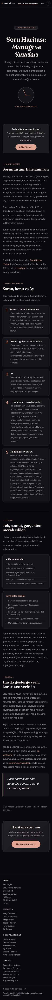

**Adres:** /horary  ·  **Başlık etiketi:** Soru Haritası (Horary): Mantığı ve Sınırları — Sorbi  ·  **H1:** Soru Haritası: Mantığı ve Sınırları

**Ne işe yarıyor**
Soru haritasının (horary) mantığını, Lilly geleneğindeki göstergeleri, iyi sorunun nasıl kurulduğunu ve yöntemin sınırlarını anlatan okunur rehber. Harita çizmez; çizim için Atölye'nin an haritası kipine ve /soru-sor'a yönlendirir.

**Ekranda ne var**
- Hero — rozet "✦ Soru Astrolojisi", iki satırlı H1, alt başlık, CSS ile çizilmiş saat süsü ve "SORUNUN SORULDUĞU AN" etiketi. `min-height:100vh`.
- Mod çağrısı kutusu — "An haritasını şimdi çıkar" + "Atölye'de aç ✦" (`/detayli-dogum-haritasi?m=moment`).
- Horary nedir? — "Sorunun anı, haritanın anı": üç paragraf; /soru-sor'u "Soru Sorma Yöntemi", Atölye'yi "an haritası" olarak tanıtan bağlantılı cümle.
- Temel kavramlar — "Soran, konu ve Ay": beş numaralı kart (Soran: 1. ev ve hükümdarı; Konu: ilgili ev; Ay; Uygulanan ve ayrılan açılar; Radikallik uyarıları).
- İyi soru — "Tek, somut, gerçekten merak edilen": "✓ Çalışan sorular" (5 örnek) ve "Zayıf kalan sorular" (5 örnek) listeleri, tekrar sormama ve konum notu.
- Sınırlar — "Harita gösterge verir, kararı sen verirsin": üç paragraf, an haritası ve yöntem sayfasına bağlantı, alıntı.
- Diğer rehberler satırı — Haritayı okuma · Sinastri · Yaşam döngüleri.
- Kapanış kutusu — "Haritana soru sor" + "Haritana soru sor →" (`/soru-sor`).
- Ortak alt bilgi.

**Kullanıcı ne yapıyor**
Girdi yok, okunur sayfa. Çıkışlar: Atölye an haritası kipi (üstte ve metin içinde), /soru-sor (metin içinde ve altta).

**Teknik**
- Motor/JS: sorbi-profil.js, sorbi-olcum.js. Hesap modülü yok.
- Veri: localStorage `sorbi_tema`, `sorbi_birth` (tema). `/api/track` sayfa görüntülemesi.
- Hesap: statik metin.
- Ağırlık: 822 kelime · 8,8 ekran boyu mobilde · 1 düğme (tema) · 0 form alanı

**Boş / dolu hal**
Fark yok (ölçümler ve ekran görüntüleri iki halde birebir aynı; dolu halde yalnızca nav rozeti).

**Kusur**
- Sayfa /soru-sor'u "yöntemin adımları" sayfası, Atölye'yi ise "anın haritası" olarak tanıtıyor; oysa /soru-sor kendi başına haritayı çiziyor ve okuma iskeletini üretiyor. Bu sayfadaki üst çağrı kullanıcıyı asıl horary aracının (soru-sor) yanından geçirip Atölye'ye götürüyor.
- Ad karmaşası: araclar.html bu sayfayı "Soru Haritası (Horary) — harita sorunun sorulduğu ana çizilir" diye listeliyor (sayfa çizmiyor), /soru-sor'u ise "Soru Sorma Yöntemi — haritana göre kişisel cevap" diye (o sayfa kişisel cevap vermediğini açıkça yazıyor). Footer'da bu sayfa "An Haritası (Horary)", soru-sor "Soru Sorma Yöntemi". Başlık etiketi ve H1 ise "Soru Haritası". Aynı sayfa dört farklı adla anılıyor.
- Hero `min-height:100vh`; içerik ikinci ekranda başlıyor.
- Kapanış kutusu sınıfı `pricing-section` (kalıntı ad).
- Mobil nav kesik bağlantı (ortak).

**Durum:** çakışıyor: soru-sor.html (ad ve rol örtüşmesi; içerik olarak canlı ve işini yapıyor)

---

---

## soru-sor.html — Soru haritası hesaplayıcı

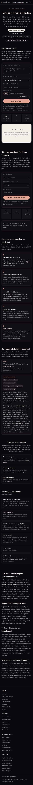

**Adres:** /soru-sor  ·  **Başlık etiketi:** Soru Haritası — Sorunun Anının Haritasını Çiz ve Oku | Sorbi  ·  **H1:** Sorunun Anının Haritası

**Ne işe yarıyor**
Şu anın (ya da girdiğin geçmiş bir anın) ve bulunduğun şehrin haritasını tarayıcıda çizer; seçtiğin konuya göre soranı, konuyu, aralarındaki açıyı, Ay'ın durumunu ve radikallik uyarılarını "hesap + geleneksel kural" çiftleri hâlinde listeler. Cevap üretmez, yapay zekâ yoktur; yorum kullanıcıya bırakılır. İsteğe bağlı ikinci katmanda an haritası kendi doğum haritanla karşılaştırılır.

**Ekranda ne var**
- Hero — kicker "Soru astrolojisi · Horary", H1, alt başlık, dört etiket (DOĞUM SAATİ GEREKMEZ, SORUNUN ANI + YERİ, EV BAŞLANGIÇLARI: SWISS EPHEMERIS TESTLİ, TARAYICINDA ASTRONOMY-ENGINE).
- 1 · Sorunun anını çiz — form kartı: "Sorun" (textarea, 240 karakter, isteğe bağlı), "Sorunun konusu → ev" (9 seçenekli select: 1, 2, 3, 4, 5, 7, 9, 10 varsayılan, 11. ev), "Şu an bulunduğun yer" (şehir arama, öneri listesi), "Sorunun anı" (Şimdi / Soruyu daha önce sordum çipleri + ev sistemi select: Regiomontanus, Whole Sign, Placidus), gizli tarih+saat satırı, "Anın haritasını çiz" düğmesi, ipucu metni. Altında an özeti kutusu, üç değer kutusu (Yükselen, Ay, Güneş), çark kutusu (boşken "Anın haritası burada belirecek" yer tutucu).
- Okuma iskeleti (`#skel`) — çizimden sonra: 0 Radikallik (Yükselen derecesi, Satürn 1./7. ev, Ay boşlukta, Via Combusta), 1 Soran (Yükselen hükümdarı, evi), 2 Konu (seçilen evin başlangıcı ve hükümdarı), 3 Göstergeler arası açı (tür, orb, uygulanan/ayrılan), 4 Ay (son ve sıradaki açı). Her kutuda "hesap" satırı + "KURAL" satırı. Sonunda "Tam okuma — dignite tablosu, alıcılık ve engelleme kontrolü, zamanlama penceresi — Sorbi uygulamasında hesaplanıyor" şeridi ve iskelet notu.
- 2 · İkinci katman: kendi haritanla karşılaştır — doğum tarihi, saati (isteğe bağlı), yeri alanları, "Doğum haritamla karşılaştır" düğmesi; Natal Güneş / Ay / Yükselen kutuları; karşılaştırma kartı (anın Yükseleni natalde hangi eve düşüyor, soran hükümdarı natalde hangi evde, en dar orblu beş temas listesi).
- 3 · Soru haritası okunurken ne yapılıyor? — beş adım kartı (Lilly, Christian Astrology 1647 kaynağı).
- 4 · Bir okuma iskeleti neye benziyor? — kurgusal örnek soru ("başvuru bu ay değerlendirilir mi?") ve iskeletin okunuşu.
- 5 · Buradan sonrası sende — "Sorbi kişiye özel okuma yapmaz, astroloji hizmeti satmaz" cümlesi; üç kart (Horary rehberi, An haritası kipi, Araçlar).
- 6 · Ne olduğu, ne olmadığı — altı sınır kartı (eğilim/kesinlik, kararı sen verirsin, tıbbi-hukuki-finansal değil, verin sende kalır, 18+, hesaplama açık).
- SEO bölümü — dört soru-cevap (FAQPage JSON-LD ile aynı).
- Ortak alt bilgi.

**Kullanıcı ne yapıyor**
Girdi: konum (zorunlu; listeden şehir seçilmezse "Önce bulunduğun yeri seç" uyarısı), isteğe bağlı soru metni, konu evi, an (şimdi / tarih+saat, 1850–2069), ev sistemi. Düğme: "Anın haritasını çiz". İşlem: ilk çizimde astronomy.browser.min.js + sorbi-chart.js + sorbi-astro.js tembel yükleniyor; `SorbiAstro.now()`/`chart()` ile harita, `within()` ile açılar, sayfa içi `fillSkeleton()` ile hükümdar/ev/orb/Ay durumu hesaplanıyor. Çıktı: çark (SorbiChart, `theme:'paper'`), an özeti, AC/Ay/Güneş, beş kutulu iskelet. Konu select'i değişince iskelet yeniden yazılıyor; "şimdi yeniden çiz" çipi var. İkinci katman: doğum tarihi + yer (saat isteğe bağlı) → `SorbiAstro.chart()` natal, `cross()` ile an–natal temaslar; saat yoksa evler/Yükselen okunmuyor ve bu yazılıyor.
Soru metni hiçbir hesaba girmiyor; yalnızca an özetinde tırnak içinde geri gösteriliyor.

**Teknik**
- Motor/JS: sorbi-yer.js (open-meteo geocoding isteğini yakalayıp 81 ili yerel tablodan Türkçe-duyarsız eşliyor), sorbi-form.js (tarih/saat alanlarını segmentli girişe çeviriyor), sorbi-profil.js (profil çipi + kayıtlı bilgiyle otomatik çalıştırma), sorbi-olcum.js (sayfa sayacı); tembel: astronomy.browser.min.js, sorbi-chart.js, sorbi-astro.js. sorbi-sohbet.js bu sayfada YÜKLENMİYOR (kaynakta hiç geçmiyor; o modül yalnız seni-taniyorum.html'de). sorbi-dignite.js de yüklenmiyor; `dig()` fonksiyonu kodda duruyor ama çağrılmıyor ("ücretsiz katmandan kaldırıldı" yorumu).
- Veri: dış istek yalnızca `https://geocoding-api.open-meteo.com/v1/search` (şehir arama, yazılan metin gönderiliyor); localStorage `sorbi_soru_yer` (son konum), `sorbi_birth` / `sorbi_profile` (doğum bilgisi, okunuyor ve ikinci katmanda yazılıyor), `sorbi_tema`. `/api/track` yalnız sorbi-olcum.js'ten sayfa görüntülemesi (`type:'sayfa'`); soru metni, konum, doğum bilgisi ya da harita sonucu hiçbir uca gönderilmiyor (sayfa içi betikte open-meteo dışında fetch/sendBeacon yok).
- Hesap: tamamen tarayıcıda (astronomy-engine).
- Ağırlık: 1.298 kelime · 10,6 ekran boyu mobilde (dolu halde 13) · 5 düğme (dolu 6) · 10 form alanı

**Boş / dolu hal**
Belirgin fark. Dolu halde: nav altına profil çipi ("Deniz · 14.06.1994 09:35 · İstanbul — bilgilerin her araçta hazır · değiştir · çıkış"); konum alanı doğum yerinden ön-dolu; sayfa açılır açılmaz an haritası, iskelet ve ikinci katman (natal Güneş/Ay/Yükselen + beş temas) otomatik çiziliyor (`loadSaved()` → `render()` + `renderNatal()`). Sayfa 10,6 ekrandan 13 ekrana çıkıyor. Boş halde çark kutusu yer tutucu, iskelet gizli, natal kutuları "—".

**Kusur**
- Kimlik karmaşası: bu sayfa asıl horary aracı, ama araclar.html onu "Soru Sorma Yöntemi — aklındaki soruya haritana göre kişisel cevap" diye tanıtıyor; sayfanın kendisi "Sorbi kişiye özel okuma yapmaz" diyor. horary.html ise bunu "yöntem sayfası" olarak anıyor ve çizimi Atölye'ye yönlendiriyor. Footer adı "Soru Sorma Yöntemi", başlık etiketi "Soru Haritası".
- Soru metni alanı hesaba hiç girmiyor (yalnızca özet satırında gösteriliyor); kullanıcıya "sorunu yaz" deniyor ama yazmanın sonuca etkisi yok — sayfa bunu "isteğe bağlı" etiketiyle kısmen söylüyor.
- Çark `theme:'paper'` sabit: gece temasında koyu sayfada beyaz kart olarak duruyor (ekran görüntüsünde), sorbi-chart.js'in "sayfanın tersi" kuralına uyuyor; gündüz temasında ise kural gereği gece çark olması gerekirken kağıt kalıyor (kaynaktan; görüntüyle doğrulanmadı).
- "Tam okuma … Sorbi uygulamasında hesaplanıyor" şeridi mobil uygulamaya işaret ediyor ama bağlantı ya da düğme yok.
- Konu seçeneklerinde 6, 8, 12. evler bilerek yok ("sağlık/hukuk/para" için), 5. ev var; bu seçim sayfada gerekçelendiriliyor.
- Ekran ölçümü 5 taşma öğesi bildiriyor; mobil nav kesik ("itası").
- FAQPage JSON-LD + görünür SEO bölümü + sınır kartları aynı içeriği üç kez tekrar ediyor; 1.298 kelimenin önemli kısmı bu tekrar.

**Durum:** canlı ve işini yapıyor (ad/rol düzeyinde horary.html ile çakışıyor)

---

---

## gunun-karti.html — Günün kartı

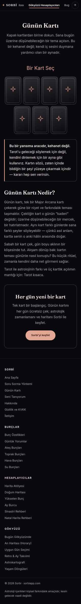

**Adres:** /gunun-karti  ·  **Başlık etiketi:** Günün Kartı — Ücretsiz Tarot Kartı Seç — Sorbi  ·  **H1:** Günün Kartı

**Ne işe yarıyor**
Yedi kapalı karttan birine dokunursun, bir Major Arcana kartı açılır: Roma rakamı, ad, anahtar cümle ve üç cümlelik yansıtıcı bir metin. Kart günde bir tanedir; aynı gün tekrar dokunulamaz, ertesi gün değişir.

**Ekranda ne var**
- Hero — H1, üç cümlelik alt yazı ("kehanet değil; ayna").
- "Bir Kart Seç" başlığı + deste: 7 kapalı kart (4+3 dizilim, her biri yıldız glifli SVG arka yüz).
- Sonuç kutusu (`#res`, gizli) — Roma rakamı, kart adı, anahtar cümle, okuma metni.
- "Bugünün kartı bu. Yarın değişir." notu (`#gunNot`, çekimden sonra görünür).
- Çerçeve notu — "Bu bir yansıma aracıdır, kehanet değil…" vurgulu kutu.
- "Günün Kartı Nedir?" — iki paragraf + /tarot bağlantısı.
- Çağrı kutusu — ikinci bir `<h1>` "Her gün yeni bir kart", metin, "Sorbi'yi keşfet" düğmesi (`/`).
- Ortak alt bilgi.

**Kullanıcı ne yapıyor**
Girdi: bir karta dokunma (div `onclick="drawCard(this)"`). İşlem: `__gunKarti(22)` — bugünün tarihi ("YYYY-A-G") FNV-1a benzeri hash'ten geçirilip 22'ye bölünüyor; sonuç dünkü kartla aynıysa bir sonraki karta kaydırılıyor. Yani kart RASTGELE DEĞİL, hangi karta dokunulduğundan da BAĞIMSIZ: aynı gün her ziyaretçi, hangi kartı seçerse seçsin aynı kartı görür. Çıktı: dokunulan kart çevriliyor, diğer altısı soluklaşıp kilitleniyor (`.kilitli`), sonuç kutusu açılıyor. localStorage `sorbi.gunkart`'a bugünün anahtarı yazılıyor; aynı gün tekrar gelindiğinde ilk kart kendiliğinden açık geliyor.

**Teknik**
- Motor/JS: sayfa içi betik (22 kartlık MAJOR dizisi, hash, çevirme); sorbi-profil.js, sorbi-olcum.js.
- Veri: localStorage `sorbi.gunkart` (tarih anahtarı), `sorbi_tema`; `/api/track` sayfa görüntülemesi. Kart seçimi sunucuya gitmiyor.
- Hesap: tarayıcıda, deterministik (tarihe bağlı).
- Ağırlık: 277 kelime · 3,4 ekran boyu mobilde · 2 düğme · 0 form alanı

**Boş / dolu hal**
Fark yok (ölçümler ve görüntüler birebir; dolu halde yalnız nav rozeti). Kart doğum bilgisine bakmıyor.

**Kusur**
- "Bir kart seç" kurgusu bir seçim değil: yedi kart aynı kartı açıyor ve kart tarihe bağlı. Sayfa bunu söylemiyor; "Kapalı kartlardan birine dokun… sana … açılsın" ifadesi kişisel bir çekim izlenimi veriyor.
- Kartlar `div onclick`; klavyeyle erişilemiyor, `role`/`tabindex` yok (ölçüm 2 düğme sayıyor: tema + "Sorbi'yi keşfet").
- Sayfada iki `<h1>` var (Günün Kartı, Her gün yeni bir kart).
- Kart yerel saatle hesaplanıyor; gece yarısı farklı saat dilimlerindeki ziyaretçiler farklı "günün kartı"nı görebilir (kaynaktan; olağan kullanımda fark edilmez).
- Ölçüm 5 taşma öğesi bildiriyor; mobil nav kesik ("itası").

**Durum:** canlı ve işini yapıyor

---

---

## tarot.html — Tarot rehberi

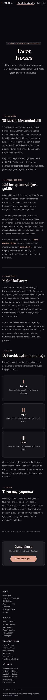

**Adres:** /tarot  ·  **Başlık etiketi:** Tarot Nedir? Astrolojiden Farkı ve Günlük Kart — Sorbi  ·  **H1:** Tarot Kısaca

**Ne işe yarıyor**
Tarotun ne olduğunu (78 kart, büyük/küçük arkana), astrolojiden farkını ("biri hesaplanır, diğeri çekilir"), günlük kartın makul kullanımını, üç kartlık açılımın mantığını ve sınırlarını anlatan okunur sayfa. Kart çekmez; çekim için /gunun-karti'ye gönderir.

**Ekranda ne var**
- Hero — rozet "✦ Tarot ve astroloji ayrı şeyler", iki satırlı H1, alt yazı; üç kart animasyonu (`.tarot-visual`, mobilde `display:none`). `min-height:100vh`.
- Tarot nedir? — "78 kartlık bir sembol dili": iki paragraf (Rider-Waite 1909).
- Astrolojiden farkı — "Biri hesaplanır, diğeri çekilir": Atölye, Bugün ve Günün Kartı bağlantılı ayrım paragrafı.
- Günlük kart — "Makul kullanım": sabah çek / akşam karşılaştır ritüeli, tekrar çekmeme.
- Üç kart — "Üç kartlık açılımın mantığı": I Durum, II Engel, III Öneri kartları; geçmiş–şimdi–gelecek notu.
- Sınırlar — "Tarot neyi yapmaz?": tek paragraf.
- Diğer rehberler — Haritayı okuma · Soru haritası.
- Kapanış kutusu — "Günün kartı / Her gün bir kart, bir soru. Ücretsiz." + "Günün kartını çek →" (`/gunun-karti`).
- Ortak alt bilgi.

**Kullanıcı ne yapıyor**
Girdi yok, okunur sayfa. Tek çıkış düğmesi /gunun-karti.

**Teknik**
- Motor/JS: sorbi-profil.js, sorbi-olcum.js. Kart ya da hesap modülü yok; sorbi-kart.js (paylaşım kartı üreteci) bu sayfayla ilgisiz, yalnız nadirlik ve seni-taniyorum'da yükleniyor.
- Veri: localStorage `sorbi_tema`, `sorbi_birth` (tema). `/api/track` sayfa görüntülemesi.
- Hesap: statik metin.
- Ağırlık: 531 kelime · 6,8 ekran boyu mobilde · 1 düğme (tema) · 0 form alanı

**Boş / dolu hal**
Fark yok. (envdolu klasöründe tarot için görüntü/ölçüm alınmamış; kaynakta doğum bilgisine bağlı bir dal yok.)

**Kusur**
- Hero `min-height:100vh` ve mobilde kart görseli gizli: ilk ekranın yarıdan fazlası boş (ekran görüntüsünde belirgin).
- Sayfa "günün kartı bir hesap değil, kart rastgele çekilir" diyor; gunun-karti.html'de kart rastgele değil, tarihe bağlı deterministik. Rehberin anlattığı ile aracın yaptığı örtüşmüyor.
- Üç kartlık açılım anlatılıyor ama sitede üç kart çeken araç yok; yalnızca tek kartlı günün kartı var.
- Kapanış kutusu sınıfı `pricing-section` (kalıntı ad).
- H1 ` ` ile bölündüğü için metadata'da "TarotKısaca" çıkıyor (araç çıktısı).
- Mobil nav kesik bağlantı (ortak).

**Durum:** canlı ve işini yapıyor

---

# Zaman, yer ve içerik

## retro-ay-takvimi.html — Retro Takvimi & Ay Boşlukta

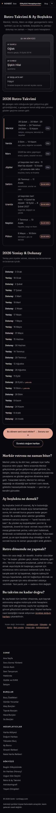

**Adres:** /retro-ay-takvimi  ·  **Başlık etiketi:** Retro Takvimi 2026 — Merkür Retro, Ay Boşlukta | Sorbi  ·  **H1:** Retro Takvimi & Ay Boşlukta

**Ne işe yarıyor**
Şu an Ay'ın hangi burçta olduğunu, evresini ve boşlukta olup olmadığını gösterir. Altında içinde bulunulan yılın sekiz gezegenlik retro takvimi ve yeniay-dolunay listesi vardır. Hepsi sayfa açılınca tarayıcıda hesaplanır.

**Ekranda ne var**
- Üst: H1 + tek cümlelik alt metin.
- "ŞU AN GÖKYÜZÜ" kartı — üç kutu: Ay Burcu (sonraki burca geçiş saatiyle), Ay Evresi (ad + anahtar kelime), Ay Boşlukta mı? (Evet/Hayır + bitiş ya da "Sıradaki boşluk bir sonraki açıdan sonra").
- "2026 Retro Takvimi" — Merkür'den Plüton'a 8 satır; her satırda tarih aralıkları, gezegenin temsil ettiği alan ve "Şu an retro"/"Düz" çipi. Merkür satırı sol kenar çizgisiyle vurgulu.
- "2026 Yeniay & Dolunay" — yılın tüm yeniay/dolunay tarihleri iki sütun; sıradaki ikisinde "↙ yakında" etiketi.
- CTA: "Bu dönem seni nasıl etkiler? → Sorunu sor" (/soru-sor) + "Ücretsiz doğum haritan" (/dogum-haritasi-hesaplama).
- SEO metni: 4 H2 — Merkür retrosu ne zaman biter? / Ay boşlukta ne demek? / Retro dönemde ne yapmalı? / Bu takvim ne kadar doğru?
- Alt link satırı + ortak footer.

**Kullanıcı ne yapıyor**
Girdi yok, okunur sayfa. Sayfa açılınca astronomy-engine yüklenir, "Gökyüzü okunuyor…" yer tutucuları hesaplanan değerlerle dolar. Kullanıcı yalnızca okur; yıl değiştirme, tarih seçme, gezegen filtreleme yok.

**Teknik**
- Motor/JS: astronomy.browser.min.js (efemeris); sorbi-profil.js (profil rozeti); sorbi-olcum.js (sayfa görüntüleme sayacı). sorbi-eph/astro/yer/yildiz yüklenmiyor; tüm astroloji kodu sayfanın içinde satır içi.
- Veri: veri dosyası yok. localStorage: sorbi_birth, sorbi_tema (yalnız okunur). API: /api/track'e "retro_takvim_goruldu" olayı (meta: şu an retro olan gezegenler).
- Hesap: tamamen tarayıcıda, gerçek efemerisle. Kanıt: kaynaktaki `vel()` fonksiyonu gezegenin ±12 saatlik ekliptik boylam farkından hızı bulur, `station()` 26 adımlı ikiye bölmeyle durak anını çözer; retro tablosu `year=new Date(now).getFullYear()` ile içinde bulunulan yılı, yıl başından 210 gün önce ve yıl sonundan 70 gün sonraya kadar gün gün tarar. Ay evreleri `A.SearchMoonQuarter`/`NextMoonQuarter` ile. Ay boşlukta: son 4 gün içinde Güneş–Satürn arası 6 gezegene 0/60/90/120/180/240/270/300° açıların tam anı aranır, Ay'ın sonraki burca giriş anıyla karşılaştırılır. Elle yazılmış tek bir tarih yok. Veri "hangi tarihe kadar" sorusu: sabit bir sınır yok; her açılışta cihaz saatine göre o yılın takvimi üretilir (2027'de açılınca 2027). Ancak yalnız içinde bulunulan yıl gösterilir, ileri/geri yıl yok.
- Ağırlık: 686 kelime · 6,6 ekran boyu mobilde · 1 düğme · 0 form alanı

**Boş / dolu hal**
Fark yok. Doğum bilgisi kayıtlıyken yalnız nav'daki "✦ Profilim" rozeti değişir; sayfa içeriği ve ölçüm (686 kelime) birebir aynı. Sayfa kişisel harita kullanmıyor.

**Kusur**
- Ay boşlukta "Hayır" iken alt satır "Sıradaki boşluk bir sonraki açıdan sonra" yazıyor — bilgi vermeyen yer tutucu cümle; sonraki boşluk penceresinin saati hesaplanabilecekken yazılmıyor.
- `voidOfCourse` içinde boş bir for döngüsü (72 saatlik tarama, gövdesi yorum) çalışıyor; sonuç üretmiyor, sadece işlemci harcıyor.
- Ay boşlukta hesabına Uranüs/Neptün/Plüton dahil değil (klasik gelenekle uyumlu ama sayfada belirtilmiyor).
- Başlık etiketi "Retro Takvimi 2026" sabit; sayfa 2027'de de bu title'ı taşır, içerik ise 2027'yi gösterir.
- Retro aralıklarında saat yok, yalnız gün; tarih formatı `Intl` başarısız olursa ISO'ya düşüyor (küçük olasılık).
- Ekran görüntüsünde mobil nav yatay kaydırma nedeniyle ilk sekme "itası" olarak kırpık görünüyor (ortak nav sorunu, bu sayfaya özgü değil).
- Google AdSense scripti yüklü, reklam bloğu yok.

**Durum:** canlı ve işini yapıyor

---

---

## uygun-gun-secimi.html — Uygun Gün Seçimi

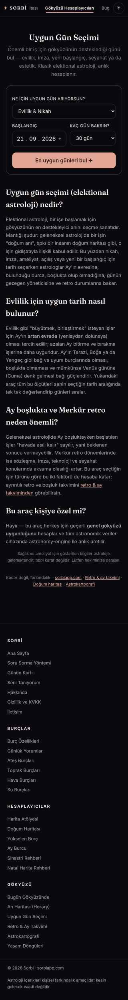

**Adres:** /uygun-gun-secimi  ·  **Başlık etiketi:** Uygun Gün Seçimi — Evlilik, İmza, Başlangıç | Sorbi  ·  **H1:** Uygun Gün Seçimi

**Ne işe yarıyor**
Ziyaretçi "ne için" (evlilik, imza, açılış…) ve bir tarih aralığı seçer; sayfa her günü Ay evresi, Ay burcu, haftanın günü, Merkür retro ve Ay boşlukta ölçütleriyle puanlayıp en iyi üç günü ve tüm günlerin listesini verir.

**Ekranda ne var**
- Üst: H1 + alt metin ("Klasik elektional astroloji, anlık hesaplanır").
- Form kartı: "Ne için uygun gün arıyorsun?" açılır listesi (12 seçenek), Başlangıç tarihi (segmentli GG.AA.YYYY), "Kaç gün baksın?" (14/30/60), "En uygun günleri bul ✦" düğmesi.
- Sonuç bölümü (hesaptan sonra görünür): "En uygun 3 gün" kartları (puan rozeti, tarih, gerekçe listesi) → Ay boşlukta pencereleri notu (ilk 4 pencere) → "Tüm günler" listesi (puan pili yeşil/sarı/kırmızı, evre, Ay burcu, Uygun/Orta/Kaçın) → "Bu tarih senin için de doğru mu?" satış kutusu (doğum haritasına link).
- SEO metni: 4 H2 — elektional astroloji nedir / evlilik tarihi nasıl bulunur / Ay boşlukta ve Merkür retro neden önemli / Bu araç kişiye özel mi (cevap: hayır).
- Tıbbi sorumluluk reddi, alt link satırı, ortak footer.

**Kullanıcı ne yapıyor**
Niyet seç + başlangıç tarihi (varsayılan bugün) + aralık → "En uygun günleri bul" → tarayıcıda her gün için İstanbul öğle saatinde puan hesaplanır → sonuç bölümü açılır ve oraya kaydırılır. Sonuç metnindeki gerekçeler şablon cümlelerdir.

**Teknik**
- Motor/JS: astronomy.browser.min.js; sorbi-form.js (tarih girişini segmentli yapar, bu yüzden ölçümde 5 alan sayılıyor: 2 açılır liste + 3 tarih segmenti); sorbi-profil.js; sorbi-olcum.js.
- Veri: veri dosyası yok. localStorage: sorbi_profile (yalnız "Tekrar hoş geldin" bandı için okunur), sorbi_tema. API: /api/track "uygun_gun_hesaplandi" (meta: niyet id).
- Hesap: tarayıcıda. Uygulanan kurallar (`INTENTS` tablosu + `scoreDay`): taban 50 puan; (1) Ay evresi yönü — niyet "artan" istiyorsa Ay artan evrede +15, değilse −12; "azalan" niyetlerde tersi; seyahat için yön serbest. (2) Ay burcu — niyete uygun burç listesindeyse +16, kaçınılacak listedeyse −15 (ör. evlilik: Terazi/Boğa/Yengeç/Balık uygun, Akrep/Koç kaçın). (3) Haftanın günü yöneticisi — uygun günse +12 (evlilik: Cuma/Perşembe/Pazartesi); ameliyat için Salı −12. (4) Merkür retro — yalnız `mercury:true` niyetlerde (imza, görüşme, açılış, para, seyahat) −24. (5) Ay boşlukta — 10:00–18:00 aralığına giren boşluk penceresi varsa −13. Puan 3–98 arasına sıkıştırılır; ≥68 Uygun, ≥48 Orta, altı Kaçın. Klasik seçim astrolojisinin diğer engelleri (Ay'ın Akrep'te düşükte/ Oğlak'ta zararda olması genel kural olarak, Venüs/Mars retro, Ay–Satürn/Mars sert açıları, yanık gezegen, yükselen/saat seçimi, tutulma günleri) uygulanmıyor. SSS'deki "Venüs'ün güçlü olduğu gün" ölçütü kodda yok.
- Ağırlık: 372 kelime (boş) / 390 (dolu) · 3,6–3,7 ekran boyu mobilde · 2 düğme · 5 form alanı

**Boş / dolu hal**
Dolu halde iki ek bant çıkıyor: (a) sayfanın kendi scriptinin body'nin en başına, yapışkan nav'ın ÜSTÜNE bastığı "Tekrar hoş geldin, ✦" kutusu — ekran görüntüsünde isim boş (profilde name yok, e-posta yok); (b) sorbi-profil.js'in nav altına bastığı "✦ Deniz · 14.06.1994 09:35 · İstanbul — bilgilerin her araçta hazır · değiştir · çıkış" çipi. Hesap kendisi doğum bilgisini hiç kullanmıyor; sonuçlar iki halde de aynı.

**Kusur**
- Dolu halde "Tekrar hoş geldin, " bandı boş isimle basılıyor ve yapışkan nav'ın üstünde durduğu için nav aşağı kayıyor; renkleri sabit koyu tema değerleri (#A5A3AE/#F2EFE9), gündüz temasında uyumsuz.
- Aynı bilgi için iki farklı profil bandı üst üste (sayfa scripti + sorbi-profil.js).
- Yalnız İstanbul öğle saati (12:00 TR) örneklenir; günün sabahı/akşamı farklı Ay burcu olabilir, kullanıcıya saat seçtirilmez.
- Puan gerekçeleri şablon; "Ay X burcunda." gibi nötr satırlar da gerekçe listesine giriyor.
- Motor yüklenmeden düğmeye basılırsa `alert()` ile uyarı (tarayıcı alert kutusu).
- "En uygun 3 gün" düşük puanlı günlerden de seçilebilir (sıralama üstten 3 alır, eşik yok); 30 günün hepsi "Kaçın" olsa da 3 gün önerilir.
- "Ameliyat & Sağlık" seçeneği var, altta tıbbi sorumluluk reddi tek satır.
- Sonuçların paylaşım/kaydetme yolu yok.

**Durum:** canlı ve işini yapıyor

---

---

## astrokartografi.html — Astrokartografi Haritası

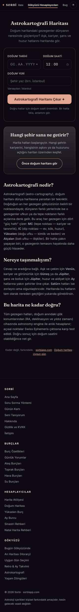

**Adres:** /astrokartografi  ·  **Başlık etiketi:** Astrokartografi — Ücretsiz Gezegen Hatları Haritası | Sorbi  ·  **H1:** Astrokartografi Haritası

**Ne işe yarıyor**
Doğum tarihi, saati ve yerine göre 10 gezegenin MC/IC/Yükselen/Alçalan hatlarını dünya haritasının üstüne çizer. Bir hatta tıklanınca o hattın kısa anlamı açılır.

**Ekranda ne var**
- Üst: H1 + alt metin.
- Form kartı: Doğum tarihi (segmentli), Doğum saati (varsayılan 12:00), Doğum yeri (şehir arama, öneri listesi), "Varsayılan: İstanbul" notu, "Astrokartografi Haritamı Çıkar ✦" düğmesi, ipucu satırı.
- Harita alanı (hesaptan sonra görünür): Leaflet haritası, koyu CARTO altlığı, +/− yakınlaştırma, gezegen hatları (düz = MC/ASC, kesik = IC/DSC), tıklanınca popup.
- Lejant: 10 gezegen çipi (tıklayınca o gezegenin hatları gizlenir/gösterilir) + "Düz çizgi = … Kesik çizgi = …" açıklaması.
- Satış kutusu "Hangi şehir sana ne getirir?" → "Önce doğum haritanı gör".
- SEO metni: 3 H2 — Astrokartografi nedir? / Nereye taşınmalıyım? / Bu harita ne kadar doğru?
- Alt link satırı, ortak footer.

**Kullanıcı ne yapıyor**
Tarih + saat + şehir (open-meteo geocoding; sorbi-yer.js 81 ili yerelden Türkçe-duyarsız eşleştirir) → düğme → tarayıcıda hatlar hesaplanır → harita ve lejant açılır, harita alanına kaydırılır. Girilen doğum bilgisi sorbi_birth/sorbi_profile'a kaydedilir. Hat tıklama → popup; lejant çipi → katman aç/kapa.

**Teknik**
- Motor/JS: astronomy.browser.min.js (efemeris); Leaflet 1.9.4 (cdnjs) harita; sorbi-yer.js (geocoding isteğini yakalayıp TR illerini yerelden verir); sorbi-form.js; sorbi-profil.js; sorbi-olcum.js. Harita altlığı: `basemaps.cartocdn.com/dark_all` karo servisi.
- Veri: veri dosyası yok. Dış servisler: open-meteo geocoding API, CARTO karo sunucusu, cdnjs. localStorage: sorbi_birth, sorbi_profile (okur ve yazar), sorbi_tema. API: /api/track "astrokartografi_cikarildi" (meta: şehir adı).
- Hesap: tarayıcıda. `acgLines()` her gezegen için RA/deklinasyon (EQD) ve Greenwich yıldız zamanı alır; MC boylamı = RA − GAST, IC = +180°; ASC/DSC hatları −78°…+78° enlemde 1,2° adımla `H0=acos(−tanφ·tanδ)` ile çözülür. Hatlar antimeridyende parçalanıyor. Ev sistemi/ayrıntı yok, yalnız dört köşe hattı. Paran hatları yok.
- Ağırlık: 360 kelime (boş, envanter-ham) / 367 (dolu) · 4 ekran boyu mobilde (dolu) · 3 düğme · 0 form alanı (dolu halde form gizli; boş halde 3 giriş + tarih segmentleri). Boş hal için env/olcum.jsonl kaydı yok.

**Boş / dolu hal**
Boş: form açık, harita gizli, yalnız form + satış kutusu + metin. Dolu: sorbi-profil.js çipi nav altında; sayfanın kendi scripti formu gizleyip yerine "✦ İstanbul · 1994-06-14 · 09:35 · değiştir" çipi basıyor ve motor+Leaflet yüklenince düğmeye otomatik basıyor; harita ve lejant açık geliyor. Aynı doğum bilgisi ekranda iki farklı formatta (14.06.1994 ve 1994-06-14) iki çipte görünüyor.

**Kusur**
- Harita altlığı üstünde her karoda büyük "API KEY REQUIRED — carto.com/basemaps/apikey" filigranı var (envdolu ekran görüntüsünde net). CARTO ücretsiz karo servisi anahtar istiyor; altlık teknik olarak yükleniyor ama okunmuyor. Harita çiziyor, sonuç kullanılamaz görünümde.
- 10 gezegen için yalnız 3 renk (şeftali #E3A692, gri #A5A3AE, krem #F2EFE9): Güneş=Venüs=Mars, Ay=Merkür=Uranüs=Neptün=Plüton, Jüpiter=Satürn aynı renk. Lejant çipleri de aynı; hangi hattın hangi gezegen olduğu tıklamadan anlaşılmıyor.
- Renkler ve popup renkleri sabit hex; gündüz temasında popup metni `#0B0810` ve harita altlığı hep koyu.
- Şehir arama sonuçları yalnız 6 kayıt, mahalle/ilçe düzeyi zayıf; open-meteo erişilemezse sessizce hiçbir şey olmuyor (catch boş).
- Motor yüklenmeden düğme → `alert()`.
- Doğum saati bilinmiyorsa uyarı yok, 12:00 varsayılanıyla hat çizilir (hint satırı dışında).
- Leaflet ve altlık üçüncü taraf CDN'den; ağ kısıtında "Harita yüklenemedi" mesajı var ama Leaflet CSS yüklenmezse düzen bozulur.
- İki ayrı profil çipi (sorbi-profil.js + sayfa scripti).

**Durum:** canlı ama eksik

---

---

## yasam-donguleri.html — Yaşam Döngüleri

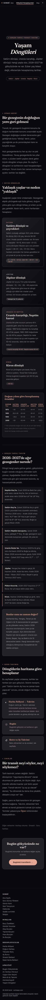

**Adres:** /yasam-donguleri  ·  **Başlık etiketi:** Yaşam Döngüleri: Satürn Dönüşü ve Transit Takvimi — Sorbi  ·  **H1:** Yaşam Döngüleri (kaynakta `Yaşam <em>Döngüleri</em>`; metadata "YaşamDöngüleri" olarak okuyor)

**Ne işe yarıyor**
Satürn dönüşü, Jüpiter dönüşü, Uranüs karşıtlığı, Neptün karesi ve Kiron dönüşünün hangi yaşlarda geldiğini anlatan bir rehber; altında 2026–2027 için ağır gezegenlerin burç geçiş ve retro tarihleri listesi var. Kişiye özel hesap yapmaz, Harita Atölyesi'ne yönlendirir.

**Ekranda ne var**
- Hero (tam ekran yüksekliğinde): "✦ Gerçek tarihli transit takvimi" rozeti, H1, alt metin, "Satürn · Jüpiter · Uranüs · Neptün · Kiron" hapı.
- "Döngü nedir?" — 2 paragraf.
- "Büyük döngüler" — 4 kart: Satürn (yaş listesi), Jüpiter, Uranüs ve Neptün, Kiron; her kartta yaş etiketi.
- "Doğum yılına göre hesaplanmış örnekler" tablosu — 1970/1980/1990/2000 doğumlular için 4 döngünün yaşı + dipnot.
- "2026–2027'de ağır gezegenler nerede?" — 7 maddelik tarih listesi (Neptün Koç, Satürn Koç, Satürn–Neptün kavuşumu, Uranüs İkizler, Jüpiter, Plüton Kova, Kiron) + "Bunlar sana ne zaman değer?" kutusu.
- "Senin takvimin" — 3 yönlendirme: Harita Atölyesi → Takvim, Bugün, Retro ve Ay Takvimi.
- "Sınırlar" — 2 paragraf.
- Diğer rehberler linkleri; "Bugün gökyüzünde ne var?" CTA kutusu → /bugun.
- Ortak footer.

**Kullanıcı ne yapıyor**
Girdi yok, okunur sayfa. Tek düğme "Bugünkü transitlerin →" (/bugun).

**Teknik**
- Motor/JS: sorbi-profil.js, sorbi-olcum.js. astronomy-engine YÜKLENMİYOR; sayfada hesap yapan hiçbir script yok.
- Veri: yok. localStorage: sorbi_birth, sorbi_tema (yalnız profil rozeti/tema için).
- Hesap: statik metin. "Efemerisle hesaplanmış" denen tüm tarihler ve tablo değerleri HTML'e elle yazılmış (yazım anında hesaplanıp dökülmüş; sayfada yeniden hesaplanmıyor). Tarihlerin doğruluğu bu envanterde ayrıca doğrulanmadı. Kişiye özel mi sorusunun cevabı: hayır, herkese aynı metin; sayfa bunu kendisi de söylüyor ("tarihler ise herkes için aynı gökyüzü") ve kişiselleştirme için Harita Atölyesi'ne gönderiyor.
- Ağırlık: 891 kelime · 9,9 ekran boyu mobilde · 1 düğme · 0 form alanı

**Boş / dolu hal**
Fark yok. envdolu ölçümü birebir aynı (891 kelime, 9,9 ekran). Yalnız nav rozeti değişir.

**Kusur**
- Hero `min-height:100vh` + `padding:8rem` ile mobilde ilk ekranın tamamını kaplıyor; ilk ekranda 52 kelime var, üstte ~600px boşluk (ekran görüntüsünde belirgin). 10 ekranlık sayfanın ilk ekranı içeriksiz.
- H1 ` ` ile bölündüğü için makine okumasında "YaşamDöngüleri" çıkıyor.
- Rozet "Gerçek tarihli transit takvimi" ve alt metin "efemerisle hesaplanmış tarihler" diyor; sayfa hesap yapmıyor, 2026–2027 tarihleri sabit metin. 2028'de sayfa eskimiş kalacak; güncelleme mekanizması yok.
- Sayfa /araclar (Gökyüzü Hesaplayıcıları) altında nav'da vurgulanıyor ama bir hesaplayıcı değil, rehber.
- Element/burç sayfalarıyla aynı gövde kalıbı kullanmıyor; ayrı bir "hero + section" şablonu (site içinde üçüncü bir görsel kalıp).
- Kiron, astronomy-engine'de olmayan bir cisim; sayfadaki Kiron tarihleri hangi kaynaktan geldi belirsiz.

**Durum:** canlı ama eksik

---

---

## gunluk-burc-yorumlari.html — Günlük Burç Yorumları (hub)

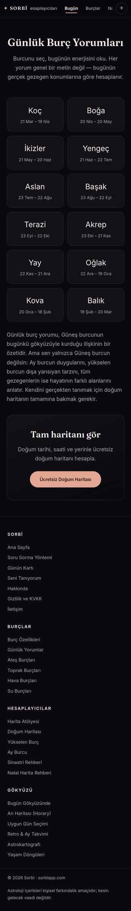

**Adres:** /gunluk-burc-yorumlari  ·  **Başlık etiketi:** Günlük Burç Yorumları — 12 Burç, Bugünün Transitleri | Sorbi  ·  **H1:** Günlük Burç Yorumları

**Ne işe yarıyor**
12 burcun günlük yorum sayfalarına açılan giriş sayfası. Kendisi yorum göstermez; burç seçilince /koc-burcu-gunluk-yorum gibi ayrı sayfaya gidilir.

**Ekranda ne var**
- Hero: H1 + alt metin ("Her yorum genel bir metin değil — bugünün gerçek gezegen konumlarına göre hesaplanır").
- 12 burç kartı, 2 sütun ızgara: burç adı + tarih aralığı, her biri kendi günlük yorum sayfasına link.
- 1 paragraf açıklama ("sen yalnızca Güneş burcun değilsin…").
- CTA kutusu "Tam haritanı gör" (ikinci bir `<h1>` etiketi) → "Ücretsiz Doğum Haritası" düğmesi, hedef `/#dogum-haritasi`.
- Ortak footer.

**Kullanıcı ne yapıyor**
Girdi yok, okunur sayfa. Burç kartı → ilgili günlük yorum sayfası. CTA → ana sayfa.

**Teknik**
- Motor/JS: sorbi-profil.js, sorbi-olcum.js. Hub'da hesap yok.
- Veri: yok. localStorage: sorbi_birth, sorbi_tema.
- Hesap: hub statik. Yorum metninin kaynağı (12 alt sayfa incelendi, örnek koc-burcu-gunluk-yorum.html): API yok, statik metin de değil — tarayıcıda üretiliyor. Her alt sayfa astronomy.browser.min.js yükler; o anki Ay, Venüs, Mars ekliptik boylamını hesaplar, burçtan sayılan "güneş-evi"ne yerleştirir (ör. Koç için Ay Boğa'daysa 2. ev) ve 12 satırlık üç sabit cümle tablosundan (HT genel, LOVE aşk, MONEY para/kariyer) ilgili satırı çeker; Ay evresi adı eklenir. Yani günlük yorum = 3 cümle × 12 seçenek + evre; aynı gün aynı burç için herkes aynı metni görür, gün değişince Ay ilerlediği için metin değişir. Dördüncü satırda "Hesap: … kişisel doğum haritasının yerini tutmaz" açıklaması var.
- Ağırlık: 237 kelime · 3,2 ekran boyu mobilde · 2 düğme · 0 form alanı

**Boş / dolu hal**
Fark yok; nav rozeti dışında değişen bir şey yok.

**Kusur**
- Sayfada iki `<h1>` (başlık + CTA kutusu "Tam haritanı gör").
- CTA hedefi `/#dogum-haritasi`; index.html'de `id="dogum-haritasi"` yok → link ana sayfanın tepesine düşüyor (ölü çapa). Aynı çapa 12 günlük yorum sayfasında ve 4 element sayfasında da kullanılıyor.
- Alt metin "bugünün gerçek gezegen konumlarına göre hesaplanır" doğru ama yorum 3 gezegen × 12 hazır cümleyle sınırlı; "transit" iddiası (title) kişisel transit değil.
- H2 yok (metadata h2: []); hub'ın tek yapılandırma öğesi kart ızgarası.
- Nav vurgusu "Bugün" sekmesine eşlenmiş (`'/gunluk-burc-yorumlari':'/bugun'`); footer'da ise "Burçlar" sütununda listeleniyor — iki farklı yer.

**Durum:** canlı ve işini yapıyor

---

---

## ates-burclari.html — Ateş Burçları

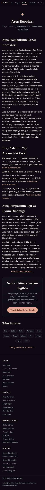

**Adres:** /ates-burclari  ·  **Başlık etiketi:** Ateş Burçları: Koç, Aslan, Yay — Özellikleri ve Uyumu — Sorbi  ·  **H1:** Ateş Burçları

**Ne işe yarıyor**
Koç, Aslan ve Yay'ın ortak "ateş" karakterini, üçü arasındaki farkı ve aşk/uyum dinamiğini anlatan okuma sayfası. Hesap yok, bilgi metni.

**Ekranda ne var**
- Hero: ✦ glif, H1, meta satırı "Koç · Aslan · Yay — Element: Ateş · Nitelik: Aktif, coşkulu, öncü".
- "Ateş Elementinin Genel Karakteri" — 3 paragraf.
- "Koç, Aslan ve Yay Arasındaki Fark" — 3 paragraf, her biri o burcun günlük yorum sayfasına link.
- "Ateş Burçlarının Aşk ve Uyum Dinamiği" — 2 paragraf + "Burç uyumunu hesapla →" (/burc-uyumu).
- CTA kutusu "Sadece Güneş burcun değilsin" → "Ücretsiz Doğum Haritanı Hesapla" (`/#dogum-haritasi`).
- "Tüm Burçlar" — 12 burç hapı (günlük yorum sayfalarına) + "Tüm günlük burç yorumları →".
- Ortak footer.

**Kullanıcı ne yapıyor**
Girdi yok, okunur sayfa.

**Teknik**
- Motor/JS: sorbi-profil.js, sorbi-olcum.js. Astro modülü yok.
- Veri: yok. localStorage: sorbi_birth, sorbi_tema. JSON-LD: Article + BreadcrumbList.
- Hesap: statik metin.
- Ağırlık: 510 kelime (envanter-ham) · ekran/düğme ölçümü yok (env/olcum.jsonl'de bu sayfa için kayıt bulunmuyor; ekran görüntüsü toprak/hava/su ile aynı uzunluk sınıfında, tahminen ~5 ekran) · 2 düğme (tahmin, kalıp aynı) · 0 form alanı

**Boş / dolu hal**
Fark yok.

**Kusur**
- Dört element sayfası aynı kalıp: HTML iskeleti, CSS bloğu (dört dosyada `<style>` birebir eşit), bölüm başlıkları, CTA ve burç navigasyonu aynı; değişen yalnızca element adı, üç burcun adları, "Nitelik" satırı ve paragraf metinleri. Ateş ve Toprak'ta genel karakter 3 paragraf, Hava ve Su'da 2 paragraf (kelime farkının kaynağı bu).
- Burç adları "günlük yorum" sayfalarına gidiyor; site'de var olan koc-burcu-ozellikleri gibi özellik sayfalarına gövdeden link yok (yalnız breadcrumb JSON-LD'de).
- CTA çapası `/#dogum-haritasi` ölü (index'te id yok).
- Title diğer üç sayfadan farklı kalıpta ("Özellikleri ve Uyumu — Sorbi" vs "Özellikleri | Sorbi").
- Nav'da "Burçlar" vurgulu; burc-ozellikleri sayfasına giden bir "geri" linki gövdede yok.

**Durum:** canlı ve işini yapıyor

---

---

## toprak-burclari.html — Toprak Burçları

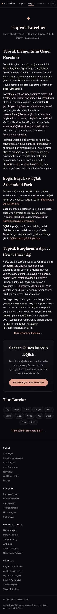

**Adres:** /toprak-burclari  ·  **Başlık etiketi:** Toprak Burçları: Boğa, Başak, Oğlak — Özellikleri | Sorbi  ·  **H1:** Toprak Burçları

**Ne işe yarıyor**
Boğa, Başak ve Oğlak'ın ortak "toprak" karakteri, aralarındaki fark ve aşk/uyum dinamiği. Okuma sayfası.

**Ekranda ne var**
Kalıp ateş-burclari ile aynı. Değişen: meta satırı "Boğa · Başak · Oğlak — Element: Toprak · Nitelik: İstikrarlı, pratik, güvenilir"; "Toprak Elementinin Genel Karakteri" 3 paragraf; "Boğa, Başak ve Oğlak Arasındaki Fark" 3 paragraf (Boğa sabit/keyifli, Başak analitik, Oğlak öncü/hırslı); "Toprak Burçlarının Aşk ve Uyum Dinamiği" 2 paragraf (su ile güçlü uyum, ateşle tempo farkı, hava ile köprü); CTA cümlesi "Toprak enerjin haritanın yalnızca bir parçası".

**Kullanıcı ne yapıyor**
Girdi yok, okunur sayfa.

**Teknik**
- Motor/JS: sorbi-profil.js, sorbi-olcum.js.
- Veri: yok. localStorage: sorbi_birth, sorbi_tema. JSON-LD: Article + BreadcrumbList.
- Hesap: statik metin.
- Ağırlık: 476 kelime · 4,9 ekran boyu mobilde · 2 düğme · 0 form alanı

**Boş / dolu hal**
Fark yok.

**Kusur**
- Kalıp aynı, değişen: element/burç adları, nitelik satırı, paragraf metinleri (bkz. ates-burclari kusur listesi; ölü `/#dogum-haritasi` çapası, özellik sayfalarına gövde linki yok, burç linkleri günlük yoruma gidiyor).
- Bu sayfaya özgü ek kusur bulunmadı.

**Durum:** canlı ve işini yapıyor

---

---

## hava-burclari.html — Hava Burçları

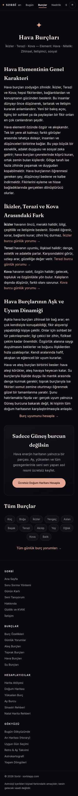

**Adres:** /hava-burclari  ·  **Başlık etiketi:** Hava Burçları: İkizler, Terazi, Kova — Özellikleri | Sorbi  ·  **H1:** Hava Burçları

**Ne işe yarıyor**
İkizler, Terazi ve Kova'nın ortak "hava" karakteri, aralarındaki fark ve aşk/uyum dinamiği. Okuma sayfası.

**Ekranda ne var**
Kalıp ateş-burclari ile aynı. Değişen: meta satırı "İkizler · Terazi · Kova — Element: Hava · Nitelik: Zihinsel, iletişimci, sosyal"; "Hava Elementinin Genel Karakteri" 2 paragraf (üçüncü "öğrenmesi gereken" paragrafı ikinciye katılmış); fark bölümü 3 paragraf (İkizler öncü/meraklı, Terazi uyumlu/ilişkisel, Kova sabit/özgün); aşk bölümü 2 paragraf (ateşle besleşme, su ile duygu–mantık dengesi, toprakla somutlama); CTA "Hava enerjin…".

**Kullanıcı ne yapıyor**
Girdi yok, okunur sayfa.

**Teknik**
- Motor/JS: sorbi-profil.js, sorbi-olcum.js.
- Veri: yok. localStorage: sorbi_birth, sorbi_tema. JSON-LD: Article + BreadcrumbList.
- Hesap: statik metin.
- Ağırlık: 448 kelime · 4,7 ekran boyu mobilde · 2 düğme · 0 form alanı

**Boş / dolu hal**
Fark yok.

**Kusur**
- Kalıp aynı, değişen: element/burç adları, nitelik satırı, paragraf metinleri; genel karakter bölümü diğer ikisinden bir paragraf kısa (en düşük kelime sayısı 448–458 buradan).
- Ortak kusurlar ates-burclari'ndeki gibi (ölü çapa, özellik sayfası linki yok).

**Durum:** canlı ve işini yapıyor

---

---

## su-burclari.html — Su Burçları

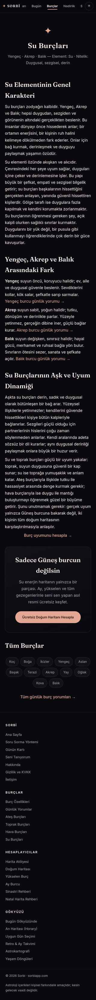

**Adres:** /su-burclari  ·  **Başlık etiketi:** Su Burçları: Yengeç, Akrep, Balık — Özellikleri | Sorbi  ·  **H1:** Su Burçları

**Ne işe yarıyor**
Yengeç, Akrep ve Balık'ın ortak "su" karakteri, aralarındaki fark ve aşk/uyum dinamiği. Okuma sayfası.

**Ekranda ne var**
Kalıp ateş-burclari ile aynı. Değişen: meta satırı "Yengeç · Akrep · Balık — Element: Su · Nitelik: Duygusal, sezgisel, derin"; "Su Elementinin Genel Karakteri" 2 paragraf; fark bölümü 3 paragraf (Yengeç öncü/koruyucu, Akrep sabit/yoğun, Balık değişken/sınırsız); aşk bölümü 2 paragraf (toprakla güçlü uyum, ateşle tutku–hassasiyet dengesi, hava ile duygu–mantık); CTA "Su enerjin…".

**Kullanıcı ne yapıyor**
Girdi yok, okunur sayfa.

**Teknik**
- Motor/JS: sorbi-profil.js, sorbi-olcum.js.
- Veri: yok. localStorage: sorbi_birth, sorbi_tema. JSON-LD: Article + BreadcrumbList.
- Hesap: statik metin.
- Ağırlık: 464 kelime · 4,8 ekran boyu mobilde · 2 düğme · 0 form alanı

**Boş / dolu hal**
Fark yok.

**Kusur**
- Kalıp aynı, değişen: element/burç adları, nitelik satırı, paragraf metinleri (hava gibi 2 paragraflık genel karakter).
- Ortak kusurlar ates-burclari'ndeki gibi (ölü `/#dogum-haritasi` çapası, özellik sayfalarına gövde linki yok, burç hapları günlük yoruma gidiyor).
- Element sayfaları arasında karşılıklı link yok (su sayfasından toprak sayfasına yalnız footer üzerinden gidilir).

**Durum:** canlı ve işini yapıyor

---

# Sayım, nadirlik, öğren

## nadirlik.html — Harita Nadirlik Ölçer

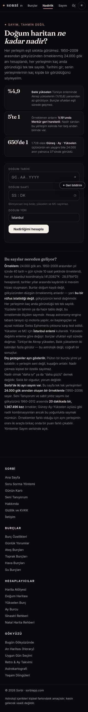

**Adres:** /nadirlik  ·  **Başlık etiketi:** Doğum Haritan Ne Kadar Nadir? Kaç Kişide Bir | Sorbi  ·  **H1:** Doğum haritan ne kadar nadir?

**Ne işe yarıyor**
Doğum tarihi, saati ve yerini girince Güneş, Ay, yükselen gibi yerleşimlerinin kaç kişide bir görüldüğünü söyler. Sonuçta en seyrek yanın büyük yazıyla öne çıkar, altında sıralı liste ve paylaşım kartı vardır. Rakamlar 24.000 gök anlık hazır bir sayımdan okunur.

**Ekranda ne var**
- Üst: kicker "✦ Sayım, tahmin değil" + H1 + tek paragraf açıklama (1950–2009, 24.000 gök anı).
- Üç "kanca" kartı — %4,9 Balık yükselen · 5'te 1 Merkür retro · 650'de 1 Güneş·Ay·Yükselen üçlüsü.
- Form kartı — Doğum tarihi (GG.AA.YYYY segmentli), Doğum saati (SS:DK, "Bilmiyorsan boş bırak; yükselen ve MC sayılmaz" ipucu), Doğum yeri (varsayılan "İstanbul", yazınca Open-Meteo şehir listesi), "Nadirliğimi hesapla" düğmesi, durum satırı.
- Sonuç bloğu (hesap sonrası): "En nadir yanın" manşeti (büyük "N kişiden 1", yerleşim adı, 100 noktalı görsel), "Kartı indir ✦" + "Sonucu kopyala" → "Kişisel yerleşimlerin" çubuk listesi (7 satır, eşit-dağılım çizgisi lejantı) → "Güneş · Ay · Yükselen üçlüsü" (saat varsa) → "Kuşak yerleşimleri" (details, kapalı) → "Dikkat çeken yanlar" (stelyum, boş element, kaç gezegen retro, Merkür retro, gündüz/gece haritası) → "Haritanın tamamını aç" / "Diğer araçlar" bağlantıları.
- Uygulama bekleme listesi bloğu (data-sorbi-liste, sonuç görününce açılır; e-posta + KVKK kutusu).
- "Bu sayılar nereden geliyor?" yöntem bölümü — 6 paragraf (örneklem, sayım, İstanbul enlemi, dış gezegenler, "nadir = iyi değil", iki ayrı sayım notu: 24.000 ve 1.367.496).
- Ortak footer.

**Kullanıcı ne yapıyor**
Tarih (+ isteğe bağlı saat) + şehir → "Nadirliğimi hesapla" → tarayıcı astronomy.browser.min.js ve sorbi-astro.js'i o anda yükler, /nadirlik-veri.json'ı çeker, haritayı kurar, her yerleşimin burcunu veri tablosundaki sayıyla oranlar → sonuç bloğu açılır ve oraya kaydırılır. "Kartı indir" sorbi-kart.js ile PNG üretir; "Sonucu kopyala" panoya bir cümle yazar. Yıl aralığı 1850–2069 dışında hata verir; şehir listeden seçilmezse "Listeden bir şehir seç" der (İstanbul önseçili olduğu için ilk açılışta seçmeye gerek yok).

**Teknik**
- Motor/JS: sayfa içi satır içi hesap kodu; sorbi-yer.js (head, yer/tema), sorbi-form.js (tarih/saat alanlarını segmentli yapar), sorbi-kart.js (paylaşım kartı PNG), sorbi-liste.js (bekleme listesi formu), sorbi-geri-bildirim.js, sorbi-olcum.js. astronomy.browser.min.js + sorbi-astro.js düğmeye basınca dinamik yüklenir. **sorbi-nadir.js bu sayfada yüklenmiyor** (o modül seni-taniyorum.html'de; 1.367.496 anlık üçlü ppm tablosu taşır). sorbi-ozellik.js de yüklenmiyor.
- Veri: **/nadirlik-veri.json** — `t:24000`, `m.yil_araligi:[1950,2009]`, `m.uretim:"2026-09-01"`; alanlar b (burç sayımları), r (retro), u (1728 üçlü), e (element), s (stelyum), rs (retro adedi), g (gündüz). Sayfadaki "24.000", "%4,9 Balık yükselen" (1168/24000), "%19 Merkür retro" (4571/24000 = %19,05), "en yaygın üçlü 37" (u'daki en büyük değer 37) veriyle birebir tutuyor. **ozellik-veri.json kullanılmıyor**: o dosya `n:210384`, `yil:"1930–2025"`, `uretim:"2026-09-20"`, 441 sayım anahtarı + 1728 üçlü içeriyor ve site klasöründeki hiçbir HTML ya da JS dosyası onu fetch etmiyor; sorbi-ozellik.js (katalog) de hiçbir sayfaya bağlı değil. Yani yeni büyük sayım üretilmiş ama sayfa hâlâ 24.000'lik eski dosyayı okuyor. İki dosyanın yükselen oranları benzer (Balık %4,9 / %4,8; Aslan %10,7 / %10,5) ama nadirlik-veri'de olup ozellik-veri'de olmayan alanlar var (chi, nod, mc burçları, "g" gündüz sayısı biçimi farklı) — doğrudan takas edilemez.
- API: Open-Meteo geocoding (şehir arama, dış istek); /api/liste (bekleme listesi); /api/geri-bildirim; /api/track. localStorage: sorbi_tema, sorbi_wl (liste kaydı). sorbi_birth yalnız tema scriptinde okunuyor, form doldurmak için okunmuyor.
- Hesap: tarayıcıda (harita gerçek efemerisle), oranlar statik JSON'dan.
- Ağırlık: 431 kelime · 3,7 ekran boyu mobilde · 3 düğme · 6 form alanı (2 tarih segmenti ×3 + saat ×2 + yer = ölçüm 6 sayıyor)

**Boş / dolu hal**
Fark yok. Doğum bilgisi kayıtlıyken form yine boş gelir (envdolu/nadirlik-1.png ile env/nadirlik-1.png birebir aynı; ölçüm 431/431 kelime). Sayfa sorbi_birth'ü okumuyor, girilen bilgiyi de kaydetmiyor.

**Kusur**
- Kayıtlı doğum bilgisi forma taşınmıyor; kullanıcı sitede üçüncü kez tarih giriyor.
- Yeni sayım (ozellik-veri.json, 210.384 harita) üretilmiş ama sayfa onu kullanmıyor; sayfa, meta, schema ve paylaşım kartı dipnotu 24.000'e sabit.
- Yöntem bölümü "Sorbi'de iki ayrı sayım var" diyor (24.000 ve 1.367.496); oysa sayım serisinde üçüncü bir örneklem daha var (19.359 gün) ve dördüncüsü dosyada duruyor (210.384). Sitede en az üç, dosyada dört örneklem.
- Manşet "N kişiden 1" bir gök anı oranını "kişi"ye çeviriyor; yöntem paragrafı "nüfus istatistiği değil" diye düzeltiyor ama manşette bu uyarı yok.
- Bekleme listesi kutusu (uygulama e-posta kaydı) sonuçla birlikte açılıyor; nadirlik sayfasının işiyle ilgisi yok.
- İlk ekranda "Geri bildirim" yüzen düğmesi tarih alanının üstüne biniyor (env/nadirlik-1.png).
- Ölçümde 1 taşan eleman var (tasma:1), ekran görüntüsünde yatay kayma görünmüyor; hangi eleman olduğu emin değilim.
- Google AdSense scripti yüklü, reklam bloğu yok.

**Durum:** canlı ve işini yapıyor

---

---

## sayim.html — Sayım serisi kapağı

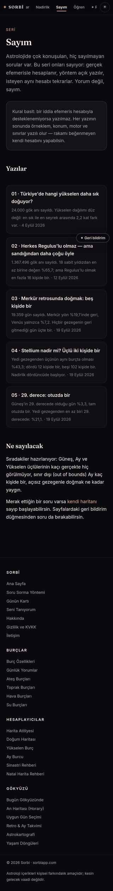

**Adres:** /sayim  ·  **Başlık etiketi:** Sayım — Astrolojiyi Veriyle Sayan Seri | Sorbi  ·  **H1:** Sayım

**Ne işe yarıyor**
Beş sayım yazısının listesi ve serinin kuralı. Her yazının başlığı, tek cümlelik bulgusu ve tarihi var. Sırada ne sayılacağı da yazılı.

**Ekranda ne var**
- Üst: "SERİ" etiketi + H1 + giriş paragrafı ("Yorum değil, sayım").
- Vurgu kutusu: "Kural basit: bir iddia efemeris hesabıyla desteklenemiyorsa yazılmaz…"
- "Yazılar" — 5 kart: 01 Yükselen (24.000 gök anı · 4 Eylül 2026), 02 Regulus (1.367.496 gök anı · 12 Eylül), 03 Merkür retro (19.359 gün · 19 Eylül), 04 Stellium (örneklem yazılmamış · 19 Eylül), 05 29. derece (örneklem yazılmamış · 19 Eylül).
- "Ne sayılacak" — sıradaki üç konu (hiç görülmeyen üçlüler, sınır dışı Ay, açısız gezegen) + /nadirlik bağlantısı + geri bildirim notu.
- Ortak footer.

**Kullanıcı ne yapıyor**
Girdi yok, okunur sayfa. Kartlara dokununca yazıya gider.

**Teknik**
- Motor/JS: sorbi-geri-bildirim.js, sorbi-olcum.js. Başka modül yok.
- Veri: yok; liste elle yazılmış HTML. localStorage: sorbi_tema (tema scripti). API: /api/track, /api/geri-bildirim.
- Hesap: statik metin.
- Ağırlık: 338 kelime · 3,6 ekran boyu mobilde · 2 düğme · 0 form alanı

**Boş / dolu hal**
Fark yok.

**Kusur**
- Kart 04 ve 05'in özetinde örneklem yazılmıyor (03'te "19.359 gün sayıldı" var, aynı örneklemi kullanan 04 ve 05'te yok).
- og:image yok (yazı sayfalarında var).
- Yeni yazı eklendikçe bu liste elle güncellenmek zorunda; sayfa içinde sitemap/JSON'dan okuyan bir mekanizma yok.
- Google AdSense scripti yüklü, reklam bloğu yok.

**Durum:** canlı ve işini yapıyor

---

---

## sayim-yildiz.html — Sayım 02 · Sabit yıldızlar

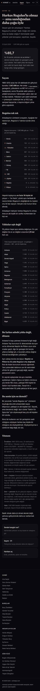

**Adres:** /sayim-yildiz  ·  **Başlık etiketi:** Herkes Regulus'lu Olmaz — Sabit Yıldızların Sayımı | Sorbi  ·  **H1:** Herkes Regulus'lu olmaz — ama sandığından daha çoğu öyle

**Ne işe yarıyor**
18 parlak sabit yıldıza 1° içinde değen gezegen ya da açısal noktanın ne sıklıkla görüldüğünü anlatan yazı. Regulus'u nesne nesne, sonra 18 yıldızı toplam kavuşumla sıralar. Tüm sayılar 1.367.496 gök anlık sayımdan.

**Ekranda ne var**
- Üst: "SAYIM · 02" + H1 + giriş ("Geçen gün bir arkadaşım…") + künye "12 Eylül 2026 · 1.367.496 gök anı sayıldı".
- Vurgu: "%65,7" — 18 yıldızdan en az birine değen.
- "Sayım" — yöntem özeti (20 dakikada bir, presesyon 50,3″/yıl).
- "Regulus tek tek" — 12 satırlık tablo (Venüs 747 … Jüpiter 529; Neptün ve Plüton 0 "bu dönemde hiç"), "yüz bin kişide kaç" + "N kişide bir".
- "Yıldızlar eşit değil" — 18 yıldız tablosu (Antares 9.973 → Rigel 4.635).
- "Bu farkın sebebi yıldız değil, dönem" — Neptün/Plüton Antares'ten geçti, Regulus'a hiç değmedi açıklaması.
- "Bu senin için ne demek?" — 2 paragraf.
- "Yöntem" — örneklem, yıldız konumları, orb, boylam sınırı, pencere sınırı, hata (8 Eylül 2026'da üretildi).
- Kapanış cümlesi + 3 yol kartı (Seni Tanıyorum, Sayım 01, Haritanı aç). Footer.

**Kullanıcı ne yapıyor**
Girdi yok, okunur sayfa.

**Teknik**
- Motor/JS: sorbi-geri-bildirim.js, sorbi-olcum.js. Canvas/animasyon yok.
- Veri: sayfa hiçbir veri dosyası çekmiyor; tüm sayılar HTML'e yazılmış. Kaynak sayım site/sorbi-yildiz-say.js içinde (`window.SORBI_YILDIZ_SAY`, n:1367496, `cift` = yıldız|nesne çiftleri) — o dosya bu sayfada yüklenmiyor, seni-taniyorum.html'de yükleniyor. sayim-veri.json'daki `yildiz.n:1367496` da aynı örneklem. Doğrulama: Regulus|Venus 10212/1367496 = yüz binde 747 ✓; yıldız toplamları (Antares 9.973, Regulus 6.254, Rigel 4.635) sorbi-yildiz-say.js'deki çift toplamlarıyla birebir ✓. "%65,7" (en az bir yıldız) elimdeki dosyalarda toplu alan olarak yok, doğrulayamadım. ozellik-veri.json'daki 210.384'lük sayımda `yildiz.hicbiri:66994` → en az biri %68,2; farklı örneklem, sayfada kullanılmıyor.
- Hesap: statik metin.
- Ağırlık: 855 kelime · 7,7 ekran boyu mobilde · 2 düğme · 0 form alanı

**Boş / dolu hal**
Fark yok.

**Kusur**
- Mobilde tablo çubukları gizli (`@media(max-width:560px) .satir .cubuk{display:none}`); sayfa yalnız rakam sütunu gösteriyor, "çubuk" görseli masaüstüne özel.
- Sağ sütun ("134 kişide bir", "bu dönemde hiç") 76px'e sığmıyor, ekran görüntüsünde kart kenarında kırpık (env/sayim-yildiz-tam.jpg).
- Rakam biçimi serinin diğer yazılarından farklı: burada "yüz binde 747", 01'de "10.67%" (nokta), 03–05'te "%19,1" (virgül). Üç yazıda üç biçim.
- Sayım tarihi künyede 12 Eylül, yöntemde "8 Eylül 2026'da üretildi"; yayın/üretim ayrımı okuyucuya söylenmiyor.
- "%65,7" ana iddiası veri dosyasında karşılığı olmayan tek rakam (emin değilim, dosyada başka adla olabilir).
- Google AdSense scripti yüklü, reklam bloğu yok.

**Durum:** canlı ve işini yapıyor

---

---

## sayim-yukselen.html — Sayım 01 · Yükselen dağılımı

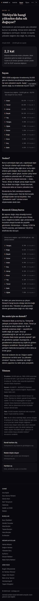

**Adres:** /sayim-yukselen  ·  **Başlık etiketi:** Türkiye'de Hangi Yükselen Daha Sık Doğuyor? — Sayım | Sorbi  ·  **H1:** Türkiye'de hangi yükselen daha sık doğuyor?

**Ne işe yarıyor**
İstanbul enleminde 12 yükselen burcun ne sıklıkla ufukta olduğunu tablolar. Aslan/Terazi/Akrep %10,6 civarı, Koç/Balık %4,9; fark 2,2 kat. Aynı örneklemin Güneş burcu dağılımıyla kontrol yapar.

**Ekranda ne var**
- Üst: "SAYIM · 01" + H1 + giriş + künye "4 Eylül 2026 · 24.000 gök anı sayıldı".
- Vurgu: "2,2 kat".
- "Sayım" — açıklama + 12 satır yükselen tablosu (10.67% … 4.87%, "9 kişide 1" … "21 kişide 1"; son dört satır "nadir" renkli).
- "Neden?" — tutulum eğimi / enlem açıklaması, 2 paragraf.
- "Kontrol: Güneş burcu" — 12 satır Güneş tablosu (8.70% … 7.83%) + 1 paragraf.
- "Bu senin için ne demek?" — 2 paragraf.
- "Yöntem" — örneklem (40 tarih × 10 saat), konum, hesap (Placidus, true düğüm, TZ +03), hata, sınır.
- 3 yol kartı (Kendi haritanı ölç, Neden böyle oluyor → /ogren, Haritanı aç). Footer.

**Kullanıcı ne yapıyor**
Girdi yok, okunur sayfa.

**Teknik**
- Motor/JS: sorbi-geri-bildirim.js, sorbi-olcum.js.
- Veri: sayfa veri dosyası çekmiyor, sayılar HTML'de. Kaynak: nadirlik-veri.json (`t:24000`, `b.asc`, `b.sun`). Doğrulama: Aslan 2562/24000 = %10,675 → "10.67%" ✓; Balık 1168 → %4,87 ✓; Güneş Yengeç 2088 → %8,70 ✓; Oğlak 1879 → %7,83 ✓. Sayfa ile dosya birebir.
- Hesap: statik metin.
- Ağırlık: 768 kelime · 6,9 ekran boyu mobilde · 2 düğme · 0 form alanı

**Boş / dolu hal**
Fark yok.

**Kusur**
- Yüzdeler "10.67%" biçiminde (İngiliz noktası, işaret sonda); sitenin geri kalanı "%10,7". Aynı seride 03–05 "%19,1" yazıyor.
- Mobilde çubuklar gizli (aynı media kuralı); tablo salt rakam.
- Künyede "24.000 gök anı", nadirlik.html ile aynı örneklem — ama ozellik-veri.json'da aynı sorunun 210.384'lük cevabı duruyor (asc.0 Koç %4,9, asc.4 Aslan %10,5) ve kullanılmıyor.
- Yöntem "Placidus ev sistemi … yedi ev sisteminde de fark ölçülebilir düzeyin altında" diyor; yükselen ev sisteminden bağımsızdır, cümle yanlış değil ama gereksiz.
- Google AdSense scripti yüklü, reklam bloğu yok.

**Durum:** canlı ve işini yapıyor

---

---

## sayim-retro.html — Sayım 03 · Retro günleri

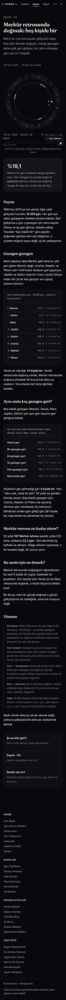

**Adres:** /sayim-retro  ·  **Başlık etiketi:** Merkür Retrosunda Doğmak Kaç Kişide Bir? Retro Sayımı | Sorbi  ·  **H1:** Merkür retrosunda doğmak: beş kişide bir

**Ne işe yarıyor**
1960–2012 arası her günün öğle vaktine bakıp sekiz gezegenin kaç gün geri gittiğini sayar. Merkür %19,1 (5'te 1), Venüs %7,2 (14'te 1); dış gezegenler yılın %40'ından fazlası. Başta son bir yılın Merkür yolunu çizen hareketli halka var.

**Ekranda ne var**
- Üst: "SAYIM · 03" + H1 + giriş + künye "19 Eylül 2026 · 19.359 gün sayıldı".
- Hareketli halka (canvas): 12 burçlu çember, son 365 günün Merkür izi, geri günler vurgu renginde; altında tarih/derece satırı ("10 Eyl 2026 · Merkür 29° Başak"), sağda "67 gün geri / 354" sayacı, "bir yıl önce — bugün" kaydırıcı; not "Son bir yıl, gün gün. Çizgiyi sürükle, halkaya dokununca durur."
- Vurgu: "%19,1".
- "Sayım" — yöntem özeti.
- "Gezegen gezegen" — 8 satır tablo (Merkür %19,1 … Plüton %43,0).
- "Aynı anda kaç gezegen geri?" — 6 satır (Hiçbiri %29,4 … Beşi birden "bu dönemde hiç").
- "Merkür retrosu ne kadar sürer?" — 167 retro, 22,2 gün, yılda 3,15.
- "Bu senin için ne demek?" — 2 paragraf.
- "Yöntem" — örneklem, geri hareket tanımı, örnekleme sınırı, pencere sınırı, hata (tools/sayim-uret.mjs → sayim-veri.json).
- 3 yol kartı (Retro takvimi, Sayım 04, Seni Tanıyorum). Footer.

**Kullanıcı ne yapıyor**
Girdi yok, okunur sayfa. Halka görünür alana girince kendiliğinden oynar; kaydırıcıyla gün seçilir, halkaya dokununca durur. Halka bilgi vermek için var, sonucu değiştirmez.

**Teknik**
- Motor/JS: sorbi-sayim-gorsel.js (halka; astronomy.browser.min.js + sorbi-astro.js ile birlikte IntersectionObserver ile geç yüklenir), sorbi-geri-bildirim.js, sorbi-olcum.js.
- Veri: tablolar HTML'e yazılmış; sayfa JSON çekmiyor. Kaynak sayim-veri.json: `n:19359`, `yil:"1960–2012"`, `rx.mer:3705` → 3705/19359 = %19,14 ✓; `rx.ven:1390` → %7,18 ✓; `esZamanli5.0:5691` → %29,4 ✓; `esZamanli5.4:69` → 19359/69 = 281 ✓; `merDonem {adet:167, ortGun:22.2, yilBasina:3.15}` ✓. Sayfa ile dosya birebir. Halka verisi ise ayrı: son 365 gün, her gün öğle 12:00 İstanbul, tarayıcıda gerçek efemerisle o anda hesaplanıyor (sahte hareket yok).
- Hesap: tablolar statik; halka tarayıcıda gerçek efemeris.
- Ağırlık: 724 kelime · 7 ekran boyu mobilde · 2 düğme · 0 form alanı

**Boş / dolu hal**
Fark yok.

**Kusur**
- Halkanın altındaki sayaç ("67 gün geri / 354") ile "Geri bildirim" yüzen düğmesi üst üste biniyor (env/sayim-retro-1.png).
- Sayaç "/ 354" gösteriyor; hesap parça parça yapıldığı için ekran görüntüsü anında 365 günün tamamı bitmemiş. Kullanıcı bunu anlamaz, sayı "eksik" görünür.
- Halkanın hangi noktanın ne olduğu (iç halka Merkür, vurgu = geri) yalnız kaynak yorumunda; sayfada lejant yok.
- Mobilde tablo çubukları gizli.
- Meta og:image "/og-sayim-retro.png" gösteriyor; site klasöründe o dosya yok (og-sayim-yildiz ve og-sayim-yukselen var). Sunucuda olabilir, emin değilim.
- "Kaç kişide bir" gün payından türetiliyor; metin bunu iki yerde söylüyor ama başlık ve vurgu kutusu "kişi" diyor.
- Google AdSense scripti yüklü, reklam bloğu yok.

**Durum:** canlı ve işini yapıyor

---

---

## sayim-yigin.html — Sayım 04 · Stellium

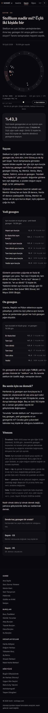

**Adres:** /sayim-yigin  ·  **Başlık etiketi:** Stellium Nadir mi? Aynı Burçta Kaç Gezegen Sayımı | Sorbi  ·  **H1:** Stellium nadir mi? Üçlü iki kişide bir

**Ne işe yarıyor**
Her gün aynı burçta en fazla kaç gezegen olduğunu sayar; yedi klasik ve on gezegen için iki tablo. En az üçlü %43,3 (2'de 1), dörtlü 12'de 1, beşli 102'de 1. Başta son bir yılın en kalabalık burcunu gösteren halka var.

**Ekranda ne var**
- Üst: "SAYIM · 04" + H1 + giriş + künye "19 Eylül 2026 · 19.359 gün sayıldı".
- Hareketli halka: yedi gezegen glifi, en kalabalık burç dilimi aydınlanır; alt satır "19 Mar 2026 · en kalabalık: 3 gezegen Koç'ta", sayaç "124 gün üçlü / 179", kaydırıcı, not.
- Vurgu: "%43,3".
- "Sayım" — tanım tartışması + Merkür 28°/Venüs 47° açıklaması.
- "Yedi gezegen" — 7 satır tablo (Hepsi ayrı %2,6 … Yedisi aynı burçta "6453 kişide bir") + paragraf (7'li gün 53 yılda 3: Şubat 1962 Kova ×2, Mayıs 2000 Boğa).
- "On gezegen" — 6 satır tablo + paragraf ("%68,8 … stellium varsayılan durum").
- "Bu senin için ne demek?" — 2 paragraf.
- "Yöntem" — örneklem, tanım (ev yığını sayılmadı), Ay sınırı, pencere, hata.
- 3 yol kartı (/nadirlik, Sayım 03, Sayım 05). Footer.

**Kullanıcı ne yapıyor**
Girdi yok, okunur sayfa. Halka kendiliğinden oynar, kaydırıcıyla gün seçilir.

**Teknik**
- Motor/JS: sorbi-sayim-gorsel.js (tip "yigin"), astronomy + sorbi-astro geç yüklenir; sorbi-geri-bildirim.js, sorbi-olcum.js.
- Veri: sayılar HTML'de. Kaynak sayim-veri.json `yigin7 {1:500,2:10475,3:6766,4:1429,5:170,6:16,7:3}` → tam üç 6766/19359 = %35,0 ✓; en az üç (6766+1429+170+16+3)=8384 → %43,3 ✓; beş 19359/170 = 114 ✓; yedi 19359/3 = 6453 ✓. `yigin10` → en az üç 13316/19359 = %68,8 ✓. Sayfa ile dosya birebir.
- Hesap: tablolar statik; halka tarayıcıda gerçek efemeris.
- Ağırlık: 722 kelime · 6,7 ekran boyu mobilde · 2 düğme · 0 form alanı

**Boş / dolu hal**
Fark yok.

**Kusur**
- Halkadaki gezegen glifleri üst üste geliyor (Güneş–Merkür–Venüs aynı bölgede; env/sayim-yigin-1.png'de okunmuyor).
- Sayaç "/ 179" — hesap bitmeden çekilmiş, retro sayfasıyla aynı sorun.
- Vurgu kutusu "%43,3 … 2 kişide bir" derken tabloda "Tam üçü %35,0 · 3 kişide bir" var; "en az" ile "tam" ayrımı ancak alt paragrafta açılıyor, tabloda "en az" satırı yok.
- Mobilde tablo çubukları gizli.
- og:image "/og-sayim-yigin.png" site klasöründe yok.
- Geri bildirim düğmesi kaydırıcı satırının üstüne biniyor.
- Google AdSense scripti yüklü, reklam bloğu yok.

**Durum:** canlı ve işini yapıyor

---

---

## sayim-anaretik.html — Sayım 05 · 29. derece

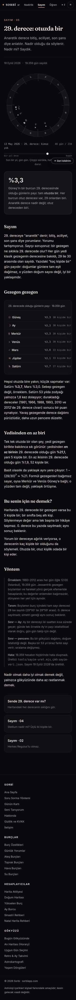

**Adres:** /sayim-anaretik  ·  **Başlık etiketi:** 29. Derece (Anaretik) Nadir mi? Sayım | Sorbi  ·  **H1:** 29. derece: otuzda bir

**Ne işe yarıyor**
Yedi klasik gezegenin 29. derecede olduğu günlerin payını sayar: her biri %3,3 civarı, yani otuzda bir. Yedisinden en az biri 29'da olan gün %21,1 (5'te 1). Başta son bir yılın 29. derecedeki gezegenlerini işaretleyen halka var.

**Ekranda ne var**
- Üst: "SAYIM · 05" + H1 + giriş + künye "19 Eylül 2026 · 19.359 gün sayıldı".
- Hareketli halka: 7 glif, 29. derecedeki gezegen o gün işaretli; alt satır "13 May 2026 · 29. derece: kimse yok", sayaç "48 gün / 234", kaydırıcı, not.
- Vurgu: "%3,3".
- "Sayım" — 1 paragraf.
- "Gezegen gezegen" — 7 satır tablo (Güneş %3,3 … Satürn %3,7) + Satürn sapması açıklaması (1961, 1966, 1988, 1993, 2010, 2012 durakları).
- "Yedisinden en az biri" — %21,1 / en az ikisi %1,9 + 1−(29/30)^7 ≈ %21 kontrolü.
- "Bu senin için ne demek?" — 2 paragraf (0. derece sayılmadı notu).
- "Yöntem" — örneklem, tanım (29°00′–29°59′), Ay sınırı, pencere, hata.
- 3 yol kartı (/nadirlik, Sayım 04, Sayım 02). Footer.

**Kullanıcı ne yapıyor**
Girdi yok, okunur sayfa. Halka oynar/kaydırılır.

**Teknik**
- Motor/JS: sorbi-sayim-gorsel.js (tip "anaretik") + astronomy + sorbi-astro geç yüklenir; sorbi-geri-bildirim.js, sorbi-olcum.js.
- Veri: sayılar HTML'de. Kaynak sayim-veri.json `anaretikGez {sun:646 … sat:724}` → 646/19359 = %3,34 ✓, 724/19359 = %3,74 ✓; `anaretik {hic:15276, bir:3714, ikiArti:369}` → en az biri 4083/19359 = %21,09 ✓, en az ikisi 369 → %1,9, 52'de 1 ✓. Sayfa ile dosya birebir.
- Hesap: tablolar statik; halka tarayıcıda gerçek efemeris.
- Ağırlık: 603 kelime · 6 ekran boyu mobilde · 2 düğme · 0 form alanı

**Boş / dolu hal**
Fark yok.

**Kusur**
- Yol kartı "Sende 29. derece var mı? — Haritandaki her derecenin sıklığını gör" /nadirlik'e gidiyor; nadirlik sayfası derece saymıyor, burç sayıyor. Vaat tutmuyor.
- Sayaç "/ 234" — hesap bitmeden çekilmiş.
- Geri bildirim düğmesi halka notunun üstüne biniyor (env/sayim-anaretik-1.png).
- Mobilde tablo çubukları gizli.
- og:image "/og-sayim-anaretik.png" site klasöründe yok.
- Ay için günde tek örnek; yöntem bunu söylüyor ama tablo Ay'ı diğerleriyle aynı güvenle listeliyor.
- Google AdSense scripti yüklü, reklam bloğu yok.

**Durum:** canlı ve işini yapıyor

---

---

## ogren.html — Astroloji okuryazarlığı (dört ders)

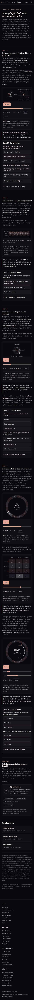

**Adres:** /ogren  ·  **Başlık etiketi:** Astroloji Okuryazarlığı — Sorbi  ·  **H1:** Önce gökyüzünü anla, yoruma sonra geç

**Ne işe yarıyor**
Dört kısa dersle retro, Merkür–Güneş yakınlığı, yükselenin saate bağlılığı ve burçların element/nitelik/açı geometrisini hareketli çizimlerle anlatır. Her dersin sonunda 1–2 soruluk mini sınav, sayfa sonunda puan/seviye kartı var. En altta aynı terimlerin kullanıcının kendi haritasındaki karşılığı kart kart çıkar.

**Ekranda ne var**
- Üst: kicker "✦ Astroloji okuryazarlığı" + H1 + giriş paragrafı ("üç animasyonun hiçbiri temsili değil").
- DERS 01 "Retro: gezegen geri gitmiyor, biz onu geçiyoruz" — 2 paragraf → gösteri `retro-dongusu` (sol: Güneş/Merkür/Dünya tepeden, sağ: burçlar kuşağındaki iz; Oynat/Duraklat, gün kaydırıcısı, "2026-11-26 · 225.8° Akrep · İLERİ" satırı, Sıfırla, açıklama cümlesi) → çıkarım kutusu (25 Ekim–13 Kasım) → sınav ogren-1 (2 soru, 20 puan).
- DERS 02 "Merkür neden hep Güneş'in yanında?" — 2 paragraf → gösteri `uzaklik-grafigi` (iki yıllık açı eğrisi, ±27,8° bant) → çıkarım (27,8°) → sınav ogren-2 (1 soru, 15 puan).
- DERS 03 "Yükselen neden doğum saatini soruyor?" — 2 paragraf → gösteri `yukselen-halkasi` (20 Mart 2026 İstanbul, saat ibresi, "06:00 · yükselen Aslan 10°") → çıkarım (4 saat = 2 burç) → 24.000 gök anı notu + /sayim-yukselen bağlantısı → sınav ogren-3 (2 soru, 20 puan).
- DERS 04 "Burçların iskeleti: element, nitelik, açı" — paragraf → gösteri `zodyak-carki` (Akrep vurgulu, Oynat, kaydırıcı) → paragraf → gösteri `element-nitelik` (4×3 ızgara) → çıkarım (120°/90°) → paragraf → gösteri `aci-gosterimi` (Mars/Venüs iki kaydırıcı, "120.0° Üçgen orb 0.00°/7°") → çıkarım (beş açı ve orbları) → sınav ogren-4 (2 soru, 20 puan).
- HARİTANDA "Bu kelimeler senin haritanda ne demek?" — giriş + kart listesi (12 terim: Yükselen, Güneş burcu, Ay burcu, Ev, MC, Harita yöneticisi, Açı, Retro, Element ve nitelik, Yığın, Ay düğümü, Gündüz/gece; her kartta küçük harita canvas'ı + "SENİN HARİTANDA" / "ŞU ANKİ GÖKYÜZÜNDE" satırı). Ekran görüntüsünde bu bölüm "Hesaplanıyor…" halinde kalmış (aşağıda).
- "Öğren ilerlemen" kartı — 0/4 halka, "Başlangıç (seviye 1) · 0 puan · sonraki seviyeye 30 puan · Seri: 0 gün", 5 nişan çipi (Retroyu çözdün, Yükseleni çözdün, Üç element, Üç ders, Üst üste üç gün), "Ilerlemen yalnız bu tarayıcıda…" notu.
- "Buradan sonra" — 3 yol kartı (Haritanı aç, Nadirlik, Araçlar).
- Dipnot — veri tarihleri, ogren-veri.json bağlantısı, Ders 04'ün efemeris kullanmadığı notu.
- Ortak footer.

**Kullanıcı ne yapıyor**
Girdi yok (form alanı olarak yalnız 6 kaydırıcı). Okur, gösteriyi Oynat/kaydırıcı ile kurcalar, sınav şıkkına dokunur → şık doğru/yanlış boyanır, "neden" cümlesi açılır, "N / M soru yanıtlandı · d doğru, y yanlış" satırı güncellenir → tüm sorular cevaplanınca puan localStorage'a yazılır, ilerleme kartı yenilenir. HARİTANDA bölümü görünür alana yaklaşınca kendi kendine hesaplanır; sayfa içindeki `data-anlat="yukselen"` kelimesi dokununca panel açar.

**Teknik**
- Motor/JS: sorbi-astro.js (defer), sorbi-gosteri.js (6 gösteri; `data-sorbi-gosteri` bulur, canvas kurar, `data-kaynak` varsa JSON çeker), sorbi-oyun.js (sınav/ilerleme/nişan), sorbi-anlat.js + astronomy.browser.min.js + sorbi-astro.js (HARİTANDA bölümü için IntersectionObserver ile dinamik yüklenir; sorbi-astro böylece iki kez yükleniyor), sorbi-geri-bildirim.js, sorbi-olcum.js.
- Dört dersin gösterileri ve veri kaynağı:
  - Ders 01 `retro-dongusu` → /ogren-veri.json `retro.kareler` (120 gün, 2026-09-05 → 2027-01-02; her gün Merkür/Dünya helio x-y + jeosentrik boylam + `geri` bayrağı; 20 gün geri: 25 Ekim–13 Kasım). Önceden hesaplanmış gerçek efemeris çıktısı (üretim 2026-09-02); tarayıcı hesap yapmıyor, kareleri oynatıyor.
  - Ders 02 `uzaklik-grafigi` → `uzaklik.kareler` (365 değer, 2026-01-01'den iki günde bir, Merkür−Güneş açı farkı; en büyük 27,8°). Önceden hesaplanmış.
  - Ders 03 `yukselen-halkasi` → `yukselen.kareler` (144 kare, 10 dakikada bir, 20 Mart 2026 İstanbul yükselen boylamı). Önceden hesaplanmış.
  - Ders 04 `zodyak-carki`, `element-nitelik`, `aci-gosterimi` → veri dosyası yok; saf geometri. Açı sınıfı ve orblar `SorbiAstro.ASPECTS`'ten okunuyor (sitenin ortak açı tablosu). Efemeris kullanmıyor; dipnot bunu söylüyor.
  - Özet: 3 gösteri gerçek efemeris çıktısından (ama canlı hesap değil, dondurulmuş JSON), 3 gösteri geometri.
- sorbi-oyun.js: puan/seviye/nişan sistemi. **Veri tamamen localStorage'da**, anahtar `sorbi_oyun_v1` (xp, tamam{}, sinav{}, olay{}, seri{}); sunucuya istek yok. Seviyeler 0/30/80/150/240 puan: Başlangıç → Gözlemci → Okuyan → Çözen → Ustalaşan. **Çalıştığı sayfalar:** ogren.html (4 sınav + ilerleme kartı), burc-ozellikleri.html (1 sınav + ilerleme), burc-uyumu.html (1 sınav + ilerleme), 12 burç özellikleri sayfası (her birinde 1 sınav), haritam.html (5 nişan rozeti + "İlerlemen" kartı, SorbiOyun API'sinden okur). Toplam 18 sınav, tam puan 335. "Üç element" nişanı `sorbi:gosteri` olayını dinler (üç ayrı gösteriyi kendin oynatınca). Sayım sayfalarında ve nadirlik'te oyun yok.
- Veri: /ogren-veri.json (üretim 2026-09-02; retro, uzaklik, yukselen). localStorage: sorbi_oyun_v1 (oyun), sorbi_birth / sorbi_profile (anlat okur), sorbi_tema. API: /api/track, /api/geri-bildirim.
- Hesap: dersler önceden hesaplanmış JSON'dan oynatılır; HARİTANDA bölümü tarayıcıda gerçek efemerisle (doğum bilgisi yoksa şu anın gökyüzü).
- Ağırlık: 1287 kelime · 13,5 ekran boyu mobilde · 33 düğme · 6 form alanı (kaydırıcılar)

**Boş / dolu hal**
Yalnız HARİTANDA bölümü değişir. Boş: "Doğum bilgin kayıtlı değil, bu yüzden şu anın gökyüzü kullanılıyor. Kendi haritanı görmek için tarihini gir." + "tarihini gir →" (ana sayfaya gider); kartlarda "ŞU ANKİ GÖKYÜZÜNDE". Dolu: "Aşağıdakilerin hepsi senin haritandan hesaplandı: 1996-10-08 · İstanbul." + kartlarda "SENİN HARİTANDA" (kaynak: anlat-yok.png / anlat-saatli.png, 20 Eylül testi). Saatsiz kayıtta ayrıca "yükselen tahmini →" bağlantısı çıkıyor. Dersler, sınavlar ve ilerleme kartı iki halde de aynı; ölçüm 1287/1287 kelime.

**Kusur**
- Giriş "aşağıdaki üç animasyon" diyor, dipnot da "üç animasyon"; sayfada altı gösteri var (Ders 04'te üç tane daha). Dipnot bunu sonradan düzeltiyor ama giriş cümlesi yanlış.
- Ders 01 halkasındaki burç etiketleri mobilde üst üste biniyor ("BaşakTeraziAkrep YayOğlak", env/ogren-tam.jpg); Ders 02 grafiğinde bant etiketleri ("bu bandın dışına çıkamaz", "Merkür Güneş'in doğusunda") eğriyle çakışıyor ve 390px'te okunmuyor.
- Ders 01 tarih biçimi "2026-11-26" (ISO), sitenin geri kalanı "26 Kasım 2026"; derece "225.8°" noktalı.
- HARİTANDA bölümü tam sayfa görüntüsünde "Hesaplanıyor…" olarak kalmış: IntersectionObserver kaydırma olmadan tetiklenmiyor. Gerçek tarayıcıda çalışıyor (20 Eylül testleri), ama kaydırmadan sayfaya bakan ya da sayfayı yazdıran biri boş görür. 12 kartın her biri ayrı canvas çiziyor; sayfa zaten 13,5 ekran.
- sorbi-astro.js iki kez yükleniyor (defer + anlat yükleyicisi).
- Sayfa 13,5 ekran, 33 düğme, 1287 kelime: sitenin en uzun sayfalarından biri; dört ders + 12 terim kartı + oyun kartı tek sayfada.
- Ders 03 halkasının saat etiketleri gökyüzüyle tutmuyor. ogren-veri.json `yukselen.kareler` dk:360 (06:00) için asc 130,37° (Aslan 10°) diyor; sitenin kendi motoru (sorbi-astro.js + astronomy-engine, aynı tarih/yer, Europe/Istanbul) 06:00 için asc 329° (Balık 29°), 00:00 için 236° (Akrep 26°) veriyor — JSON'da 00:00 için 43° (Boğa 13°) yazılı. Kayma yaklaşık 9 saat; sebebi (UTC/yerel saat karışması ya da farklı tarih) emin değilim. Ekranda "06:00 · yükselen Aslan 10°" görünüyor; 20 Mart sabahı 06:00'da İstanbul'da Aslan yükselmez, Güneş o saatte Balık/Koç sınırında doğar. Dersin ana fikri (iki saatte bir değişir) etkilenmiyor, ama "gerçek efemeris" iddiası bu gösteri için saat etiketi düzeyinde yanlış.
- Seviye/nişan ilerlemesi yalnız tarayıcıda; tarayıcı verisi silinince sıfırlanır, cihazlar arası taşınmaz. Sayfa bunu açıkça yazıyor, kusur değil ama sınır.
- og:image yok.
- Google AdSense scripti yüklü, reklam bloğu yok.

**Durum:** canlı ve işini yapıyor

---

---

# Burç özellikleri (hub + 12)

## burc-ozellikleri.html — Burç Özellikleri (hub)

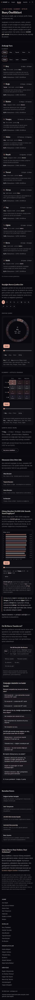

**Adres:** /burc-ozellikleri  ·  **Başlık etiketi:** Burç Özellikleri: 12 Burç Rehberi — Aşk & Kariyer | Sorbi  ·  **H1:** Burç Özellikleri

**Ne işe yarıyor**
On iki burcun kartlarını element ve niteliğe göre süzüp tek tek burç sayfalarına dağıtan giriş ekranı. Seçilen burcu zodyak çarkında ve element × nitelik ızgarasında gösterir, 24.000 gök anındaki Güneş burcu dağılımını çizer. Altında dört element sayfasına, sayım/nadirlik sayfalarına ve bir sınav + ilerleme halkasına bağlanır.

**Ekranda ne var**
- Üst menü — ortak menü, "Burçlar" işaretli; 390 px'te yalnız "…arı · Bugün · Burçlar · Nadirlik · S" görünüyor.
- Başlık bloğu — üst etiket "✦ ON İKİ BURÇ · ELEMENT · NİTELİK", H1, alt cümle ("Her burcun kişilik, aşk ve kariyer profili. Detay için burcunu seç."), 5 cümlelik açıklama paragrafı (süzgeç, çark, ızgara ve "24.000 gök anı" sayısını anlatıyor).
- "Zodyağı Tara" — Element süzgeci (Tümü/Ateş/Toprak/Hava/Su), Nitelik süzgeci (Tümü/Öncü/Sabit/Değişken); 12 kart alt alta (glif, ad, tarih aralığı, "Element · nitelik · yönetici", tek cümle özet, "8,4% Güneş burcu · 2.027 / 24.000 an"); sayaç satırı "On iki burcun tamamı gösteriliyor."
- "Seçtiğin Burcu Çarkta Gör" — açıklama paragrafı, 12 gliflik seçici şerit (iki satıra kırılıyor), "Zodyak çarkı" canvas'ı (Oynat düğmesi, kaydırıcı, "♈︎ Koç · Ateş · Öncü", Sıfırla, altında 2 cümle metin), "Element × nitelik ızgarası" canvas'ı (aynı kontrol seti), "Çarkta seçili burç" paneli (özet cümle, an sayısı, "Koç burcu özellikleri →").
- "Elemente Göre Dört Aile" — 1 paragraf + 4 yol kartı (Ateş/Toprak/Hava/Su burçları).
- "Güneş Burçları 24.000 Gök Anında Nasıl Dağılıyor?" — 1 paragraf, dağılım canvas'ı (12 yatay çubuk, Güneş/Ay/yükselen kaydırıcısı, Oynat, Sıfırla, 3 cümlelik otomatik metin), sarı çizgili çıkarım kutusu ("…Güneş burcu bir nadirlik ölçüsü değil…"), "Sayımın tamamını / yerleşim nadirliğini" bağlantı satırı.
- "On İki Burcu Tanıdın mı?" — 1 paragraf, ilerleme kartı ("0/12 halka · 0 / 12 burç okundu · Başlangıç (seviye 1) · 0 puan · sonraki seviyeye 30 puan · Seri: 0 gün", 5 nişan çipi: Retroyu çözdün, Yükseleni çözdün, Üç element, Üç ders, Üst üste üç gün, gizlilik notu), 4 soruluk sınav ("Zodyağın iskeletini ne kadar tanıdın", her soru 3 seçenek, altta "0 / 4 soru yanıtlandı").
- "Buradan Sonra" — 5 yol kartı (Doğum haritanı hesapla, Seni Tanıyorum, 24.000 Gök Anında Sayıldı, Astroloji Okuryazarlığı, Burç Uyumu).
- "Güneş Burcu Neyi Anlatır, Neyi Anlatmaz?" — 1 paragraf + küçük puntolu yöntem/sorumluluk notu (nadirlik-veri.json, 1950–2009, 41,0°K, "gelecekle ilgili bir iddia taşımaz").
- Alt bilgi — ortak footer (4 sütun, telif, sorumluluk cümlesi).

**Kullanıcı ne yapıyor**
Süzgeç düğmesine basınca kartlar gizlenir/gösterilir ve sayaç güncellenir. Kart üstüne gelince (pointerenter/focus) ya da şeritten glif seçince çark ve ızgara canvas'larının kaydırıcısı o burca çekilir, "Çarkta seçili burç" paneli yeniden yazılır. Karta dokunmak burç sayfasına gider. Canvas'ların Oynat düğmesi 12 burcu sırayla döndürür; dağılım kaydırıcısı Güneş → Ay → yükselen arasında geçer. Sınav cevapları ve "okudum" işaretleri `sorbi_oyun_v1`'e yazılır; ilerleme halkası oradan okunur.

**Teknik**
- Motor/JS: sorbi-gosteri.js (zodyak-carki, element-nitelik canvas'ları; kaydırıcı/Oynat/Sıfırla kontrolleri), sorbi-burc.js (burc-dagilimi canvas tipini ekler, süzgeç, seçici, seçili panel, kartlara "okudun" işareti, ilerleme kartındaki sayıyı yalnız burc-* anahtarlarına göre düzeltir), sorbi-oyun.js (sınav, ilerleme halkası, seviye/nişan/seri), sorbi-profil.js (profil çipi), sorbi-olcum.js (sayfa sayacı).
- Veri: `/nadirlik-veri.json` (dağılım canvas'ı fetch eder; kart üstündeki sayılar HTML'e gömülü), localStorage `sorbi_oyun_v1` (sınav/okudum/puan), `sorbi_birth`/`sorbi_profile` (yalnız profil çipi), `sorbi_tema`; `/api/track`. AdSense betiği yüklü. JSON-LD: CollectionPage.
- Hesap: tarayıcıda (canvas çizimleri, dağılım oranları JSON'dan); metinlerin tamamı statik.
- Ağırlık: 1.166 kelime statik / 1.344 görünür · 13,1 ekran boyu mobilde · 40 düğme · 3 form alanı (üç canvas'ın kaydırıcıları)

**Boş / dolu hal**
Doğum bilgisine göre fark yok; dolu halde yalnız menü altına profil çipi gelir (sorbi-profil.js, kaynaktan). Sayfanın kendi "dolu" hali doğum bilgisine değil `sorbi_oyun_v1`'e bağlı: okunan burçların kartına ✦ işareti, halkada n/12.

**Kusur**
- Akrep kartında görünen metin "yönetici **Mars**", kartın `data-yon`'u "Plüton (geleneksel: Mars)"; şeritten Akrep seçilince JS'in yazdığı panel "yöneticisi Plüton (geleneksel: Mars)" der, çark canvas'ının ortası "yön. Mars" der, Akrep sayfasının title/description'ı "Plüton yönetimindeki" der. Aynı sayfada üç ayrı ifade. Kova (Satürn/Uranüs) ve Balık (Jüpiter/Neptün) için aynı durum.
- "kartların üzerine gel: her iki gösterim de o burca göre yeniden çizilir" — mobilde üzerine gelme yok; karta dokunmak sayfaya gider. Kartlar üzerinden canlı güncelleme dokunmatikte çalışmıyor; yalnız şerit çalışıyor.
- Aynı üç canvas (çark, ızgara, dağılım) 12 burç sayfasının her birinde de var; hub'dan sayfaya geçen kişi aynı üç kutuyu ikinci kez görüyor.
- İlerleme kartındaki 5 nişandan 4'ü ("Retroyu çözdün", "Yükseleni çözdün", "Üç ders", "Üç element") Öğren derslerine ait; bu sayfada kazanılamıyor ama burada listeleniyor. "0 / 12 burç okundu" satırı sorbi-oyun.js'in bastığı "bölüm bitti" metnini sorbi-burc.js'in MutationObserver ile sonradan düzelttiği bir yama.
- Sayfa 13,1 ekran; ilk ekranda H1 + 5 cümlelik açıklama + iki süzgeç satırı var, ilk kart ancak ekranın dibinde başlıyor.
- Ölçüm: 2 sağa taşan öğe (`A.` ×2 — menü bağlantıları).

**Durum:** canlı ve işini yapıyor

---

---

## koc-burcu-ozellikleri.html — Koç Burcu Özellikleri  **[KALIP — 12 burç sayfasının şablonu]**

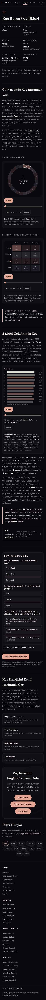

**Adres:** /koc-burcu-ozellikleri  ·  **Başlık etiketi:** Koç Burcu Özellikleri: Kişilik, Aşk, Kadın & Erkek — Sorbi  ·  **H1:** Koç Burcu Özellikleri

**Ne işe yarıyor**
Tek bir burcun kimlik kartı (yönetici, element, nitelik, karşı burç, tarih, derece kuşağı), zodyaktaki geometrik yeri, 24.000 gök anındaki sıklığı ve altı bölümlük kişilik/aşk/kariyer metni. Sonunda 3 soruluk sınav, "okudum" işareti ve harita/günlük yorum bağlantıları.

**Ekranda ne var**
- Üst menü — ortak menü, "Burçlar" işaretli (yol `/burc/` deseniyle eşleşiyor).
- Hero — büyük glif (♈︎), H1. Tarih/element/yönetici satırı `bk-sr` (yalnız ekran okuyucu), görünmüyor.
- Kimlik tablosu — 2 sütun × 3 satır: Yönetici gezegen (Mars), Element (Ateş · "harekete geçme ve yönelme"), Nitelik (Öncü · "başlatma niteliği"), Karşı (kutup) burç (Terazi · "zodyakta 180° karşısında"), Tarih aralığı (21 Mart – 19 Nisan · "Güneş bu kuşaktan geçerken"), Zodyak kuşağı (0°–30° · "1. burç"). Altında tek cümle özet — hub kartındaki cümlenin aynısı.
- "Gökyüzünde Koç Burcunun Yeri" — 2 paragraf (element/nitelik ızgarası açıklaması; aynı element/nitelik/karşı burç bağlantıları ve 120°/90°/180° geometrisi), "Zodyak çarkında Koç" canvas'ı (Oynat, kaydırıcı, Sıfırla, 2 cümle metin), "Element × nitelik ızgarasında Koç" canvas'ı (aynı kontroller), sarı çizgili çıkarım kutusu ("Koç zodyağın 1. burcu… Bu dört veri… iskelettir.").
- "24.000 Gök Anında Koç" — 1 paragraf yöntem, dağılım canvas'ı (Koç çubuğu vurgulu; Güneş/Ay/yükselen kaydırıcısı, Oynat, Sıfırla, otomatik 4 cümle), 2 paragraf sayı yorumu ("2.027 an… 8,4%… 27 an üstünde… 6. sırada… her 12 andan biri"; "Ay'da 2.531 an (10,5%, 3. sıra), yükselende 1.185 an (4,9%, 11. sıra)… 1,11 / 1,70 / 2,19 kat"), çıkarım kutusu ("Güneş burcu bir nadirlik ölçüsü değil…").
- Katlı bölüm (`
`, kapalı) — özet satırı "Koç burcunun özellikleri — Genel karakter, Koç kadını ve erkeği, aşk, iş ve gelişim yönleri — 6 bölüm" ve "+" işareti. Açılınca 6 H2: Genel Özellikleri (2 p, 130 kelime), Koç Kadını (2 p, 87), Koç Erkeği (2 p, 73), Aşk (1 p, 90), İş/Kariyer (1 p, 79), Güçlü ve Gelişim Yönleri (1 p, 53). Toplam 512 kelime. Ekran görüntüsünde bu blok tek satırlık kapalı bir kutu.
- Sınav kartı — "Koç'u ne kadar tanıdın": 3 soru × 3 seçenek (element·nitelik; geleneksel yönetici; Güneş 8,4% – yükselen 4,9% farkı neden), "0 / 3 soru yanıtlandı".
- "Koç'u okudum olarak işaretle" düğmesi (JS ile görünür olur) + gizlilik cümlesi + "On iki burçluk ilerlemene" bağlantısı.
- "Koç Enerjisini Kendi Haritanda Gör" — 1 paragraf + 4 yol kartı (Doğum haritanı hesapla, Seni Tanıyorum, On iki burcu tara, Ateş burçları).
- CTA kutusu — H2 "Koç burcunun bugünkü yorumu için", 2 cümle, 3 düğme: Günlük Yorum (altın), Ücretsiz Doğum Haritası (/#dogum-haritasi), Burç Uyumu.
- "Diğer Burçlar" — 1 cümle + 12 burç çipi (Koç işaretli).
- Alt bilgi — ortak footer.

**Kullanıcı ne yapıyor**
Girdi yok, okunur sayfa. Etkileşim: üç canvas'ın kaydırıcı/Oynat/Sıfırla'sı; `
` özetine dokununca uzun metin açılır; sınav seçeneğine basınca doğru/yanlış ve gerekçe görünür, 3. cevapta sonuç `sorbi_oyun_v1`'e yazılır (18 puan); "okudum" düğmesi `burc-koc` anahtarını tamamlar (12 puan), hub kartına ✦ ekler.

**Teknik**
- Motor/JS: sorbi-gosteri.js (zodyak-carki, element-nitelik), sorbi-burc.js (burc-dagilimi tipi, okudum düğmesi; düğme metnini `ad+"’u okudum"` ile üretir), sorbi-oyun.js (sınav kartı, puan/seri), sorbi-profil.js, sorbi-olcum.js.
- Veri: `/nadirlik-veri.json` (yalnız dağılım canvas'ı için; paragraftaki sayılar HTML'e gömülü), localStorage `sorbi_oyun_v1`, `sorbi_birth`/`sorbi_profile` (yalnız profil çipi), `sorbi_tema`; `/api/track`. AdSense yüklü. JSON-LD: Article + BreadcrumbList (görünür kırıntı yok).
- Hesap: tarayıcıda canvas çizimi; tüm sayılar ve metin statik.
- Ağırlık: 1.255 kelime statik / 1.410 görünür · 10 ekran boyu mobilde · 20 düğme · 3 form alanı (kaydırıcılar)

**Boş / dolu hal**
Fark yok (dolu halde yalnız menü altına profil çipi; kaynaktan, ekran görüntüsü alınmadı).

**Kusur**
- Sayfanın title'ında vaat edilen içerik ("Kişilik, Aşk, Kadın & Erkek", 512 kelime) kapalı bir `
` içinde; ekran görüntüsünde tek satırlık kutu. Katlanmadan görünen 9 ekran, geometri + sayım + sınav + bağlantı.
- Hub'daki 3 canvas (çark, ızgara, dağılım) burada aynen tekrar ediyor; "Güneş burcu bir nadirlik ölçüsü değil" çıkarım kutusu hub'dakiyle kelimesi kelimesine aynı.
- 24.000 gök anı yöntem paragrafı ("Tahmin değil sayım… 41,0°K… nüfus istatistiği değil") hem hub'da hem 12 sayfada; aynı bilgi bu sayfada ikinci kez çıkarım kutusunda da yazılı.
- Sınavın 3. sorusu ("…Güneş'te 8,4%, yükselende 4,9% görüldü. Bu fark neden?") 12 sayfada aynı, sadece rakam değişiyor; doğru cevap gerekçesi 12 sayfada birebir aynı.
- "Öncü (Kardinal)" parantezi yalnız Koç'ta, "(Mutable)" yalnız İkizler'de; diğer 10 sayfada yok. Görünmez (`bk-sr`) satırda olduğu için gözle fark edilmiyor.
- Ölçüm: 2 sağa taşan öğe (menü kaynaklı olması muhtemel; olcum.jsonl öğe adını vermiyor, emin değilim).

**Durum:** canlı ve işini yapıyor

---

---

## boga-burcu-ozellikleri.html — Boga Burcu Özellikleri

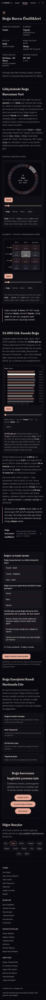

**Kalıptan farkı**
— /boga-burcu-ozellikleri · title "Boğa Burcu Özellikleri: Kişilik, Aşk, Kadın & Erkek — Sorbi" · H1 "Boğa Burcu Özellikleri" · 1.245 statik / 1.400 görünür · 10 ekran · 11 H2.
Fark: kalıpla aynı yapı ve aynı CTA ("Boğa burcunun bugünkü yorumu için"). Sınav başlığı ekranda "**Boğa'u** ne kadar tanıdın", düğme "**Boğa'u** okudum olarak işaretle" (ek `'u` sabit; ekran görüntüsünde doğrulandı). Katlı metin 505 kelime.

**Ortak kalıp**
Hepsinde: aynı 11 H2 (Gökyüzünde… Yeri / 24.000 Gök Anında… / 6 katlı H2 / …Enerjisini Kendi Haritanda Gör / CTA H2 / Diğer Burçlar), aynı 3 canvas, aynı 3 soruluk sınav, aynı 4 yol kartı, aynı JS seti, 20 düğme, 3 kaydırıcı, 10 ekran boyu (±0,1). Ekran görüntüleri tek tek bakıldı; farklar aşağıda.

---

## ikizler-burcu-ozellikleri.html — Ikizler Burcu Özellikleri

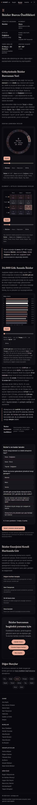

**Kalıptan farkı**
— /ikizler-burcu-ozellikleri · title "İkizler Burcu Özellikleri: Kişilik, Aşk, Kadın & Erkek — Sorbi" · H1 "İkizler Burcu Özellikleri" · 1.242 / 1.397 · 10 ekran · 11 H2.
Fark: kalıpla aynı; CTA Koç'la aynı kalıp. "İkizler'u ne kadar tanıdın / İkizler'u okudum". Görünmez satırda "Değişken (Mutable)" — bu parantez sadece burada. Katlı metin 503 kelime.

**Ortak kalıp**
Hepsinde: aynı 11 H2 (Gökyüzünde… Yeri / 24.000 Gök Anında… / 6 katlı H2 / …Enerjisini Kendi Haritanda Gör / CTA H2 / Diğer Burçlar), aynı 3 canvas, aynı 3 soruluk sınav, aynı 4 yol kartı, aynı JS seti, 20 düğme, 3 kaydırıcı, 10 ekran boyu (±0,1). Ekran görüntüleri tek tek bakıldı; farklar aşağıda.

---

## yengec-burcu-ozellikleri.html — Yengec Burcu Özellikleri

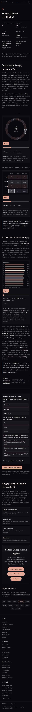

**Kalıptan farkı**
— /yengec-burcu-ozellikleri · title "Yengeç Burcu Özellikleri: Kişilik, Aşk, Kadın & Erkek — Sorbi" · H1 "Yengeç Burcu Özellikleri" · 1.402 / 1.557 · 10,1 ekran · 11 H2.
Fark: en uzun katlı metinlerden (665 kelime; 6 bölümün hepsi 2 paragraf). CTA farklı: H2 "Sadece Güneş burcun değilsin", metin "Yengeç burcu özellikleri bir başlangıç…", düğme "Yengeç Günlük Yorum". İlk ekran 81 kelime (diğerleri 143–154): H1 iki satıra, tarih "21 Haziran – 22 Temmuz" iki satıra kırılıyor, kimlik tablosu ekranı dolduruyor. "Yengeç'u" eki. En düşük yükselen kesri sorusu değil, en yüksek: "Güneş'te 8,7%, yükselende 9,9%".

**Ortak kalıp**
Hepsinde: aynı 11 H2 (Gökyüzünde… Yeri / 24.000 Gök Anında… / 6 katlı H2 / …Enerjisini Kendi Haritanda Gör / CTA H2 / Diğer Burçlar), aynı 3 canvas, aynı 3 soruluk sınav, aynı 4 yol kartı, aynı JS seti, 20 düğme, 3 kaydırıcı, 10 ekran boyu (±0,1). Ekran görüntüleri tek tek bakıldı; farklar aşağıda.

---

## aslan-burcu-ozellikleri.html — Aslan Burcu Özellikleri

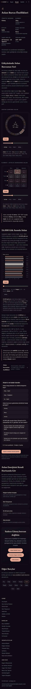

**Kalıptan farkı**
— /aslan-burcu-ozellikleri · title "Aslan Burcu Özellikleri: Kişilik, Aşk, Kadın & Erkek — Sorbi" · H1 "Aslan Burcu Özellikleri" · 1.436 statik / görünür ölçüm yok · ≈10,1 ekran (16.968 px tam sayfa görüntüsünden) · 11 H2.
Fark: en uzun katlı metin (696 kelime, her bölüm 2 paragraf). CTA Yengeç'le aynı ("Sadece Güneş burcun değilsin" · "Aslan Günlük Yorum"). "Aslan'u" eki. olcum.jsonl'de kayıt yok.

**Ortak kalıp**
Hepsinde: aynı 11 H2 (Gökyüzünde… Yeri / 24.000 Gök Anında… / 6 katlı H2 / …Enerjisini Kendi Haritanda Gör / CTA H2 / Diğer Burçlar), aynı 3 canvas, aynı 3 soruluk sınav, aynı 4 yol kartı, aynı JS seti, 20 düğme, 3 kaydırıcı, 10 ekran boyu (±0,1). Ekran görüntüleri tek tek bakıldı; farklar aşağıda.

---

## basak-burcu-ozellikleri.html — Basak Burcu Özellikleri

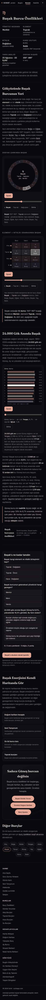

**Kalıptan farkı**
— /basak-burcu-ozellikleri · title "Başak Burcu Özellikleri: Kişilik, Aşk, Kadın & Erkek — Sorbi" · H1 "Başak Burcu Özellikleri" · 1.438 / 1.593 · 10 ekran · 11 H2.
Fark: katlı metin 699 kelime (en uzun). CTA Yengeç/Aslan kalıbı. "Başak'u" eki. Ölçüm: 3 taşan öğe (diğerlerinde 2; fazladan öğe ne, emin değilim).

**Ortak kalıp**
Hepsinde: aynı 11 H2 (Gökyüzünde… Yeri / 24.000 Gök Anında… / 6 katlı H2 / …Enerjisini Kendi Haritanda Gör / CTA H2 / Diğer Burçlar), aynı 3 canvas, aynı 3 soruluk sınav, aynı 4 yol kartı, aynı JS seti, 20 düğme, 3 kaydırıcı, 10 ekran boyu (±0,1). Ekran görüntüleri tek tek bakıldı; farklar aşağıda.

---

## terazi-burcu-ozellikleri.html — Terazi Burcu Özellikleri

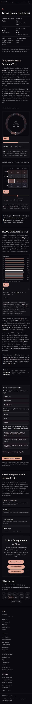

**Kalıptan farkı**
— /terazi-burcu-ozellikleri · title "Terazi Burcu Özellikleri: Kişilik, Aşk, Kadın & Erkek — Sorbi" · H1 "Terazi Burcu Özellikleri" · 1.254 / 1.409 · 10 ekran · 11 H2.
Fark: katlı metin ikinci tekil şahısla yazılmış ("iç pusulana güvenmeyi öğrendiğinde"; 18 sen-formu, Koç'ta 1) ve son bölümde kalın etiketli iki liste: "**Güçlü yönlerin:** … **Gelişim yönlerin:** …" (12 sayfada yalnız Terazi/Akrep/Yay'da). CTA üçüncü varyant: "Terazi özelliklerin başlangıç noktası… Bugünün gökyüzünü oku, ücretsiz haritanı çıkar.", düğmeler "Terazi Günlük Yorumu" ve "**Burç Uyumu Hesapla**" (diğerlerinde "Burç Uyumu"). Aşk bölümü "Unutma: gerçek uyum yalnızca Güneş burcuyla değil… (sinastri)…" cümlesiyle bitiyor — Akrep ve Yay'da birebir aynı cümle. "Terazi'u" eki. 3 taşan öğe.

**Ortak kalıp**
Hepsinde: aynı 11 H2 (Gökyüzünde… Yeri / 24.000 Gök Anında… / 6 katlı H2 / …Enerjisini Kendi Haritanda Gör / CTA H2 / Diğer Burçlar), aynı 3 canvas, aynı 3 soruluk sınav, aynı 4 yol kartı, aynı JS seti, 20 düğme, 3 kaydırıcı, 10 ekran boyu (±0,1). Ekran görüntüleri tek tek bakıldı; farklar aşağıda.

---

## akrep-burcu-ozellikleri.html — Akrep Burcu Özellikleri

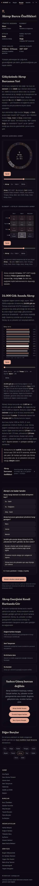

**Kalıptan farkı**
— /akrep-burcu-ozellikleri · title "Akrep Burcu Özellikleri: Kişilik, Aşk, Kadın & Erkek — Sorbi" · H1 "Akrep Burcu Özellikleri" · 1.235 statik / görünür ölçüm yok · ≈10,1 ekran (17.038 px) · 11 H2.
Fark: kimlik tablosunda yönetici iki satır: "**Mars** — modern: Plüton" (ekran görüntüsünde doğrulandı); çıkarım kutusu "Plüton (geleneksel: Mars)"; title/description "Plüton yönetimindeki"; hub kartı "Mars"; çark canvas'ı "yön. Mars". Katlı metin ikinci tekil şahıs ("yüzeyle asla yetinmezsin") + "Güçlü yönlerin/Gelişim yönlerin" listeleri; en kısa metinlerden (478). CTA Terazi varyantı ("Akrep Günlük Yorumu", "Burç Uyumu Hesapla"). Sınav gerekçesinde "Akrep'un yöneticisi Mars" (ek hatası gerekçe metninde de). olcum.jsonl'de kayıt yok.

**Ortak kalıp**
Hepsinde: aynı 11 H2 (Gökyüzünde… Yeri / 24.000 Gök Anında… / 6 katlı H2 / …Enerjisini Kendi Haritanda Gör / CTA H2 / Diğer Burçlar), aynı 3 canvas, aynı 3 soruluk sınav, aynı 4 yol kartı, aynı JS seti, 20 düğme, 3 kaydırıcı, 10 ekran boyu (±0,1). Ekran görüntüleri tek tek bakıldı; farklar aşağıda.

---

## yay-burcu-ozellikleri.html — Yay Burcu Özellikleri

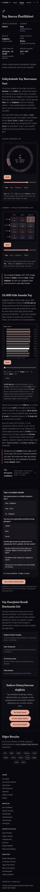

**Kalıptan farkı**
— /yay-burcu-ozellikleri · title "Yay Burcu Özellikleri: Kişilik, Aşk, Kadın & Erkek — Sorbi" · H1 "Yay Burcu Özellikleri" · 1.248 / 1.403 · 10,1 ekran · 11 H2.
Fark: Terazi/Akrep grubuyla aynı: ikinci tekil şahıs (22 sen-formu, en yüksek), kalın "Güçlü yönlerin / Gelişim yönlerin", CTA "Yay Günlük Yorumu" + "Burç Uyumu Hesapla", aynı sinastri kapanış cümlesi. "Yay'u" eki. Ölçüm: 4 taşan öğe — 12 sayfanın en yükseği; hangi öğe, emin değilim.

**Ortak kalıp**
Hepsinde: aynı 11 H2 (Gökyüzünde… Yeri / 24.000 Gök Anında… / 6 katlı H2 / …Enerjisini Kendi Haritanda Gör / CTA H2 / Diğer Burçlar), aynı 3 canvas, aynı 3 soruluk sınav, aynı 4 yol kartı, aynı JS seti, 20 düğme, 3 kaydırıcı, 10 ekran boyu (±0,1). Ekran görüntüleri tek tek bakıldı; farklar aşağıda.

---

## oglak-burcu-ozellikleri.html — Oglak Burcu Özellikleri

**Kalıptan farkı**
— /oglak-burcu-ozellikleri · title "Oğlak Burcu Özellikleri: Kişilik, Aşk, Kadın & Erkek — Sorbi" · H1 "Oğlak Burcu Özellikleri" · 1.194 / 1.349 · 10 ekran · 11 H2.
Fark: katlı metin kısa (452) ve ikinci tekil şahıs ("mutluluğu ertelersin"), kalın liste yok. Aşk bölümü "Yine de gerçek uyum yalnızca Güneş burcuyla değil… (sinastri)…" ile bitiyor — Kova ve Balık'ta birebir aynı. CTA dördüncü varyant: "Oğlak burcu özellikleri bir başlangıç… Ücretsiz hesapla, günlük yorumunu oku.", "Oğlak Günlük Yorumu", "Burç Uyumu". "Oğlak'u" eki. Sınav 3. sorusu bu sayfada anlamsız: "Güneş'te 7,8%, yükselende 8,0% görüldü. Bu fark neden?" — fark 0,2 puan, doğru cevap yine "burçlar ufuktan eşit sürede doğmuyor".

**Ortak kalıp**
Hepsinde: aynı 11 H2 (Gökyüzünde… Yeri / 24.000 Gök Anında… / 6 katlı H2 / …Enerjisini Kendi Haritanda Gör / CTA H2 / Diğer Burçlar), aynı 3 canvas, aynı 3 soruluk sınav, aynı 4 yol kartı, aynı JS seti, 20 düğme, 3 kaydırıcı, 10 ekran boyu (±0,1). Ekran görüntüleri tek tek bakıldı; farklar aşağıda.

---

## kova-burcu-ozellikleri.html — Kova Burcu Özellikleri

**Kalıptan farkı**
— /kova-burcu-ozellikleri · title "Kova Burcu Özellikleri: Kişilik, Aşk, Kadın & Erkek — Sorbi" · H1 "Kova Burcu Özellikleri" · 1.190 / 1.347 · 10,1 ekran · 11 H2.
Fark: en kısa katlı metin (440). Kimlik tablosunda yönetici iki satır "Satürn — modern: Uranüs", hub kartında "Satürn", title/description "Uranüs ve Satürn yönetimindeki", çıkarım kutusu "Uranüs (geleneksel: Satürn)". Oğlak grubuyla aynı CTA ve kapanış cümlesi; ikinci tekil şahıs. "Kova'u" eki.

**Ortak kalıp**
Hepsinde: aynı 11 H2 (Gökyüzünde… Yeri / 24.000 Gök Anında… / 6 katlı H2 / …Enerjisini Kendi Haritanda Gör / CTA H2 / Diğer Burçlar), aynı 3 canvas, aynı 3 soruluk sınav, aynı 4 yol kartı, aynı JS seti, 20 düğme, 3 kaydırıcı, 10 ekran boyu (±0,1). Ekran görüntüleri tek tek bakıldı; farklar aşağıda.

---

## balik-burcu-ozellikleri.html — Balik Burcu Özellikleri

**Kalıptan farkı**
— /balik-burcu-ozellikleri · title "Balık Burcu Özellikleri: Kişilik, Aşk, Kadın & Erkek — Sorbi" · H1 "Balık Burcu Özellikleri" · 1.191 / 1.348 · 10 ekran · 11 H2.
Fark: katlı metin 444; yönetici "Jüpiter — modern: Neptün" (hub kartı "Jüpiter", title "Neptün ve Jüpiter"). Oğlak/Kova grubuyla aynı CTA ve kapanış cümlesi. Sen-formu 9 (grubun en azı). "Balık'u" eki.

**Ortak kalıp**
Hepsinde: aynı 11 H2 (Gökyüzünde… Yeri / 24.000 Gök Anında… / 6 katlı H2 / …Enerjisini Kendi Haritanda Gör / CTA H2 / Diğer Burçlar), aynı 3 canvas, aynı 3 soruluk sınav, aynı 4 yol kartı, aynı JS seti, 20 düğme, 3 kaydırıcı, 10 ekran boyu (±0,1). Ekran görüntüleri tek tek bakıldı; farklar aşağıda.

---

## 12 sayfanın karşılaştırma tablosu
| Dosya | Kelime (statik / görünür) | Katlı metin | Ekran | H2 | Fark |
|---|---|---|---|---|---|
| koc-burcu-ozellikleri | 1.255 / 1.410 | 512 | 10 | 11 | KALIP · CTA "bugünkü yorumu için" · 3. şahıs |
| boga-burcu-ozellikleri | 1.245 / 1.400 | 505 | 10 | 11 | kalıpla aynı · "Boğa'u" |
| ikizler-burcu-ozellikleri | 1.242 / 1.397 | 503 | 10 | 11 | kalıpla aynı · "(Mutable)" gizli satırda |
| yengec-burcu-ozellikleri | 1.402 / 1.557 | 665 | 10,1 | 11 | uzun metin · CTA "Sadece Güneş burcun değilsin" · ilk ekran 81 kelime (H1 iki satır) |
| aslan-burcu-ozellikleri | 1.436 / — | 696 | ≈10,1 | 11 | en uzun metin · CTA Yengeç grubu · olcum kaydı yok |
| basak-burcu-ozellikleri | 1.438 / 1.593 | 699 | 10 | 11 | en uzun metin · CTA Yengeç grubu · 3 taşma |
| terazi-burcu-ozellikleri | 1.254 / 1.409 | 502 | 10 | 11 | 2. şahıs · kalın "Güçlü/Gelişim yönlerin" · "Burç Uyumu Hesapla" · 3 taşma |
| akrep-burcu-ozellikleri | 1.235 / — | 478 | ≈10,1 | 11 | yönetici 2 satır (Mars/Plüton), 4 farklı ifade · Terazi grubu · olcum kaydı yok |
| yay-burcu-ozellikleri | 1.248 / 1.403 | 494 | 10,1 | 11 | Terazi grubu · 4 taşma (en çok) |
| oglak-burcu-ozellikleri | 1.194 / 1.349 | 452 | 10 | 11 | 2. şahıs · CTA "…günlük yorumunu oku" · 3. soru 7,8% vs 8,0% |
| kova-burcu-ozellikleri | 1.190 / 1.347 | 440 | 10,1 | 11 | en kısa metin · yönetici 2 satır (Satürn/Uranüs) · Oğlak grubu |
| balik-burcu-ozellikleri | 1.191 / 1.348 | 444 | 10 | 11 | yönetici 2 satır (Jüpiter/Neptün) · Oğlak grubu |

Hub (burc-ozellikleri): 1.166 / 1.344 · 13,1 ekran · 7 H2 · 40 düğme.

**Kelime farkı nereden geliyor:** 12 sayfanın kalıp kısmı (kimlik, geometri, sayım, sınav, yol kartları, CTA, Diğer Burçlar) sayfa başına 740 ± 5 kelime, sabit. Fark tamamen katlı `
` içindeki altı bölümlük metinden geliyor: 440 (Kova) ile 699 (Başak) arasında. Yengeç/Aslan/Başak'ta her bölüm 2 paragraf (665–699), Koç/Boğa/İkizler'de aşk-iş-gelişim tek paragraf (503–512), Oğlak/Kova/Balık en kısa (440–452). Görünür sayı statikten ~155 kelime fazla; bu, üç canvas'ın ve sınav kartının JS ile bastığı metin. 1.190 (Kova statik) – 1.557 (Yengeç görünür) aralığı iki ölçümün karışımı.

---

---

## Çözülen sorular
**Metin elle mi yazılmış, üretilmiş mi?**
Sayfa iskeleti kesin olarak şablondan üretilmiş: geometri ve sayım paragrafları 12 sayfada aynı cümle kalıbı, sadece burç adı/derece/sayı değişiyor; sınavın 3 sorusu aynı; "okudum" düğmesi ve sınav başlığı `ad + "'u"` ile ekleniyor, bu yüzden Koç dışındaki 11 sayfada ek yanlış ("Boğa'u", "Yay'u", "Kova'u"). Katlı uzun metinler ise zodyak sırasında **üçerli dört parti** halinde farklı yönergeyle üretilmiş görünüyor; her parti kendi içinde tutarlı, partiler arası tutarsız:
- Koç/Boğa/İkizler: 3. şahıs, ~505 kelime, meta description "…kişilik analizi… gerçek karakteri", CTA "bugünkü yorumu için".
- Yengeç/Aslan/Başak: 3. şahıs, ~690 kelime, her bölüm 2 paragraf, description "Kişiliği, aşk hayatı ve kariyer yönü — X elementi, Y yönetiminde.", CTA "Sadece Güneş burcun değilsin".
- Terazi/Akrep/Yay: 2. şahıs, kalın "Güçlü yönlerin / Gelişim yönlerin" listeleri, aşk bölümü aynı "Unutma: gerçek uyum… (sinastri)…" cümlesiyle bitiyor, description "…güçlü ve gelişim yönleri — Sorbi.", düğme "Burç Uyumu Hesapla".
- Oğlak/Kova/Balık: 2. şahıs, ~445 kelime, aynı kapanış cümlesi "Yine de gerçek uyum…", description "…tam profili.", CTA "…günlük yorumunu oku."
Elle yazılmış mı, dil modeliyle mi üretilmiş, kaynaktan kesin söylenemez; ama tek elden tek oturumda yazılmadığı, dört ayrı üretim geçişinden çıktığı açık.

**Hub'daki kartlarla sayfa açılış cümleleri aynı mı?**
Evet: hub kartındaki tek cümle özet (`data-ozet`) ile burç sayfasında kimlik tablosunun altındaki `bk-ozet` cümlesi 12/12 birebir aynı. Katlı uzun metnin ilk cümlesi ise farklı ("Koç, zodyağın ilk burcudur ve bu sıralama tesadüf değildir…"). Yani hub'dan gelen kişi sayfanın ilk ekranında az önce okuduğu cümleyi tekrar görüyor.

**Her sayfada tekrar eden çark/ızgara/dağılım blokları:**
1. `zodyak-carki` canvas'ı (Oynat · kaydırıcı · Sıfırla · 2 cümle otomatik metin) — hub + 12 sayfa.
2. `element-nitelik` canvas'ı (aynı kontrol seti) — hub + 12 sayfa.
3. `burc-dagilimi` canvas'ı (12 çubuk, Güneş/Ay/yükselen kaydırıcısı, otomatik 4 cümle, nadirlik-veri.json fetch) — hub + 12 sayfa.
4. 24.000 gök anı yöntem paragrafı ("Tahmin değil sayım… 1950–2009… 41,0°K… nüfus istatistiği değil") — hub + 12 sayfa, ayrıca hub'ın alt notunda üçüncü kez.
5. "Güneş burcu bir nadirlik ölçüsü değil… 7,8% ile 8,7%… bileşim" çıkarım kutusu — hub + 12 sayfa kelimesi kelimesine.
6. "1,11 / 1,70 / 2,19 kat" cümlesi — hub'da 1, her sayfada 2 kez (paragraf + sınav gerekçesi).
7. "Gökyüzünde X Burcunun Yeri" ilk paragrafı — element/nitelik değiştirilmiş aynı 4 cümle.
8. 3 soruluk sınav + "okudum" düğmesi + gizlilik cümlesi — 12 sayfa.
9. "X Enerjisini Kendi Haritanda Gör" paragrafı + 4 yol kartı (ilk 3'ü aynı) — 12 sayfa; hub'ın "Buradan Sonra" kartlarının 2'siyle çakışıyor.
10. CTA kutusu (3 düğme) + "Diğer Burçlar" 12 çip — 12 sayfa; CTA'nın "Sadece Güneş burcun değilsin" H2'si aynı zamanda 12 günlük yorum sayfasının H2'si (envanter-ham).

---

# Günlük burç yorumları (12)

## koc-burcu-gunluk-yorum.html — Koç günlük yorum  [KALIP]

**Adres:** /koc-burcu-gunluk-yorum  ·  **Başlık etiketi:** Koç Burcu Günlük Yorum — Sorbi  ·  **H1:** Koç Burcu Günlük Yorum

**Ne işe yarıyor**
Koç burcu için bugünün üç satırlık yorumunu (genel, aşk, para-kariyer) gösterir. Yorum sabit metin değildir; tarayıcı o anki Ay, Venüs ve Mars konumunu hesaplayıp hazır cümle tablolarından seçer. Sayfa okuyucuyu Koç özellikleri sayfasına ve ücretsiz doğum haritasına yönlendirir.

**Ekranda ne var**
- Üst menü — SORBİ logosu, 9 bağlantı ("Burçlar" aktif çizgili), sağda tema düğmesi (☀). Mobilde yatay kayar; ekran görüntüsünde "…arı, Bugün, Burçlar, Nadirlik, S" görünüyor.
- Hero — ✦ glifi, H1 "Koç Burcu Günlük Yorum", meta satırı "21 Mart – 19 Nisan · Ateş · Yönetici: Mars · Öncü", altında turuncu bağlantı "Koç burcu özellikleri, aşk & kariyer →".
- Bugünün yorumu kartı — büyük harfli etiket "BUGÜNÜN KOÇ YORUMU · 21 EYLÜL 2026", altında dört satır: **Genel** (Ay'ın güneş-evi + Ay evresi), **Aşk** (Venüs'ün güneş-evi), **Para & Kariyer** (Mars'ın güneş-evi), **Hesap** (sabit açıklama: "Bu üç satır, bugünün Ay, Venüs ve Mars boylamlarının bu burçtan sayılan güneş-evlerine göre üretildi; kişisel doğum haritasının yerini tutmaz."). JS çalışmadan önce kartta "Bugünün gökyüzü hesaplanıyor…" yazar.
- "Koç Burcu — Kısaca" — tek paragraf; yorumun nasıl üretildiğini anlatır, üç iç bağlantı: Koç burcu özellikleri, burç uyumu, doğum haritanı.
- CTA kutusu — H2 "Sadece Güneş burcun değilsin", iki cümle açıklama, turuncu düğme "Ücretsiz Doğum Haritanı Hesapla" (→ /#dogum-haritasi).
- "Diğer Burçlar" — 12 çip; Koç turuncu çerçeveli (aktif).
- Alt bilgi — ortak 4 sütun (Sorbi / Burçlar / Hesaplayıcılar / Gökyüzü), telif satırı, sorumluluk notu.

**Kullanıcı ne yapıyor**
Girdi yok, okunur sayfa. Sayfa açılınca `astronomy.browser.min.js` yüklenir, `draw()` çalışır (Astronomy nesnesi hazır değilse 300 ms'de bir yeniden dener), `#dt` alanına bugünün tarihi (tr-TR biçimi), `#todayBody` alanına üç satır + Hesap notu yazılır. Sonra kullanıcı ya özellikler sayfasına, ya doğum haritası CTA'sına, ya da başka bir burcun çipine gider.

**Teknik**
- Motor/JS: `astronomy.browser.min.js?v=3` (astronomy-engine; Güneş/Ay/Venüs/Mars ekliptik boylamı), sayfa içi gömülü betik (`SIGN_I=0`, cümle tabloları, `draw()`), `sorbi-profil.js?v=3` (nav "✦ Profilim" rozeti; bu sayfada tarih alanı olmadığından profil çipi basmaz), `sorbi-olcum.js?v=1` (anonim sayfa sayacı, `/api/track`'e sendBeacon). Google AdSense betiği yüklü (`ca-pub-6653215819266638`). `sorbi-astro.js` bu sayfada YÜKLENMİYOR.
- Veri: harici veri dosyası yok, yorum için API yok. localStorage yalnız okunur: `sorbi_tema` (tema), `sorbi_birth` (tema betiği lat/lon okur ama sonucu kullanmaz — `t='gece'` sabitlenmiş; profil betiği rozet için okur). Tek giden istek `/api/track` (sayaç).
- Hesap: tarayıcıda. **Yorumun kaynağı kesin olarak sayfa içi betiktir**, kanıt:
  - `var A=window.Astronomy, t=A.MakeTime(new Date());` → girdi yalnız **şu anki saat**. Doğum bilgisi, konum, kullanıcı kimliği okunmaz.
  - `Sun/Moon/Ven/Mar = ecl(...)` → dört gök cismi boylamı; `sgn()` burç indeksi; `H(ps)=((ps-SIGN_I+12)%12)+1` → Koç'tan sayılan güneş-evi (1–12).
  - Üç cümle havuzu: `HT[1..12]` (Genel), `LOVE[1..12]` (Aşk), `MONEY[1..12]` (Para & Kariyer); her biri 12 cümle → **36 cümle**. Ayrıca `ph` için 8 Ay evresi adı (Yeni Ay … Küçülen Hilal; Ay–Güneş açı farkı 45°'lik dilimlere bölünür).
  - Çıktı = `HT[mh] + evre + LOVE[vh] + MONEY[ah]`. Teorik kombinasyon 12×12×12 = 1.728 (evreyle 13.824). Gerçekte astronomi kısıtlıyor: Venüs Güneş'ten en fazla 2 burç uzaklaşır, Ay evresi Ay'ın evine bağlı. `astronomy.browser.min.js` ile 2026-01-01 → 2035-12-31 arası günlük simülasyon (tek burç, 09:00 UTC): **981 farklı üç-cümle bileşimi, evreyle 1.719**; günlerin **%53'ünde üç cümle bir önceki günle aynı**, evre dahil %38,7'sinde tamamen aynı metin.
  - Tarih bağımlılığı: Ay ~2,5 günde bir burç değiştirdiğinden "Genel" satırı ortalama 2,5 günde bir, Venüs satırı ~3–4 haftada bir, Mars satırı ~6–7 haftada bir değişir. Etiketteki tarih her gün değişir, cümleler çoğu gün değişmez.
  - Aynı gün iki kişi: aynı burç sayfasında **aynı metni görür**. Tek fark cihaz saati/saat dilimi: `new Date()` yerel; Ay burç sınırına yakın saatlerde farklı saat dilimindeki iki kişi farklı "Genel" satırı görebilir. Tarih etiketi de cihaz diline/dilimine göre yazılır.
  - Aynı gün 12 sayfa: aynı üç gök konumu 12 kez döndürülür — Koç'ta Ay 10. evdeyse Boğa'da 9., İkizler'de 8. … Ekran görüntüleri bunu doğruluyor (Koç 10/8/4, Boğa 9/7/3, İkizler 8/6/2, Yengeç 7/5/1, Aslan 6/4/12, Başak 5/3/11, Terazi 4/2/10, Akrep 3/1/9, Yay 2/12/8, Oğlak 1/11/7, Kova 12/10/6, Balık 11/9/5; hepsinde evre "Büyüyen Şişkin Ay"). Yani bir günde 12 sayfa toplamda 36 cümlenin tamamını, her birini tam bir kez gösterir.
- Ağırlık: 216 kelime · 3,6 ekran boyu mobilde · 2 düğme (tema + CTA) · 0 form alanı

**Boş / dolu hal**
Yorum metni için fark yok: doğum bilgisi okunmaz. Tek fark üst menüdeki "✦ Profilim" rozeti — ki bu bağlantı profil yokken de görünür (kaynakta gizleme kuralı yok). Profil çipi bu sayfada hiç basılmaz (`sorbi-profil.js` yalnız `input[type=date]` / `#go` / `#goBtn` olan sayfalarda çip basar).

**Kusur**
- CTA düğmesi `/#dogum-haritasi` hedefine gidiyor; `index.html`'de `id="dogum-haritasi"` yok (harita ile ilgili hiçbir id yok). Düğme ana sayfanın tepesine düşürüyor. Aynı bozuk çapa sitede 30 sayfada kullanılıyor.
- Yorum tarayıcıda üretildiğinden HTML'de yorum metni yok; arama motoru ve JS'siz istemci kartta yalnız "Bugünün gökyüzü hesaplanıyor…" görür. Sitemap `changefreq=daily` diyor ama sunucudan giden HTML her gün aynıdır.
- Ay'ın burç değişimi ortalama 2,5 günde bir olduğu için "günlük" etiketli yorum günlerin yarısından fazlasında (%53, 10 yıllık simülasyon) bir önceki günle aynı üç cümleyi gösteriyor; sadece tarih etiketi değişiyor.
- Havuz 36 cümle; cümleler burçtan bağımsız (Koç'ta 5. ev cümlesi ile Terazi'de 5. ev cümlesi aynı). Burca özgü hiçbir metin yok, yalnız hero meta satırı.
- Ay evresi sadece "Genel" satırının sonuna ad olarak ekleniyor; yoruma etkisi yok.
- `<head>`'de Google Fonts'tan Space Grotesk + Inter yükleniyor; sayfa CSS'i Space Grotesk'i hiç kullanmıyor (Fraunces + Inter kullanılıyor, Fraunces `sorbi-fonts.css`'ten geliyor). Gereksiz dış istek.
- Tema betiği `sorbi_birth`'ten lat/lon okuyup gündoğumu hesabı yapıyor ama sonucu kullanmıyor (`t='gece'` sabit); ölü kod.
- Ölçüm: 2 taşan öğe (sağa taşma) — muhtemelen üst menü kayar alanı; ekran görüntüsünde görsel bozulma yok.
- Kalıp betiğinde `SIGN_I` her sayfada elle yazılmış; 12 sayfa 12 kopya, tek kaynak yok (bakım riski, envanter notu).
- AdSense betiği yüklü; ekran görüntülerinde reklam alanı görünmüyor (yer tutucu yok, otomatik reklam olabilir — emin değilim).

**Durum:** canlı ve işini yapıyor (yorum motoru çalışıyor, JS hatası yok) — ama CTA çapası bozuk.

---

---

## boga-burcu-gunluk-yorum.html — Boğa günlük yorum

**Adres:** /boga-burcu-gunluk-yorum  ·  **Başlık etiketi:** Boğa Burcu Günlük Yorum — Sorbi  ·  **H1:** Boğa Burcu Günlük Yorum  ·  216 kelime · 3,6 ekran · `SIGN_I=1`
**Kalıptan farkı:** meta satırı "20 Nisan – 20 Mayıs · Toprak · Yönetici: Venüs · Sabit" (mobilde 2 satıra kırılıyor); aktif çip Boğa. Ekranda 21 Eylül 2026: Ay 9. ev, Venüs 7., Mars 3. Bunun dışında kalıpla aynı.

---

---

## ikizler-burcu-gunluk-yorum.html — İkizler günlük yorum

**Adres:** /ikizler-burcu-gunluk-yorum  ·  **Başlık etiketi:** İkizler Burcu Günlük Yorum — Sorbi  ·  **H1:** İkizler Burcu Günlük Yorum  ·  216 kelime · 3,6 ekran · `SIGN_I=2`
**Kalıptan farkı:** meta satırı "21 Mayıs – 20 Haziran · Hava · Yönetici: Merkür · Değişken" (2 satır); kart etiketi "BUGÜNÜN İKİZLER YORUMU · 21 EYLÜL 2026" mobilde 2 satıra kırılıyor. Ekranda Ay 8., Venüs 6., Mars 2. Bunun dışında kalıpla aynı.

---

---

## yengec-burcu-gunluk-yorum.html — Yengeç günlük yorum

**Adres:** /yengec-burcu-gunluk-yorum  ·  **Başlık etiketi:** Yengeç Burcu Günlük Yorum — Sorbi  ·  **H1:** Yengeç Burcu Günlük Yorum  ·  216 kelime · 3,6 ekran · `SIGN_I=3`
**Kalıptan farkı:** meta satırı "21 Haziran – 22 Temmuz · Su · Yönetici: Ay · Öncü" (2 satır); kart etiketi 2 satır. Ekranda Ay 7., Venüs 5., Mars 1. Bunun dışında kalıpla aynı.

---

---

## aslan-burcu-gunluk-yorum.html — Aslan günlük yorum

**Adres:** /aslan-burcu-gunluk-yorum  ·  **Başlık etiketi:** Aslan Burcu Günlük Yorum — Sorbi  ·  **H1:** Aslan Burcu Günlük Yorum  ·  216 kelime · ekran boyu ölçümü yok (`env/olcum.jsonl`'da satır yok; görüntü diğerleriyle aynı) · `SIGN_I=4`
**Kalıptan farkı:** meta satırı "23 Temmuz – 22 Ağustos · Ateş · Yönetici: Güneş · Sabit" (2 satır); kart etiketi 2 satır. Ekranda Ay 6., Venüs 4., Mars 12. Bunun dışında kalıpla aynı.

---

---

## basak-burcu-gunluk-yorum.html — Başak günlük yorum

**Adres:** /basak-burcu-gunluk-yorum  ·  **Başlık etiketi:** Başak Burcu Günlük Yorum — Sorbi  ·  **H1:** Başak Burcu Günlük Yorum  ·  216 kelime · 3,7 ekran · `SIGN_I=5`
**Kalıptan farkı:** meta satırı "23 Ağustos – 22 Eylül · Toprak · Yönetici: Merkür · Değişken" (2 satır, ikinci satır "· Değişken" ile başlıyor); kart etiketi 2 satır. Ekranda Ay 5., Venüs 3., Mars 11. Bunun dışında kalıpla aynı.

---

---

## terazi-burcu-gunluk-yorum.html — Terazi günlük yorum

**Adres:** /terazi-burcu-gunluk-yorum  ·  **Başlık etiketi:** Terazi Burcu Günlük Yorum — Sorbi  ·  **H1:** Terazi Burcu Günlük Yorum  ·  216 kelime · 3,7 ekran · `SIGN_I=6`
**Kalıptan farkı:** meta satırı "23 Eylül – 22 Ekim · Hava · Yönetici: Venüs · Öncü" (2 satır); kart etiketi 2 satır. Ekranda Ay 4., Venüs 2., Mars 10. Bunun dışında kalıpla aynı.

---

---

## akrep-burcu-gunluk-yorum.html — Akrep günlük yorum

**Adres:** /akrep-burcu-gunluk-yorum  ·  **Başlık etiketi:** Akrep Burcu Günlük Yorum — Sorbi  ·  **H1:** Akrep Burcu Günlük Yorum  ·  217 kelime · ekran boyu ölçümü yok (`env/olcum.jsonl`'da satır yok) · `SIGN_I=7`
**Kalıptan farkı:** meta satırı "23 Ekim – 21 Kasım · Su · Yönetici: Plüton (Mars) · Sabit" (2 satır, parantezli çift yönetici); kart etiketi 2 satır. Ekranda Ay 3., Venüs 1., Mars 9. İkinci ekran görüntüsü (akrep-2.png) "Kısaca" paragrafı ve CTA kutusunu gösteriyor; kalıpla aynı. Bunun dışında kalıpla aynı.

---

---

## yay-burcu-gunluk-yorum.html — Yay günlük yorum

**Adres:** /yay-burcu-gunluk-yorum  ·  **Başlık etiketi:** Yay Burcu Günlük Yorum — Sorbi  ·  **H1:** Yay Burcu Günlük Yorum  ·  216 kelime · 3,6 ekran · `SIGN_I=8`
**Kalıptan farkı:** meta satırı "22 Kasım – 21 Aralık · Ateş · Yönetici: Jüpiter · Değişken" (2 satır); kart etiketi tek satır. Ekranda Ay 2., Venüs 12., Mars 8. Bunun dışında kalıpla aynı.

---

---

## oglak-burcu-gunluk-yorum.html — Oğlak günlük yorum

**Adres:** /oglak-burcu-gunluk-yorum  ·  **Başlık etiketi:** Oğlak Burcu Günlük Yorum — Sorbi  ·  **H1:** Oğlak Burcu Günlük Yorum  ·  216 kelime · 3,7 ekran · `SIGN_I=9`
**Kalıptan farkı:** meta satırı "22 Aralık – 19 Ocak · Toprak · Yönetici: Satürn · Öncü" (2 satır); kart etiketi 2 satır. Ekranda Ay 1., Venüs 11., Mars 7. Bunun dışında kalıpla aynı.

---

---

## kova-burcu-gunluk-yorum.html — Kova günlük yorum

**Adres:** /kova-burcu-gunluk-yorum  ·  **Başlık etiketi:** Kova Burcu Günlük Yorum — Sorbi  ·  **H1:** Kova Burcu Günlük Yorum  ·  217 kelime · 3,6 ekran · `SIGN_I=10`
**Kalıptan farkı:** meta satırı "20 Ocak – 18 Şubat · Hava · Yönetici: Uranüs (Satürn) · Sabit" (2 satır, parantezli çift yönetici); kart etiketi tek satır. Ekranda Ay 12., Venüs 10., Mars 6. Bunun dışında kalıpla aynı.

---

---

## balik-burcu-gunluk-yorum.html — Balık günlük yorum

**Adres:** /balik-burcu-gunluk-yorum  ·  **Başlık etiketi:** Balık Burcu Günlük Yorum — Sorbi  ·  **H1:** Balık Burcu Günlük Yorum  ·  217 kelime · 3,6 ekran · `SIGN_I=11`
**Kalıptan farkı:** meta satırı "19 Şubat – 20 Mart · Su · Yönetici: Neptün (Jüpiter) · Değişken" (2 satır, parantezli çift yönetici); kart etiketi tek satır. Ekranda Ay 11., Venüs 9., Mars 5. Bunun dışında kalıpla aynı.

---

---

## F2 ortak bulgular (6 soru)
1. **Yorum metni nereden geliyor?** Tarayıcıda üretiliyor. Sunucu ucu yok (`api: []`), HTML'de yorum metni yok (kart yalnız "Bugünün gökyüzü hesaplanıyor…" içerir). Sayfa içi betik `astronomy.browser.min.js` ile Ay/Venüs/Mars boylamını hesaplar ve gömülü üç cümle tablosundan satır seçer. Her 12 sayfa kendi kopyasını taşır; ortak modül yok.
2. **Girdi:** yalnız `new Date()` (şu an) ve sayfaya gömülü `SIGN_I`. Doğum bilgisi, yer, kullanıcı kimliği hesaba girmez. Aynı gün, aynı burç sayfası → herkese aynı metin (saat dilimi/cihaz saati farkı dışında).
3. **Havuz:** 3 tablo × 12 cümle = 36 cümle + 8 Ay evresi adı + 1 sabit "Hesap" cümlesi. Teorik 1.728 üçlü (evreyle 13.824); 10 yıllık simülasyonda gerçekleşen 981 üçlü (evreyle 1.719). Cümleler burçtan bağımsızdır; burç yalnız ev sayısını kaydırır.
4. **Her gün değişiyor mu?** Tarih etiketi her gün değişir; cümleler Ay burç değiştirdiğinde (~2,5 gün), Venüs (~3–4 hafta) ve Mars (~6–7 hafta) burç değiştirdiğinde değişir. Simülasyonda günlerin %53'ünde üç cümle önceki günle aynı.
5. **SEO:** Evet, sayfalar SEO amaçlı kurulmuş: her birinde özgün title/description, `<link rel=canonical>` (uzantısız URL), OG/Twitter etiketleri, JSON-LD Article + BreadcrumbList (Ana Sayfa → Günlük Burç Yorumları → burç), sitemap.xml'de 12'si de listeli (`changefreq=daily`, `priority=0.7`, `lastmod=2026-07-13`), robots.txt açık, AdSense yüklü. Ancak asıl "günlük" içerik JS ile üretildiğinden sunucudan giden HTML 216 kelimelik sabit kabuktur; 12 sayfa arasında burç adı ve meta satırı dışında özgün metin yok.
6. **CTA'lar / nereye gidiyor:** (a) hero altı bağlantı → `/<burç>-burcu-ozellikleri`; (b) "Kısaca" paragrafında 3 bağlantı → özellikler, `/burc-uyumu`, `/dogum-haritasi-hesaplama`; (c) ana düğme "Ücretsiz Doğum Haritanı Hesapla" → `/#dogum-haritasi` (çapa hedefi yok, ana sayfa tepesine düşer); (d) 12 burç çipi → kardeş sayfalar; (e) üst menü 9 bağlantı, alt bilgi 25 bağlantı (hepsinin hedef dosyası `site/` içinde var). Geri dönüş yolu: breadcrumb JSON-LD'de var ama ekranda breadcrumb yok; hub `/gunluk-burc-yorumlari`'ye yalnız alt bilgi "Günlük Yorumlar" bağlantısıyla dönülür.

---

---

## 12 sayfanın karşılaştırma tablosu
| dosya | kelime | ekran (mobil) | fark |
|---|---|---|---|
| koc-burcu-gunluk-yorum.html | 216 | 3,6 | KALIP — SIGN_I=0; meta satırı tek satır |
| boga-burcu-gunluk-yorum.html | 216 | 3,6 | SIGN_I=1; meta 2 satır; kalıpla aynı |
| ikizler-burcu-gunluk-yorum.html | 216 | 3,6 | SIGN_I=2; meta ve kart etiketi 2 satır; kalıpla aynı |
| yengec-burcu-gunluk-yorum.html | 216 | 3,6 | SIGN_I=3; meta ve kart etiketi 2 satır; kalıpla aynı |
| aslan-burcu-gunluk-yorum.html | 216 | ölçüm yok | SIGN_I=4; meta ve kart etiketi 2 satır; kalıpla aynı |
| basak-burcu-gunluk-yorum.html | 216 | 3,7 | SIGN_I=5; meta ve kart etiketi 2 satır; kalıpla aynı |
| terazi-burcu-gunluk-yorum.html | 216 | 3,7 | SIGN_I=6; meta ve kart etiketi 2 satır; kalıpla aynı |
| akrep-burcu-gunluk-yorum.html | 217 | ölçüm yok | SIGN_I=7; "Plüton (Mars)" çift yönetici; meta ve kart etiketi 2 satır; kalıpla aynı |
| yay-burcu-gunluk-yorum.html | 216 | 3,6 | SIGN_I=8; meta 2 satır; kalıpla aynı |
| oglak-burcu-gunluk-yorum.html | 216 | 3,7 | SIGN_I=9; meta ve kart etiketi 2 satır; kalıpla aynı |
| kova-burcu-gunluk-yorum.html | 217 | 3,6 | SIGN_I=10; "Uranüs (Satürn)" çift yönetici; meta 2 satır; kalıpla aynı |
| balik-burcu-gunluk-yorum.html | 217 | 3,6 | SIGN_I=11; "Neptün (Jüpiter)" çift yönetici; meta 2 satır; kalıpla aynı |

Ortak: hepsi 2 düğme, 0 form alanı, JS hatası yok, 2 taşan öğe (ölçülen 10 sayfada), aynı üç betik (`astronomy.browser.min.js`, `sorbi-profil.js`, `sorbi-olcum.js`), aynı localStorage anahtarları (`sorbi_birth`, `sorbi_tema`), aynı bozuk CTA çapası. Kelime farkı (216/217) yalnız burç adının ("İkizler" vb.) sayım biçiminden kaynaklanıyor; içerik farkı yok.

---
